Hammad Homicide
================

## Updating Libraries

``` r
library(rio)
library(formattable)
library(dplyr)
library(tidyverse)
library(readxl)
library(corrplot)
library(stargazer)
library(car)
library(PerformanceAnalytics)
library(tidyr)
library(tm)
library(MASS)
library(AER)
library(ggplot2)
library(lubridate)
library(lattice)
library(lme4)
library(MuMIn)
library("ggridges")
library("hrbrthemes")
library(ggthemes)
library("maps")
library("mapproj")
options(scipen = 999)
```

## Importing Data

``` r
df<-read_xlsx("data/HomicideData_Hammad.xlsx",sheet = "HomicideData")
```

    ## New names:
    ## * ViolentCrime -> ViolentCrime...14
    ## * PropertyCrime -> PropertyCrime...15
    ## * ViolentCrime -> ViolentCrime...39
    ## * PropertyCrime -> PropertyCrime...40

## Checking for nulls

``` r
colSums(is.na(df))
```

    ##                     State                 StateCode 
    ##                         0                         0 
    ##                      Year              NumHomicides 
    ##                         0                         0 
    ##              NumDrugUsers           NumAlcoholUsers 
    ##                        51                         0 
    ##    LawEnforcementOfficers                Population 
    ##                         2                         0 
    ##                   RealGDP          RealGDPperCapita 
    ##                         0                         0 
    ##                 GiniIndex      SeriousMentalIllness 
    ##                         0                        51 
    ##        UnenemploymentRate         ViolentCrime...14 
    ##                         0                         0 
    ##        PropertyCrime...15 SubAbuseInpatientCareBeds 
    ##                         0                       153 
    ##           CannabisMedical      CannabisRecreational 
    ##                         0                         0 
    ##                GunLawRank                     Black 
    ##                       110                         0 
    ##                  Hispanic                      Area 
    ##                         0                         0 
    ##              Adults 19-25              Adults 26-34 
    ##                         0                         0 
    ##                Big Cities                 Education 
    ##                         0                        60 
    ##                    Region           AnyOtherWeapon1 
    ##                        10                        51 
    ##        DestructiveDevice2               Machinegun3 
    ##                        51                        51 
    ##                 Silencer4       ShortBarreledRifle5 
    ##                        51                        51 
    ##     ShortBarreledShotgun6              TotalWeapons 
    ##                        51                        51 
    ##        MurderNSlaugtherVC                    RapeVC 
    ##                        10                        10 
    ##                 RobberyVC       AggravatedAssaultVC 
    ##                        10                        10 
    ##         ViolentCrime...39        PropertyCrime...40 
    ##                         0                         0

``` r
str(df)
```

    ## tibble [510 x 40] (S3: tbl_df/tbl/data.frame)
    ##  $ State                    : chr [1:510] "ALABAMA" "ALASKA" "ARIZONA" "ARKANSAS" ...
    ##  $ StateCode                : chr [1:510] "AL" "AK" "AZ" "AR" ...
    ##  $ Year                     : num [1:510] 2019 2019 2019 2019 2019 ...
    ##  $ NumHomicides             : num [1:510] 128 78 398 253 1818 ...
    ##  $ NumDrugUsers             : num [1:510] 125000 22000 191000 65000 1204000 ...
    ##  $ NumAlcoholUsers          : num [1:510] 219000 41000 289000 122000 2079000 ...
    ##  $ LawEnforcementOfficers   : num [1:510] 10804 1271 13029 7138 79616 ...
    ##  $ Population               : num [1:510] 4767100 701700 7098000 2922500 38642700 ...
    ##  $ RealGDP                  : num [1:510] 201985834440 48150509075 327683930943 115939796370 2773617529880 ...
    ##  $ RealGDPperCapita         : num [1:510] 42371 68620 46166 39671 71776 ...
    ##  $ GiniIndex                : num [1:510] 0.479 0.428 0.466 0.476 0.489 ...
    ##  $ SeriousMentalIllness     : num [1:510] 210000 31000 305000 125000 1364000 ...
    ##  $ UnenemploymentRate       : num [1:510] 2.7 6.1 4.5 3.5 3.9 2.5 3.8 4 5.3 2.9 ...
    ##  $ ViolentCrime...14        : num [1:510] 25046 6343 33141 17643 174331 ...
    ##  $ PropertyCrime...15       : num [1:510] 131133 21294 177638 86250 921114 ...
    ##  $ SubAbuseInpatientCareBeds: num [1:510] 1109 346 1500 546 13593 ...
    ##  $ CannabisMedical          : num [1:510] 0 1 1 1 1 1 1 1 1 1 ...
    ##  $ CannabisRecreational     : num [1:510] 0 1 0 0 1 1 0 0 1 0 ...
    ##  $ GunLawRank               : chr [1:510] "F" "F" "F" "F" ...
    ##  $ Black                    : num [1:510] 26.5 2.2 4.3 15.2 5.3 3.8 10 21.8 45 15 ...
    ##  $ Hispanic                 : num [1:510] 4.4 7 31.8 7.8 39.5 21.8 16.9 9.7 11.2 26.6 ...
    ##  $ Area                     : num [1:510] 51609 589757 113909 53104 158693 ...
    ##  $ Adults 19-25             : num [1:510] 8.7 9.3 9.3 8.7 9.2 8.9 8.6 8.1 9 8 ...
    ##  $ Adults 26-34             : num [1:510] 11.5 13.9 12.1 11.5 13.7 14.1 11.3 11.8 21.6 11.4 ...
    ##  $ Big Cities               : num [1:510] 0 0 1 0 4 1 0 0 1 1 ...
    ##  $ Education                : num [1:510] NA NA NA NA NA NA NA NA NA NA ...
    ##  $ Region                   : chr [1:510] "SouthEast" "West" "SouthWest" "SouthEast" ...
    ##  $ AnyOtherWeapon1          : num [1:510] 1228 332 651 1365 4113 ...
    ##  $ DestructiveDevice2       : num [1:510] 80726 5346 70179 108692 299766 ...
    ##  $ Machinegun3              : num [1:510] 29757 1674 5657 17841 30173 ...
    ##  $ Silencer4                : num [1:510] 46902 9250 26804 55099 15131 ...
    ##  $ ShortBarreledRifle5      : num [1:510] 7214 2503 4279 19124 13354 ...
    ##  $ ShortBarreledShotgun6    : num [1:510] 2438 1415 1231 2696 14129 ...
    ##  $ TotalWeapons             : num [1:510] 168265 20520 108801 204817 376666 ...
    ##  $ MurderNSlaugtherVC       : num [1:510] 358 69 365 242 1690 ...
    ##  $ RapeVC                   : num [1:510] 2068 1088 3662 2331 14799 ...
    ##  $ RobberyVC                : num [1:510] 3941 826 6410 1557 52301 ...
    ##  $ AggravatedAssaultVC      : num [1:510] 18679 4360 22704 13513 105541 ...
    ##  $ ViolentCrime...39        : num [1:510] 25046 6343 33141 17643 174331 ...
    ##  $ PropertyCrime...40       : num [1:510] 131133 21294 177638 86250 921114 ...

## Dropping Columbia from the Model

``` r
df<-df[ which(df$State!="DISTRICT OF COLUMBIA"), ]
```

## Converting to factor and releveling

``` r
df$GunLawRank<-as.factor(df$GunLawRank)
df$StateCode<-as.factor(df$StateCode)
df$State<-as.factor(df$State)
df$CannabisMedical<-as.factor(df$CannabisMedical)
df$CannabisRecreational<-as.factor(df$CannabisRecreational)
df$Region<-as.factor(df$Region)
```

``` r
summary(df)
```

    ##         State       StateCode        Year       NumHomicides   
    ##  ALABAMA   : 10   AK     : 10   Min.   :2010   Min.   :   7.0  
    ##  ALASKA    : 10   AL     : 10   1st Qu.:2012   1st Qu.:  56.0  
    ##  ARIZONA   : 10   AR     : 10   Median :2014   Median : 178.5  
    ##  ARKANSAS  : 10   AZ     : 10   Mean   :2014   Mean   : 314.9  
    ##  CALIFORNIA: 10   CA     : 10   3rd Qu.:2017   3rd Qu.: 467.2  
    ##  COLORADO  : 10   CO     : 10   Max.   :2019   Max.   :2047.0  
    ##  (Other)   :440   (Other):440                                  
    ##   NumDrugUsers     NumAlcoholUsers   LawEnforcementOfficers
    ##  Min.   :   8169   Min.   :  16000   Min.   :  353         
    ##  1st Qu.:  40000   1st Qu.:  74000   1st Qu.: 2884         
    ##  Median : 101500   Median : 175000   Median : 7818         
    ##  Mean   : 143087   Mean   : 277591   Mean   :12784         
    ##  3rd Qu.: 173750   3rd Qu.: 339250   3rd Qu.:16039         
    ##  Max.   :1204000   Max.   :2789003   Max.   :79616         
    ##  NA's   :50                          NA's   :2             
    ##    Population          RealGDP              RealGDPperCapita
    ##  Min.   :  548400   Min.   :  27662992126   Min.   :33921   
    ##  1st Qu.: 1782150   1st Qu.:  78530426417   1st Qu.:44976   
    ##  Median : 4360350   Median : 199529848021   Median :51296   
    ##  Mean   : 6205472   Mean   : 337220037316   Mean   :52589   
    ##  3rd Qu.: 7027725   3rd Qu.: 435509529331   3rd Qu.:58469   
    ##  Max.   :38745900   Max.   :2773617529880   Max.   :82983   
    ##                                                             
    ##    GiniIndex      SeriousMentalIllness UnenemploymentRate
    ##  Min.   :0.4103   Min.   :  18000      Min.   : 2.200    
    ##  1st Qu.:0.4440   1st Qu.:  67250      1st Qu.: 4.000    
    ##  Median :0.4592   Median : 156000      Median : 5.300    
    ##  Mean   :0.4586   Mean   : 211680      Mean   : 5.776    
    ##  3rd Qu.:0.4729   3rd Qu.: 263500      3rd Qu.: 7.200    
    ##  Max.   :0.5142   Max.   :1364000      Max.   :13.500    
    ##                   NA's   :50                             
    ##  ViolentCrime...14 PropertyCrime...15 SubAbuseInpatientCareBeds
    ##  Min.   :   622    Min.   :   6642    Min.   :   70.0          
    ##  1st Qu.:  5564    1st Qu.:  42017    1st Qu.:  583.2          
    ##  Median : 16392    Median : 113644    Median : 1210.5          
    ##  Mean   : 24529    Mean   : 158891    Mean   : 2166.3          
    ##  3rd Qu.: 28244    3rd Qu.: 188054    3rd Qu.: 2575.5          
    ##  Max.   :177627    Max.   :1049465    Max.   :16496.0          
    ##                                       NA's   :150              
    ##  CannabisMedical CannabisRecreational GunLawRank     Black      
    ##  0:260           0:457                A   : 49   Min.   : 0.50  
    ##  1:240           1: 43                B   : 35   1st Qu.: 2.90  
    ##                                       C   : 63   Median : 6.90  
    ##                                       D   : 58   Mean   :10.11  
    ##                                       F   :195   3rd Qu.:14.20  
    ##                                       NA's:100   Max.   :37.70  
    ##                                                                 
    ##     Hispanic          Area         Adults 19-25     Adults 26-34 
    ##  Min.   : 1.00   Min.   :  1214   Min.   : 7.100   Min.   : 9.9  
    ##  1st Qu.: 4.50   1st Qu.: 36291   1st Qu.: 8.700   1st Qu.:11.4  
    ##  Median : 8.90   Median : 56222   Median : 9.000   Median :11.8  
    ##  Mean   :11.43   Mean   : 72368   Mean   : 9.059   Mean   :11.9  
    ##  3rd Qu.:13.32   3rd Qu.: 83557   3rd Qu.: 9.400   3rd Qu.:12.4  
    ##  Max.   :49.50   Max.   :589757   Max.   :12.400   Max.   :14.5  
    ##                                                                  
    ##    Big Cities    Education           Region    AnyOtherWeapon1 
    ##  Min.   :0.0   Min.   :77.70   Midwest  :120   Min.   :  34.0  
    ##  1st Qu.:0.0   1st Qu.:84.14   NorthEast:100   1st Qu.: 439.0  
    ##  Median :0.0   Median :86.53   SouthEast:130   Median : 837.5  
    ##  Mean   :0.6   Mean   :86.15   SouthWest: 40   Mean   :1149.8  
    ##  3rd Qu.:1.0   3rd Qu.:88.23   West     :110   3rd Qu.:1487.8  
    ##  Max.   :6.0   Max.   :93.67                   Max.   :7410.0  
    ##                NA's   :50                      NA's   :50      
    ##  DestructiveDevice2  Machinegun3      Silencer4      ShortBarreledRifle5
    ##  Min.   :  1433     Min.   :  377   Min.   :    26   Min.   :   50      
    ##  1st Qu.: 12440     1st Qu.: 3828   1st Qu.:  3404   1st Qu.: 1108      
    ##  Median : 33141     Median : 7032   Median :  9568   Median : 2355      
    ##  Mean   : 48563     Mean   :11208   Mean   : 17787   Mean   : 4164      
    ##  3rd Qu.: 55993     3rd Qu.:16643   3rd Qu.: 22478   3rd Qu.: 5087      
    ##  Max.   :299766     Max.   :52965   Max.   :330806   Max.   :62504      
    ##  NA's   :50         NA's   :50      NA's   :50       NA's   :50         
    ##  ShortBarreledShotgun6  TotalWeapons    MurderNSlaugtherVC
    ##  Min.   :   59.0       Min.   :  3304   Min.   :   7.0    
    ##  1st Qu.:  768.5       1st Qu.: 27444   1st Qu.:  54.0    
    ##  Median : 1255.5       Median : 59389   Median : 178.0    
    ##  Mean   : 2726.3       Mean   : 84463   Mean   : 308.4    
    ##  3rd Qu.: 2906.0       3rd Qu.:105069   3rd Qu.: 457.2    
    ##  Max.   :14129.0       Max.   :725368   Max.   :1930.0    
    ##  NA's   :50            NA's   :50                         
    ##      RapeVC          RobberyVC     AggravatedAssaultVC ViolentCrime...39
    ##  Min.   :  110.0   Min.   :   53   Min.   :   432      Min.   :   622   
    ##  1st Qu.:  752.2   1st Qu.: 1008   1st Qu.:  3598      1st Qu.:  5564   
    ##  Median : 1617.0   Median : 3532   Median : 10302      Median : 16392   
    ##  Mean   : 2287.4   Mean   : 6483   Mean   : 15450      Mean   : 24529   
    ##  3rd Qu.: 2592.8   3rd Qu.: 7209   3rd Qu.: 18683      3rd Qu.: 28244   
    ##  Max.   :15505.0   Max.   :58116   Max.   :105541      Max.   :177627   
    ##                                                                         
    ##  PropertyCrime...40
    ##  Min.   :   6642   
    ##  1st Qu.:  42017   
    ##  Median : 113644   
    ##  Mean   : 158891   
    ##  3rd Qu.: 188054   
    ##  Max.   :1049465   
    ## 

## Calculating Homicide Rate

``` r
df$HomicideRate<-(df$NumHomicides/df$Population)*100000
glimpse(df)
```

    ## Rows: 500
    ## Columns: 41
    ## $ State                     <fct> ALABAMA, ALASKA, ARIZONA, ARKANSAS, ...
    ## $ StateCode                 <fct> AL, AK, AZ, AR, CA, CO, CT, DE, FL, ...
    ## $ Year                      <dbl> 2019, 2019, 2019, 2019, 2019, 2019, ...
    ## $ NumHomicides              <dbl> 128, 78, 398, 253, 1818, 275, 116, 5...
    ## $ NumDrugUsers              <dbl> 125000, 22000, 191000, 65000, 120400...
    ## $ NumAlcoholUsers           <dbl> 219000, 41000, 289000, 122000, 20790...
    ## $ LawEnforcementOfficers    <dbl> 10804, 1271, 13029, 7138, 79616, 124...
    ## $ Population                <dbl> 4767100, 701700, 7098000, 2922500, 3...
    ## $ RealGDP                   <dbl> 201985834440, 48150509075, 327683930...
    ## $ RealGDPperCapita          <dbl> 42370.80, 68619.79, 46165.67, 39671....
    ## $ GiniIndex                 <dbl> 0.4791, 0.4284, 0.4664, 0.4765, 0.48...
    ## $ SeriousMentalIllness      <dbl> 210000, 31000, 305000, 125000, 13640...
    ## $ UnenemploymentRate        <dbl> 2.7, 6.1, 4.5, 3.5, 3.9, 2.5, 3.8, 4...
    ## $ ViolentCrime...14         <dbl> 25046, 6343, 33141, 17643, 174331, 2...
    ## $ PropertyCrime...15        <dbl> 131133, 21294, 177638, 86250, 921114...
    ## $ SubAbuseInpatientCareBeds <dbl> 1109, 346, 1500, 546, 13593, 1135, 1...
    ## $ CannabisMedical           <fct> 0, 1, 1, 1, 1, 1, 1, 1, 1, 0, 1, 0, ...
    ## $ CannabisRecreational      <fct> 0, 1, 0, 0, 1, 1, 0, 0, 0, 0, 0, 0, ...
    ## $ GunLawRank                <fct> F, F, F, F, A, C, A, B, C, F, A, F, ...
    ## $ Black                     <dbl> 26.5, 2.2, 4.3, 15.2, 5.3, 3.8, 10.0...
    ## $ Hispanic                  <dbl> 4.4, 7.0, 31.8, 7.8, 39.5, 21.8, 16....
    ## $ Area                      <dbl> 51609, 589757, 113909, 53104, 158693...
    ## $ `Adults 19-25`            <dbl> 8.7, 9.3, 9.3, 8.7, 9.2, 8.9, 8.6, 8...
    ## $ `Adults 26-34`            <dbl> 11.5, 13.9, 12.1, 11.5, 13.7, 14.1, ...
    ## $ `Big Cities`              <dbl> 0, 0, 1, 0, 4, 1, 0, 0, 1, 0, 0, 0, ...
    ## $ Education                 <dbl> NA, NA, NA, NA, NA, NA, NA, NA, NA, ...
    ## $ Region                    <fct> SouthEast, West, SouthWest, SouthEas...
    ## $ AnyOtherWeapon1           <dbl> 1228, 332, 651, 1365, 4113, 1045, 97...
    ## $ DestructiveDevice2        <dbl> 80726, 5346, 70179, 108692, 299766, ...
    ## $ Machinegun3               <dbl> 29757, 1674, 5657, 17841, 30173, 737...
    ## $ Silencer4                 <dbl> 46902, 9250, 26804, 55099, 15131, 41...
    ## $ ShortBarreledRifle5       <dbl> 7214, 2503, 4279, 19124, 13354, 1000...
    ## $ ShortBarreledShotgun6     <dbl> 2438, 1415, 1231, 2696, 14129, 1929,...
    ## $ TotalWeapons              <dbl> 168265, 20520, 108801, 204817, 37666...
    ## $ MurderNSlaugtherVC        <dbl> 358, 69, 365, 242, 1690, 218, 104, 4...
    ## $ RapeVC                    <dbl> 2068, 1088, 3662, 2331, 14799, 3872,...
    ## $ RobberyVC                 <dbl> 3941, 826, 6410, 1557, 52301, 3663, ...
    ## $ AggravatedAssaultVC       <dbl> 18679, 4360, 22704, 13513, 105541, 1...
    ## $ ViolentCrime...39         <dbl> 25046, 6343, 33141, 17643, 174331, 2...
    ## $ PropertyCrime...40        <dbl> 131133, 21294, 177638, 86250, 921114...
    ## $ HomicideRate              <dbl> 2.685071, 11.115861, 5.607213, 8.656...

## Scaling all numerical variables according to population for easier interpretation

``` r
df$DrugUsers<-(df$NumDrugUsers/df$Population)*1000
df$AlcoholUsers<-(df$NumAlcoholUsers/df$Population)*1000
df$LawOfficers<-(df$LawEnforcementOfficers/df$Population)*10000
df$LawCover<-(df$LawEnforcementOfficers/df$Area)*100
df$GDP<-df$RealGDPperCapita/1000
df$MentalIllness<-(df$SeriousMentalIllness/df$Population)*1000
summary(df$MentalIllness)
```

    ##    Min. 1st Qu.  Median    Mean 3rd Qu.    Max.    NA's 
    ##   23.60   31.96   35.37   36.22   40.56   58.81      50

## Creating data sets for individual years

``` r
Y19<-df %>%
  filter(Year=="2019")

Y18<-df %>%
  filter(Year=="2018")

Y17<-df %>%
  filter(Year=="2017")

Y16<-df %>%
  filter(Year=="2016")

Y15<-df %>%
  filter(Year=="2015")

Y14<-df %>%
  filter(Year=="2014")

Y13<-df %>%
  filter(Year=="2013")

Y12<-df %>%
  filter(Year=="2012")

Y11<-df %>%
  filter(Year=="2011")

Y10<-df %>%
  filter(Year=="2010")
```

## Creating values for Mapping

``` r
US <- map_data("state")
US$region<-toupper(US$region)
US$State<-US$region
head(US)
```

    ##        long      lat group order  region subregion   State
    ## 1 -87.46201 30.38968     1     1 ALABAMA      <NA> ALABAMA
    ## 2 -87.48493 30.37249     1     2 ALABAMA      <NA> ALABAMA
    ## 3 -87.52503 30.37249     1     3 ALABAMA      <NA> ALABAMA
    ## 4 -87.53076 30.33239     1     4 ALABAMA      <NA> ALABAMA
    ## 5 -87.57087 30.32665     1     5 ALABAMA      <NA> ALABAMA
    ## 6 -87.58806 30.32665     1     6 ALABAMA      <NA> ALABAMA

``` r
temp<-left_join(US,df[ which(df$Year>2011), ],by="State")
```

## Pattern of Homicide Rate with Gun Laws Rank

``` r
knitr::opts_chunk$set(echo = TRUE,fig.width = 12,fig.height = 12)
p0 <- ggplot(data = temp,
             mapping = aes(x = long, y = lat,
                           group = group, fill = GunLawRank))
p1 <- p0 + geom_polygon(color = "gray90", size = 0.1) +
    coord_map(projection = "albers", lat0 = 39, lat1 = 45) 
p2 <- p1 + scale_fill_calc() +
    labs(title = "Gun Laws Rank through the years", fill = NULL)
p3<-p2 + theme_map()
p4<-p3+facet_wrap(temp$Year)
p4+theme(legend.position=c(.65, .24), legend.direction = "horizontal",legend.title = element_text(size = 18),legend.text = element_text(size = 16),legend.key.size = unit(0.5, "cm"),
  legend.key.width = unit(0.5,"cm"),legend.margin =margin(r=30,l=10,t=1,b=1)  )
```

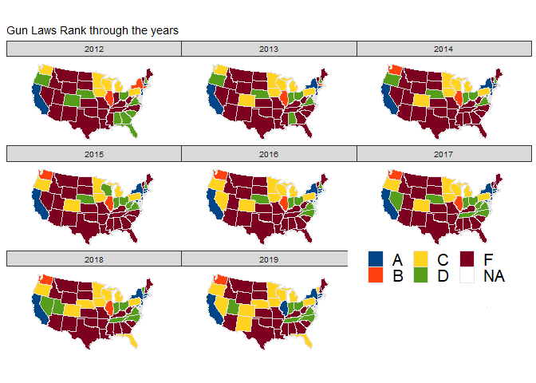<!-- -->

``` r
p0 <- ggplot(data = temp,
             mapping = aes(x = long, y = lat, group = group, fill = HomicideRate))

p1 <- p0 + geom_polygon(color = "gray90", size = 0.1) +
    coord_map(projection = "albers", lat0 = 39, lat1 = 45) 

p2 <- p1 + scale_fill_gradient(low = "white", high = "Red3") +
        labs(title = "Homicide Rate through the years") 
p3<-p2 + theme_map()+facet_wrap(temp$Year)
p3+theme(legend.position=c(.65, .22), legend.direction = "horizontal",legend.title = element_text(size = 18),legend.text = element_text(size = 16),legend.key.size = unit(1, "cm"),
  legend.key.width = unit(1,"cm"),legend.margin =margin(r=30,l=30,t=10,b=1)  )
```

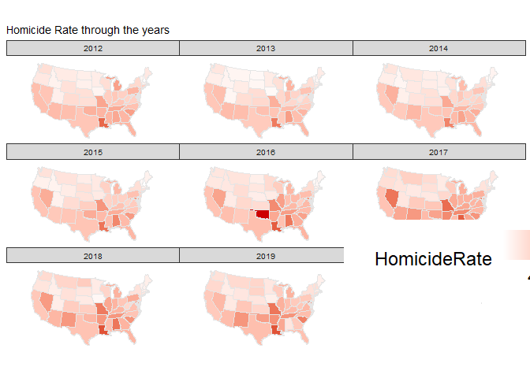<!-- -->

``` r
ggplot(df, aes(x = HomicideRate, y = State, group= State, fill = factor(stat(quantile)))) +
  stat_density_ridges(
    geom = "density_ridges_gradient",
    calc_ecdf = TRUE,
    quantiles = c(0.025, 0.975)
  ) +
  scale_fill_manual(
    name = "Probability", values = c("#FF0000A0", "#A0A0A0A0", "#0000FFA0"),
    labels = c("(0, 0.025]", "(0.025, 0.975]", "(0.975, 1]")
  ) +
  labs(title = 'Homicide Distribution by State') 
```

    ## Picking joint bandwidth of 0.423

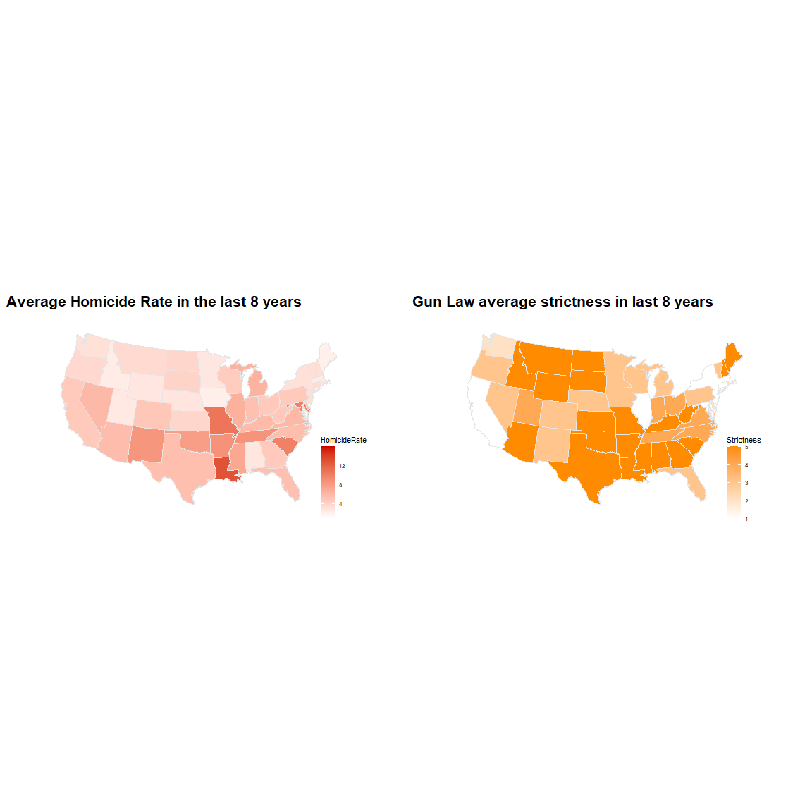<!-- -->

## Exploratory Data Analysis

``` r
knitr::opts_chunk$set(echo = TRUE,fig.width = 8.5,fig.height = 6)
temp<-df[ which(df$Year>2011), ]
ggplot(data=df[ which(df$Year>2011), ], aes(x=HomicideRate,fill=GunLawRank)) +
  geom_density(alpha=.6, na.rm=T) +
  labs(title = "Distribution of Homicide Rate by Gun Laws Rank")+
  facet_wrap(~GunLawRank)+
  theme_bw()+
  scale_fill_calc()
```

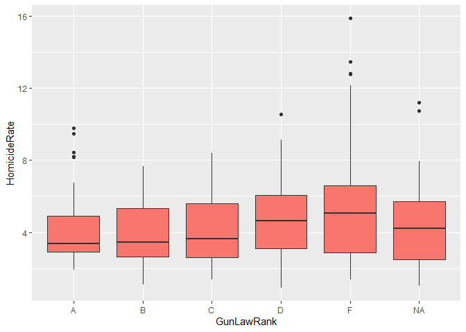<!-- -->

``` r
df %>%
  group_by(GunLawRank) %>%
  ggplot()+
  geom_boxplot(aes(x=GunLawRank,y=HomicideRate,fill="coral"))+
  guides(fill=FALSE)
```

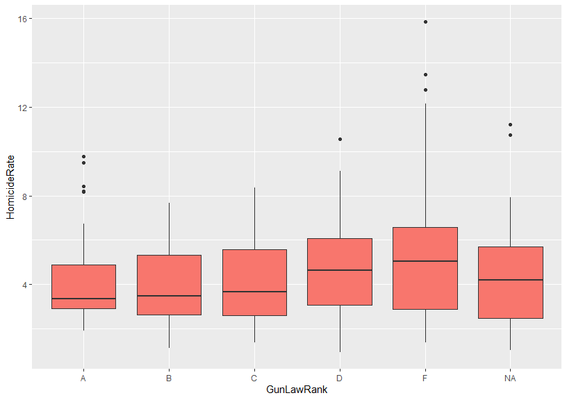<!-- -->

``` r
df %>%
  group_by(Region) %>%
  ggplot()+
  geom_boxplot(aes(x=Region,y=HomicideRate,fill="coral"))+
  guides(fill=FALSE)
```

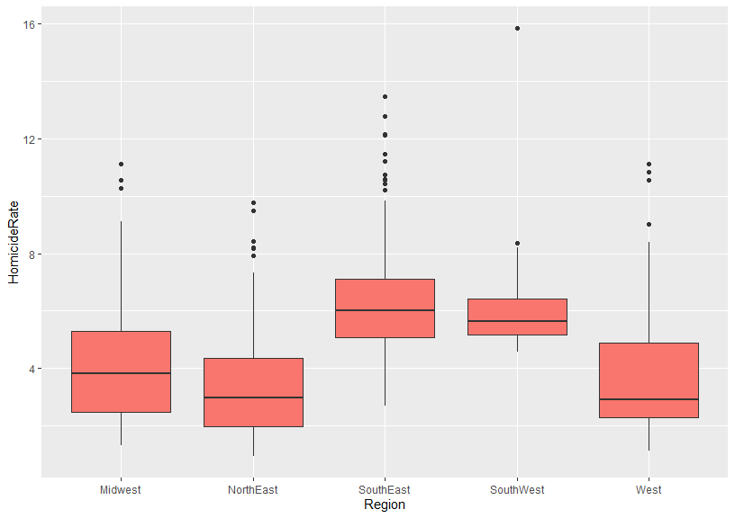<!-- -->

``` r
df %>%
  group_by(StateCode) %>%
  ggplot()+
  geom_boxplot(aes(x=StateCode,y=HomicideRate,fill="coral"))+
  guides(fill=FALSE)
```

<!-- -->

``` r
df %>%
  group_by(CannabisMedical) %>%
  ggplot()+
  geom_boxplot(aes(x=CannabisMedical,y=HomicideRate,fill="coral"))+
  guides(fill=FALSE)
```

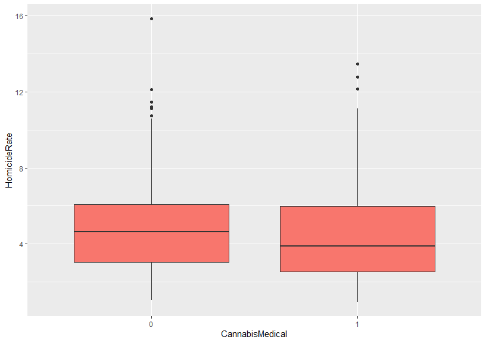<!-- -->

``` r
df %>%
  group_by(CannabisRecreational) %>%
  ggplot()+
  geom_boxplot(aes(x=CannabisRecreational,y=HomicideRate,fill="coral"))+
  guides(fill=FALSE)
```

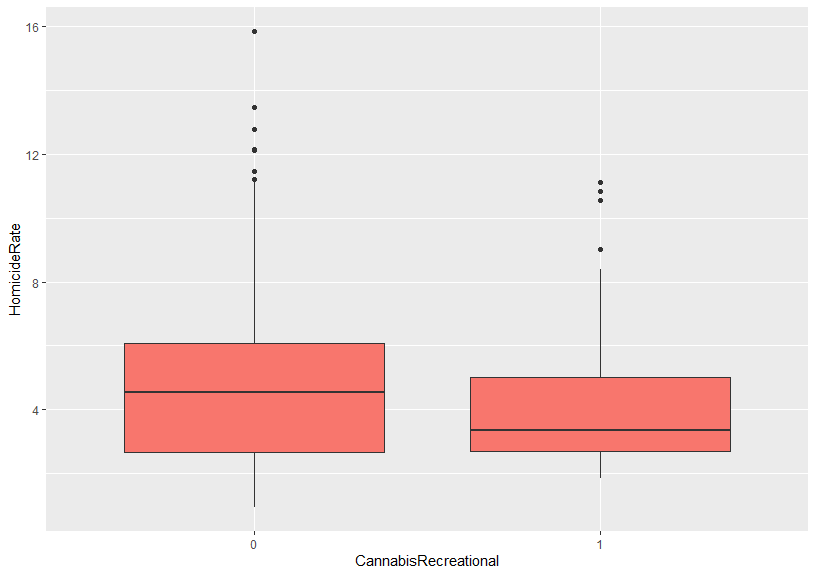<!-- -->

``` r
ggplot(data=df, aes(x=HomicideRate)) +
  geom_histogram(aes(y=..density..), col='black', fill='white') +
  geom_density(alpha=.6, fill="seagreen") +
  labs(title = "Distribution of Homicides: All States & Years")
```

    ## `stat_bin()` using `bins = 30`. Pick better value with `binwidth`.

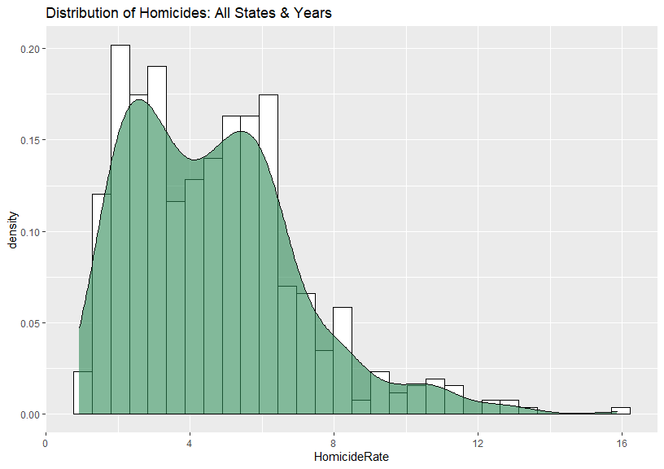<!-- -->

``` r
ggplot(data=df, aes(x=HomicideRate, group = CannabisMedical, fill = CannabisMedical)) +
  geom_density(alpha=.6, na.rm=T) +
  labs(title = "Distribution of Homicides: All by Medical Cannabis")
```

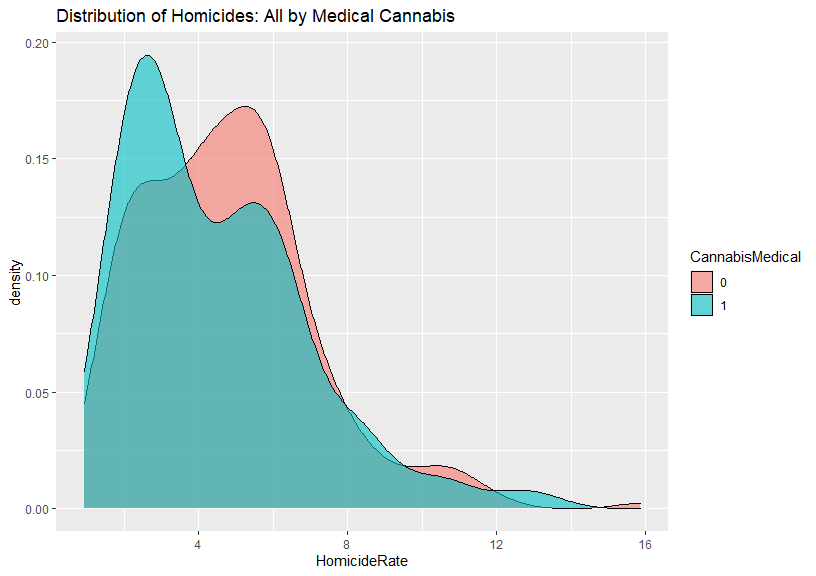<!-- -->

``` r
ggplot(data=df, aes(x=HomicideRate, group = CannabisRecreational, fill = CannabisRecreational)) +
  geom_density(alpha=.6, na.rm=T) +
  labs(title = "Distribution of Homicide Rate by Recreational Cannabis")
```

<!-- -->

``` r
ggplot(data=df, aes(x=HomicideRate, group = GunLawRank, fill = GunLawRank)) +
  geom_density(alpha=.6, na.rm=T) +
  labs(title = "Distribution of Homicide Rate by Gun Laws Rank")
```

<!-- -->

``` r
ggplot(df, aes(x=Year, y=HomicideRate)) +
  geom_point() +
  geom_smooth()+
  labs(title="Relationship Log Beds vs. NumHomicides/Population")
```

    ## `geom_smooth()` using method = 'loess' and formula 'y ~ x'

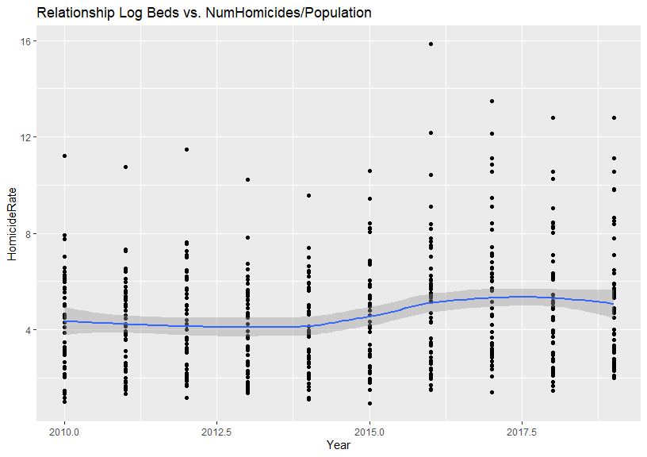<!-- -->

``` r
df2<-df %>% 
  group_by(Year) %>%                        
  summarise(MeanHomicide = mean(HomicideRate))  
df2$Year<-as.factor(df2$Year)
df2 %>%
  ggplot( aes(x=Year, y=MeanHomicide)) +
    geom_point(shape=21, color="black", fill="#69b3a2", size=6) +
    geom_line( color="grey") +
    theme_ipsum() +
    ggtitle("Trend in Average Homicide Rates")
```

    ## geom_path: Each group consists of only one observation. Do you need to
    ## adjust the group aesthetic?

    ## Warning in grid.Call(C_stringMetric, as.graphicsAnnot(x$label)): font
    ## family not found in Windows font database

    ## Warning in grid.Call(C_stringMetric, as.graphicsAnnot(x$label)): font
    ## family not found in Windows font database

    ## Warning in grid.Call(C_stringMetric, as.graphicsAnnot(x$label)): font
    ## family not found in Windows font database

    ## Warning in grid.Call(C_textBounds, as.graphicsAnnot(x$label), x$x, x$y, :
    ## font family not found in Windows font database

    ## Warning in grid.Call(C_textBounds, as.graphicsAnnot(x$label), x$x, x$y, :
    ## font family not found in Windows font database

    ## Warning in grid.Call(C_textBounds, as.graphicsAnnot(x$label), x$x, x$y, :
    ## font family not found in Windows font database

    ## Warning in grid.Call(C_textBounds, as.graphicsAnnot(x$label), x$x, x$y, :
    ## font family not found in Windows font database

    ## Warning in grid.Call(C_textBounds, as.graphicsAnnot(x$label), x$x, x$y, :
    ## font family not found in Windows font database

    ## Warning in grid.Call(C_textBounds, as.graphicsAnnot(x$label), x$x, x$y, :
    ## font family not found in Windows font database

    ## Warning in grid.Call(C_textBounds, as.graphicsAnnot(x$label), x$x, x$y, :
    ## font family not found in Windows font database

    ## Warning in grid.Call(C_textBounds, as.graphicsAnnot(x$label), x$x, x$y, :
    ## font family not found in Windows font database

    ## Warning in grid.Call(C_textBounds, as.graphicsAnnot(x$label), x$x, x$y, :
    ## font family not found in Windows font database

    ## Warning in grid.Call(C_textBounds, as.graphicsAnnot(x$label), x$x, x$y, :
    ## font family not found in Windows font database

    ## Warning in grid.Call.graphics(C_text, as.graphicsAnnot(x$label), x$x,
    ## x$y, : font family not found in Windows font database

    ## Warning in grid.Call(C_textBounds, as.graphicsAnnot(x$label), x$x, x$y, :
    ## font family not found in Windows font database

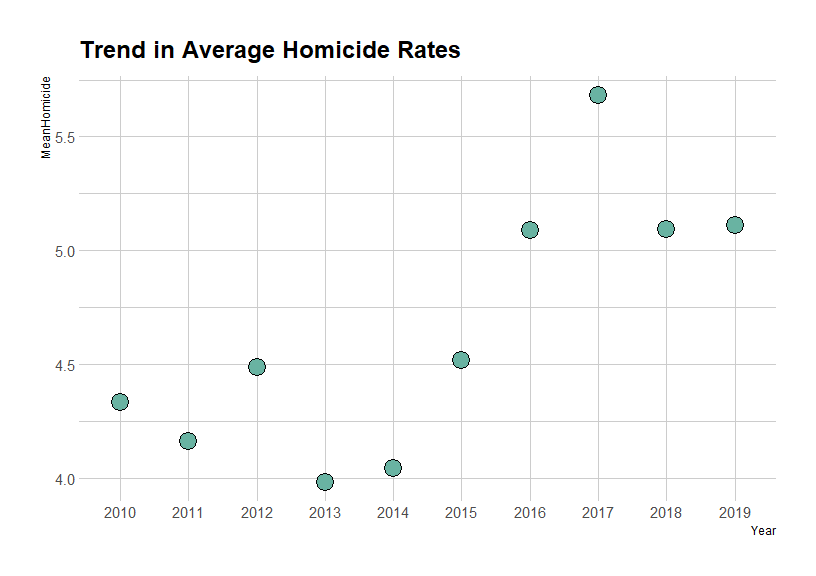<!-- -->

``` r
ggplot(df, aes(x=HomicideRate)) + geom_histogram(color="gold",fill="seagreen")+ggtitle("Histogram of Homicide Rate")+xlab("Homicide Rate")
```

    ## `stat_bin()` using `bins = 30`. Pick better value with `binwidth`.

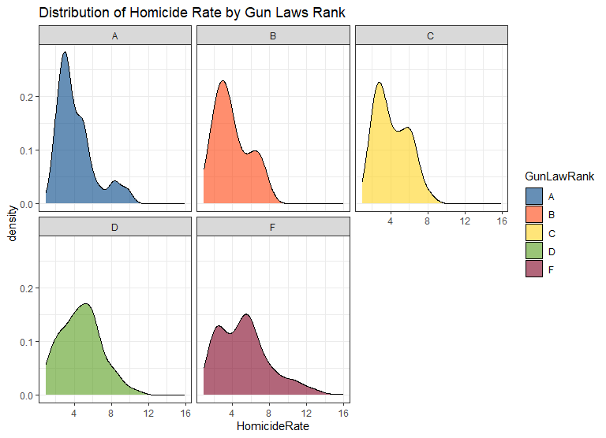<!-- -->

``` r
ggplot(df, aes(x=log(HomicideRate))) + geom_histogram(color="gold",fill="seagreen")+ggtitle("Histogram of Log Homicide Rate")+xlab("Log of Homicide Rate")
```

    ## `stat_bin()` using `bins = 30`. Pick better value with `binwidth`.

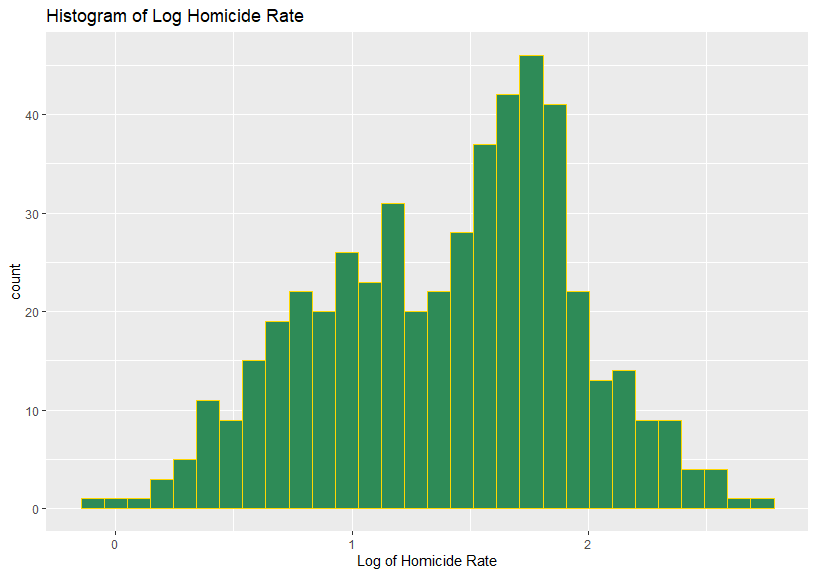<!-- -->

``` r
reg1<-lm(formula = log(HomicideRate)~MentalIllness+GDP+LawOfficers+LawCover+AlcoholUsers+DrugUsers+`Big Cities`+Education+GunLawRank+Black+GiniIndex+Year+UnenemploymentRate+TotalWeapons,data = df)

summary(reg1)
```

    ## 
    ## Call:
    ## lm(formula = log(HomicideRate) ~ MentalIllness + GDP + LawOfficers + 
    ##     LawCover + AlcoholUsers + DrugUsers + `Big Cities` + Education + 
    ##     GunLawRank + Black + GiniIndex + Year + UnenemploymentRate + 
    ##     TotalWeapons, data = df)
    ## 
    ## Residuals:
    ##      Min       1Q   Median       3Q      Max 
    ## -0.81010 -0.21559  0.01399  0.22158  1.18756 
    ## 
    ## Coefficients:
    ##                            Estimate       Std. Error t value
    ## (Intercept)        -299.72751372179   35.59733011735  -8.420
    ## MentalIllness        -0.01109756145    0.00604151326  -1.837
    ## GDP                  -0.00060301178    0.00289880029  -0.208
    ## LawOfficers           0.01069970844    0.00413911055   2.585
    ## LawCover             -0.00098042041    0.00051024273  -1.921
    ## AlcoholUsers          0.00330992195    0.00153437805   2.157
    ## DrugUsers            -0.00209085247    0.00692834109  -0.302
    ## `Big Cities`          0.05812273274    0.02853993708   2.037
    ## Education            -0.03818739219    0.01048315293  -3.643
    ## GunLawRankB           0.00419255850    0.09550751914   0.044
    ## GunLawRankC           0.16055713028    0.11104725785   1.446
    ## GunLawRankD           0.19179994549    0.11675846378   1.643
    ## GunLawRankF           0.22284721973    0.11666616698   1.910
    ## Black                 0.02614365102    0.00277003006   9.438
    ## GiniIndex            -0.21025122004    1.51758399148  -0.139
    ## Year                  0.15062897925    0.01765022577   8.534
    ## UnenemploymentRate    0.13515468790    0.02170130215   6.228
    ## TotalWeapons         -0.00000003754    0.00000035044  -0.107
    ##                                Pr(>|t|)    
    ## (Intercept)        0.000000000000001956 ***
    ## MentalIllness                  0.067283 .  
    ## GDP                            0.835363    
    ## LawOfficers                    0.010241 *  
    ## LawCover                       0.055683 .  
    ## AlcoholUsers                   0.031840 *  
    ## DrugUsers                      0.763041    
    ## `Big Cities`                   0.042633 *  
    ## Education                      0.000321 ***
    ## GunLawRankB                    0.965017    
    ## GunLawRankC                    0.149335    
    ## GunLawRankD                    0.101562    
    ## GunLawRankF                    0.057135 .  
    ## Black              < 0.0000000000000002 ***
    ## GiniIndex                      0.889910    
    ## Year               0.000000000000000896 ***
    ## UnenemploymentRate 0.000000001717979177 ***
    ## TotalWeapons                   0.914770    
    ## ---
    ## Signif. codes:  0 '***' 0.001 '**' 0.01 '*' 0.05 '.' 0.1 ' ' 1
    ## 
    ## Residual standard error: 0.3343 on 281 degrees of freedom
    ##   (201 observations deleted due to missingness)
    ## Multiple R-squared:  0.6394, Adjusted R-squared:  0.6176 
    ## F-statistic: 29.31 on 17 and 281 DF,  p-value: < 0.00000000000000022

``` r
plot(reg1)
```

<!-- -->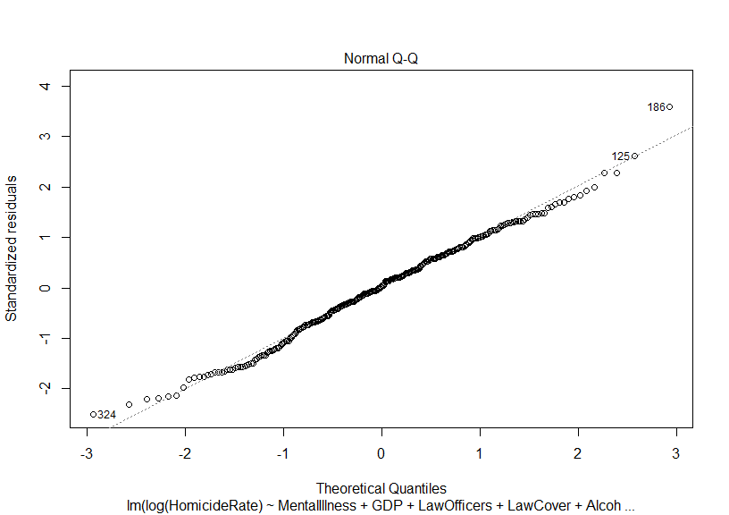<!-- -->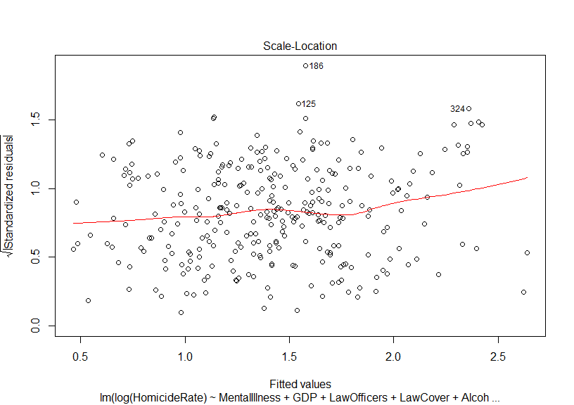<!-- -->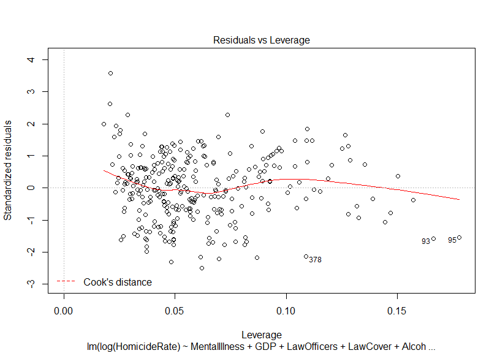<!-- -->

``` r
#Checking for linearity
#plot(reg1$fitted.values,dff$HomicideRate,pch=1,main="Predicted Values vs Actual Price",ylab = "Predicted Price Sold",xlab = "Actual Price Sold")
#abline(0,1,col="red3",lwd=3)

#checking for normality
qqnorm(reg1$residuals,pch=20,main="Checking for Normality Plot")
qqline(reg1$residuals,lwd=3,col="red3")
```

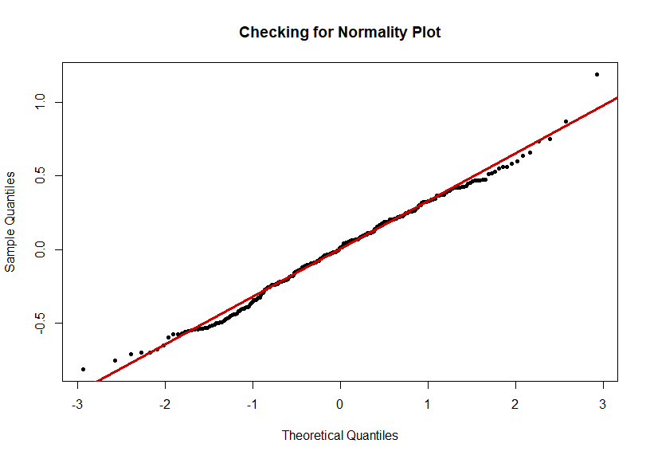<!-- -->

``` r
#Checking for equality of variances
#plot(df$HomicideRate,rstandard(reg1),pch=20,main="Equality of Variances")
#abline(0,0,col="red",lwd=3)

#Checking for leverage points
lev=hat(model.matrix(reg1))
plot(lev,pch=20,ylim=c(0,.3),main="Leverage Points")
abline(3*mean(lev),0,col="red",lwd=3)
```

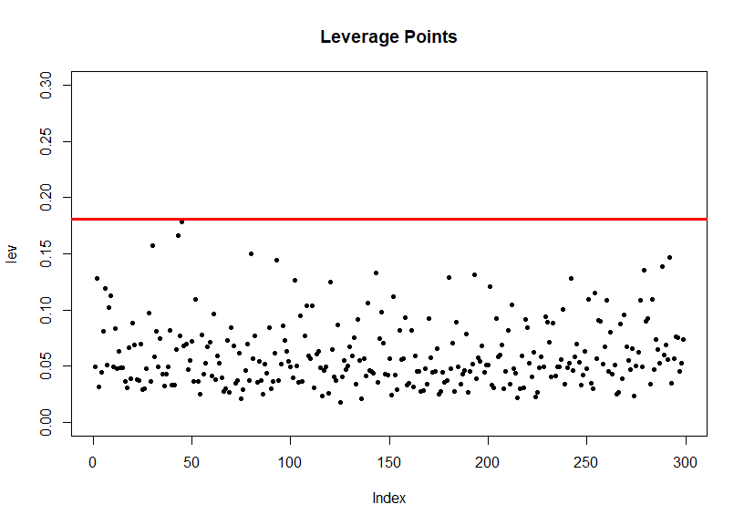<!-- -->

``` r
colSums(is.na(df))
```

    ##                     State                 StateCode 
    ##                         0                         0 
    ##                      Year              NumHomicides 
    ##                         0                         0 
    ##              NumDrugUsers           NumAlcoholUsers 
    ##                        50                         0 
    ##    LawEnforcementOfficers                Population 
    ##                         2                         0 
    ##                   RealGDP          RealGDPperCapita 
    ##                         0                         0 
    ##                 GiniIndex      SeriousMentalIllness 
    ##                         0                        50 
    ##        UnenemploymentRate         ViolentCrime...14 
    ##                         0                         0 
    ##        PropertyCrime...15 SubAbuseInpatientCareBeds 
    ##                         0                       150 
    ##           CannabisMedical      CannabisRecreational 
    ##                         0                         0 
    ##                GunLawRank                     Black 
    ##                       100                         0 
    ##                  Hispanic                      Area 
    ##                         0                         0 
    ##              Adults 19-25              Adults 26-34 
    ##                         0                         0 
    ##                Big Cities                 Education 
    ##                         0                        50 
    ##                    Region           AnyOtherWeapon1 
    ##                         0                        50 
    ##        DestructiveDevice2               Machinegun3 
    ##                        50                        50 
    ##                 Silencer4       ShortBarreledRifle5 
    ##                        50                        50 
    ##     ShortBarreledShotgun6              TotalWeapons 
    ##                        50                        50 
    ##        MurderNSlaugtherVC                    RapeVC 
    ##                         0                         0 
    ##                 RobberyVC       AggravatedAssaultVC 
    ##                         0                         0 
    ##         ViolentCrime...39        PropertyCrime...40 
    ##                         0                         0 
    ##              HomicideRate                 DrugUsers 
    ##                         0                        50 
    ##              AlcoholUsers               LawOfficers 
    ##                         0                         2 
    ##                  LawCover                       GDP 
    ##                         2                         0 
    ##             MentalIllness 
    ##                        50

``` r
which(df$HomicideRate<1)
```

    ## [1] 229

``` r
reg2<-lmer(formula = log(HomicideRate)~MentalIllness+GDP+LawOfficers+LawCover+AlcoholUsers+DrugUsers+df$`Big Cities`+Education+GunLawRank+Black+GiniIndex+(1|State)+Year+UnenemploymentRate,data = df)
```

    ## Warning: Some predictor variables are on very different scales: consider
    ## rescaling

``` r
summary(reg2)
```

    ## Linear mixed model fit by REML ['lmerMod']
    ## Formula: 
    ## log(HomicideRate) ~ MentalIllness + GDP + LawOfficers + LawCover +  
    ##     AlcoholUsers + DrugUsers + df$`Big Cities` + Education +  
    ##     GunLawRank + Black + GiniIndex + (1 | State) + Year + UnenemploymentRate
    ##    Data: df
    ## 
    ## REML criterion at convergence: 64.9
    ## 
    ## Scaled residuals: 
    ##     Min      1Q  Median      3Q     Max 
    ## -3.0774 -0.5337  0.0302  0.5521  4.1806 
    ## 
    ## Random effects:
    ##  Groups   Name        Variance Std.Dev.
    ##  State    (Intercept) 0.11383  0.3374  
    ##  Residual             0.03148  0.1774  
    ## Number of obs: 299, groups:  State, 50
    ## 
    ## Fixed effects:
    ##                        Estimate   Std. Error t value
    ## (Intercept)        -128.7139326   26.8096288  -4.801
    ## MentalIllness        -0.0020339    0.0048749  -0.417
    ## GDP                  -0.0055371    0.0045912  -1.206
    ## LawOfficers           0.0031881    0.0031717   1.005
    ## LawCover             -0.0010258    0.0007839  -1.309
    ## AlcoholUsers          0.0045541    0.0008680   5.247
    ## DrugUsers             0.0029691    0.0052985   0.560
    ## df$`Big Cities`       0.0774630    0.0501244   1.545
    ## Education            -0.0028947    0.0108794  -0.266
    ## GunLawRankB          -0.0301374    0.0790393  -0.381
    ## GunLawRankC           0.1583044    0.1213419   1.305
    ## GunLawRankD           0.1986909    0.1364582   1.456
    ## GunLawRankF           0.1620408    0.1382407   1.172
    ## Black                 0.0302782    0.0060695   4.989
    ## GiniIndex             3.8367399    3.0515232   1.257
    ## Year                  0.0635041    0.0136228   4.662
    ## UnenemploymentRate    0.0458186    0.0176872   2.590

    ## 
    ## Correlation matrix not shown by default, as p = 17 > 12.
    ## Use print(x, correlation=TRUE)  or
    ##     vcov(x)        if you need it

    ## fit warnings:
    ## Some predictor variables are on very different scales: consider rescaling

``` r
AIC(reg1)
```

    ## [1] 212.663

``` r
AIC(reg2)
```

    ## [1] 102.9321

``` r
reg3<-lm(formula = HomicideRate~MentalIllness+GDP+LawOfficers+LawCover+AlcoholUsers+DrugUsers+`Big Cities`+Education+GunLawRank+Black+GiniIndex+Year+Region,data = Y18,na.action = na.exclude)
summary(reg3)
```

    ## 
    ## Call:
    ## lm(formula = HomicideRate ~ MentalIllness + GDP + LawOfficers + 
    ##     LawCover + AlcoholUsers + DrugUsers + `Big Cities` + Education + 
    ##     GunLawRank + Black + GiniIndex + Year + Region, data = Y18, 
    ##     na.action = na.exclude)
    ## 
    ## Residuals:
    ##     Min      1Q  Median      3Q     Max 
    ## -3.6975 -1.2010 -0.0859  0.7858  4.9249 
    ## 
    ## Coefficients: (1 not defined because of singularities)
    ##                  Estimate Std. Error t value Pr(>|t|)   
    ## (Intercept)     -6.814983  25.526081  -0.267  0.79125   
    ## MentalIllness    0.018481   0.098837   0.187  0.85289   
    ## GDP             -0.024881   0.052746  -0.472  0.64044   
    ## LawOfficers      0.194941   0.093074   2.094  0.04449 * 
    ## LawCover        -0.006438   0.008434  -0.763  0.45105   
    ## AlcoholUsers    -0.089637   0.066732  -1.343  0.18894   
    ## DrugUsers        0.218334   0.126399   1.727  0.09406 . 
    ## `Big Cities`     0.100954   0.385295   0.262  0.79504   
    ## Education        0.019863   0.204729   0.097  0.92334   
    ## GunLawRankB      0.358034   1.676314   0.214  0.83227   
    ## GunLawRankC      0.324346   1.939254   0.167  0.86826   
    ## GunLawRankD      0.162084   1.947833   0.083  0.93422   
    ## GunLawRankF      1.193395   2.032236   0.587  0.56130   
    ## Black            0.188825   0.054905   3.439  0.00169 **
    ## GiniIndex        8.605268  27.359466   0.315  0.75523   
    ## Year                   NA         NA      NA       NA   
    ## RegionNorthEast -2.192907   1.333525  -1.644  0.11019   
    ## RegionSouthEast -2.007416   1.308420  -1.534  0.13512   
    ## RegionSouthWest  1.015076   1.765186   0.575  0.56941   
    ## RegionWest       0.132524   1.178232   0.112  0.91117   
    ## ---
    ## Signif. codes:  0 '***' 0.001 '**' 0.01 '*' 0.05 '.' 0.1 ' ' 1
    ## 
    ## Residual standard error: 2.098 on 31 degrees of freedom
    ## Multiple R-squared:  0.6049, Adjusted R-squared:  0.3755 
    ## F-statistic: 2.637 on 18 and 31 DF,  p-value: 0.008592
