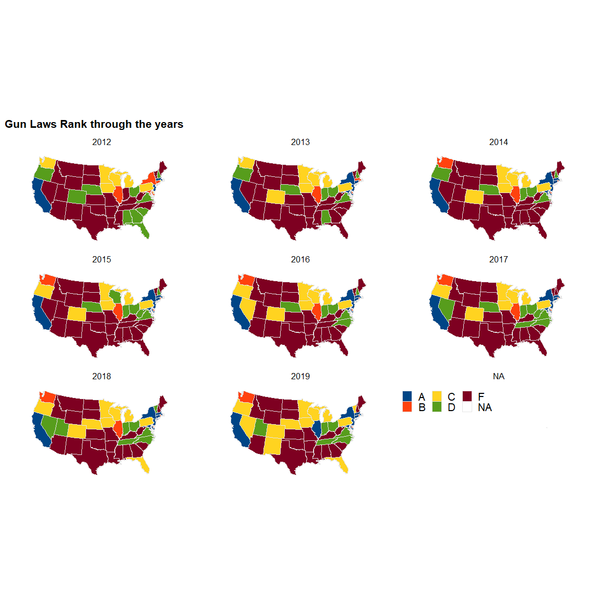
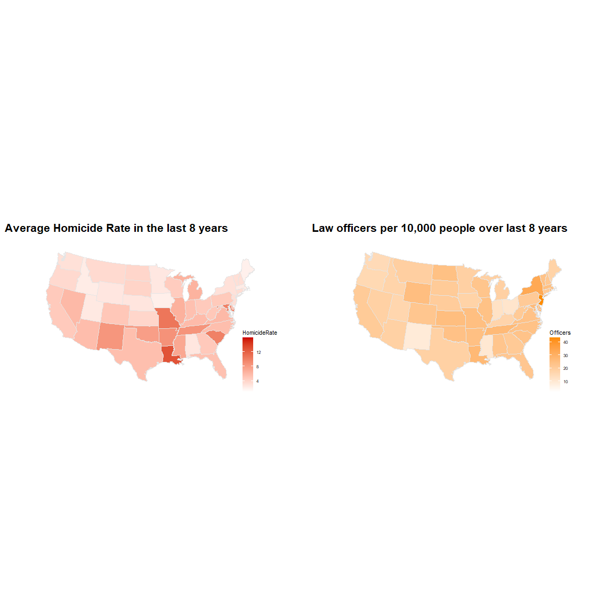
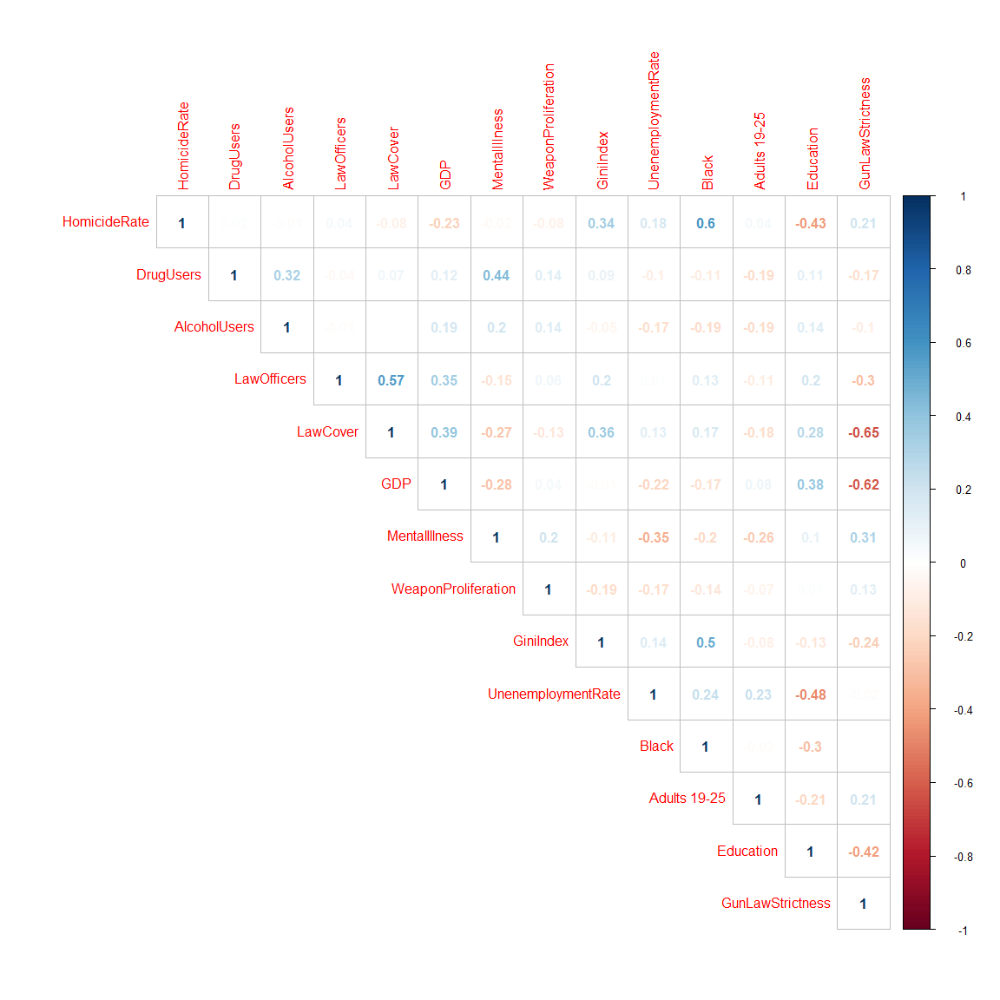

Hammad Homicide
================

## Updating Libraries

``` r
library(rio)
library(formattable)
library(dplyr)
library(tidyverse)
library(readxl)
library(corrplot)
library(stargazer)
library(car)
library(PerformanceAnalytics)
library(tidyr)
library(tm)
library(MASS)
library(AER)
library(ggplot2)
library(lubridate)
library(lattice)
library(lme4)
library(MuMIn)
library("ggridges")
library("hrbrthemes")
library(ggthemes)
library("maps")
library("mapproj")
library(cowplot)
options(scipen = 999)
```

## Importing Data

``` r
df<-read_xlsx("data/HomicideData_Hammad.xlsx",sheet = "HomicideData")
```

    ## New names:
    ## * ViolentCrime -> ViolentCrime...14
    ## * PropertyCrime -> PropertyCrime...15
    ## * ViolentCrime -> ViolentCrime...39
    ## * PropertyCrime -> PropertyCrime...40

## Checking for nulls

``` r
colSums(is.na(df))
```

    ##                     State                 StateCode 
    ##                         0                         0 
    ##                      Year              NumHomicides 
    ##                         0                         0 
    ##              NumDrugUsers           NumAlcoholUsers 
    ##                        51                         0 
    ##    LawEnforcementOfficers                Population 
    ##                         2                         0 
    ##                   RealGDP          RealGDPperCapita 
    ##                         0                         0 
    ##                 GiniIndex      SeriousMentalIllness 
    ##                         0                        51 
    ##        UnenemploymentRate         ViolentCrime...14 
    ##                         0                         0 
    ##        PropertyCrime...15 SubAbuseInpatientCareBeds 
    ##                         0                       153 
    ##           CannabisMedical      CannabisRecreational 
    ##                         0                         0 
    ##                GunLawRank                     Black 
    ##                         8                         0 
    ##                  Hispanic                      Area 
    ##                         0                         0 
    ##              Adults 19-25              Adults 26-34 
    ##                         0                         0 
    ##                Big Cities                 Education 
    ##                         0                        60 
    ##                    Region           AnyOtherWeapon1 
    ##                        10                        51 
    ##        DestructiveDevice2               Machinegun3 
    ##                        51                        51 
    ##                 Silencer4       ShortBarreledRifle5 
    ##                        51                        51 
    ##     ShortBarreledShotgun6              TotalWeapons 
    ##                        51                        51 
    ##        MurderNSlaugtherVC                    RapeVC 
    ##                        10                        10 
    ##                 RobberyVC       AggravatedAssaultVC 
    ##                        10                        10 
    ##         ViolentCrime...39        PropertyCrime...40 
    ##                         0                         0 
    ##          GunLawStrictness 
    ##                       110

``` r
str(df)
```

    ## tibble [510 x 41] (S3: tbl_df/tbl/data.frame)
    ##  $ State                    : chr [1:510] "ALABAMA" "ALASKA" "ARIZONA" "ARKANSAS" ...
    ##  $ StateCode                : chr [1:510] "AL" "AK" "AZ" "AR" ...
    ##  $ Year                     : num [1:510] 2019 2019 2019 2019 2019 ...
    ##  $ NumHomicides             : num [1:510] 128 78 398 253 1818 ...
    ##  $ NumDrugUsers             : num [1:510] 125000 22000 191000 65000 1204000 ...
    ##  $ NumAlcoholUsers          : num [1:510] 219000 41000 289000 122000 2079000 ...
    ##  $ LawEnforcementOfficers   : num [1:510] 10804 1271 13029 7138 79616 ...
    ##  $ Population               : num [1:510] 4767100 701700 7098000 2922500 38642700 ...
    ##  $ RealGDP                  : num [1:510] 201985834440 48150509075 327683930943 115939796370 2773617529880 ...
    ##  $ RealGDPperCapita         : num [1:510] 42371 68620 46166 39671 71776 ...
    ##  $ GiniIndex                : num [1:510] 0.479 0.428 0.466 0.476 0.489 ...
    ##  $ SeriousMentalIllness     : num [1:510] 210000 31000 305000 125000 1364000 ...
    ##  $ UnenemploymentRate       : num [1:510] 2.7 6.1 4.5 3.5 3.9 2.5 3.8 4 5.3 2.9 ...
    ##  $ ViolentCrime...14        : num [1:510] 25046 6343 33141 17643 174331 ...
    ##  $ PropertyCrime...15       : num [1:510] 131133 21294 177638 86250 921114 ...
    ##  $ SubAbuseInpatientCareBeds: num [1:510] 1109 346 1500 546 13593 ...
    ##  $ CannabisMedical          : num [1:510] 0 1 1 1 1 1 1 1 1 1 ...
    ##  $ CannabisRecreational     : num [1:510] 0 1 0 0 1 1 0 0 1 0 ...
    ##  $ GunLawRank               : chr [1:510] "F" "F" "F" "F" ...
    ##  $ Black                    : num [1:510] 26.5 2.2 4.3 15.2 5.3 3.8 10 21.8 45 15 ...
    ##  $ Hispanic                 : num [1:510] 4.4 7 31.8 7.8 39.5 21.8 16.9 9.7 11.2 26.6 ...
    ##  $ Area                     : num [1:510] 51609 589757 113909 53104 158693 ...
    ##  $ Adults 19-25             : num [1:510] 8.7 9.3 9.3 8.7 9.2 8.9 8.6 8.1 9 8 ...
    ##  $ Adults 26-34             : num [1:510] 11.5 13.9 12.1 11.5 13.7 14.1 11.3 11.8 21.6 11.4 ...
    ##  $ Big Cities               : num [1:510] 0 0 1 0 4 1 0 0 1 1 ...
    ##  $ Education                : num [1:510] NA NA NA NA NA NA NA NA NA NA ...
    ##  $ Region                   : chr [1:510] "SouthEast" "West" "SouthWest" "SouthEast" ...
    ##  $ AnyOtherWeapon1          : num [1:510] 1228 332 651 1365 4113 ...
    ##  $ DestructiveDevice2       : num [1:510] 80726 5346 70179 108692 299766 ...
    ##  $ Machinegun3              : num [1:510] 29757 1674 5657 17841 30173 ...
    ##  $ Silencer4                : num [1:510] 46902 9250 26804 55099 15131 ...
    ##  $ ShortBarreledRifle5      : num [1:510] 7214 2503 4279 19124 13354 ...
    ##  $ ShortBarreledShotgun6    : num [1:510] 2438 1415 1231 2696 14129 ...
    ##  $ TotalWeapons             : num [1:510] 168265 20520 108801 204817 376666 ...
    ##  $ MurderNSlaugtherVC       : num [1:510] 358 69 365 242 1690 ...
    ##  $ RapeVC                   : num [1:510] 2068 1088 3662 2331 14799 ...
    ##  $ RobberyVC                : num [1:510] 3941 826 6410 1557 52301 ...
    ##  $ AggravatedAssaultVC      : num [1:510] 18679 4360 22704 13513 105541 ...
    ##  $ ViolentCrime...39        : num [1:510] 25046 6343 33141 17643 174331 ...
    ##  $ PropertyCrime...40       : num [1:510] 131133 21294 177638 86250 921114 ...
    ##  $ GunLawStrictness         : num [1:510] 5 5 5 5 1 3 1 2 NA 3 ...

## Dropping Columbia from the Model

``` r
df<-df[ which(df$State!="DISTRICT OF COLUMBIA"), ]
```

## Converting to factor and releveling

``` r
df$GunLawRank<-as.factor(df$GunLawRank)
df$StateCode<-as.factor(df$StateCode)
df$State<-as.factor(df$State)
df$CannabisMedical<-as.factor(df$CannabisMedical)
df$CannabisRecreational<-as.factor(df$CannabisRecreational)
df$Region<-as.factor(df$Region)
```

## Calculating Homicide Rate

``` r
df$HomicideRate<-(df$NumHomicides/df$Population)*100000
glimpse(df)
```

    ## Rows: 500
    ## Columns: 42
    ## $ State                     <fct> ALABAMA, ALASKA, ARIZONA, ARKANSAS, ...
    ## $ StateCode                 <fct> AL, AK, AZ, AR, CA, CO, CT, DE, FL, ...
    ## $ Year                      <dbl> 2019, 2019, 2019, 2019, 2019, 2019, ...
    ## $ NumHomicides              <dbl> 128, 78, 398, 253, 1818, 275, 116, 5...
    ## $ NumDrugUsers              <dbl> 125000, 22000, 191000, 65000, 120400...
    ## $ NumAlcoholUsers           <dbl> 219000, 41000, 289000, 122000, 20790...
    ## $ LawEnforcementOfficers    <dbl> 10804, 1271, 13029, 7138, 79616, 124...
    ## $ Population                <dbl> 4767100, 701700, 7098000, 2922500, 3...
    ## $ RealGDP                   <dbl> 201985834440, 48150509075, 327683930...
    ## $ RealGDPperCapita          <dbl> 42370.80, 68619.79, 46165.67, 39671....
    ## $ GiniIndex                 <dbl> 0.4791, 0.4284, 0.4664, 0.4765, 0.48...
    ## $ SeriousMentalIllness      <dbl> 210000, 31000, 305000, 125000, 13640...
    ## $ UnenemploymentRate        <dbl> 2.7, 6.1, 4.5, 3.5, 3.9, 2.5, 3.8, 4...
    ## $ ViolentCrime...14         <dbl> 25046, 6343, 33141, 17643, 174331, 2...
    ## $ PropertyCrime...15        <dbl> 131133, 21294, 177638, 86250, 921114...
    ## $ SubAbuseInpatientCareBeds <dbl> 1109, 346, 1500, 546, 13593, 1135, 1...
    ## $ CannabisMedical           <fct> 0, 1, 1, 1, 1, 1, 1, 1, 1, 0, 1, 0, ...
    ## $ CannabisRecreational      <fct> 0, 1, 0, 0, 1, 1, 0, 0, 0, 0, 0, 0, ...
    ## $ GunLawRank                <fct> F, F, F, F, A, C, A, B, C, F, A, F, ...
    ## $ Black                     <dbl> 26.5, 2.2, 4.3, 15.2, 5.3, 3.8, 10.0...
    ## $ Hispanic                  <dbl> 4.4, 7.0, 31.8, 7.8, 39.5, 21.8, 16....
    ## $ Area                      <dbl> 51609, 589757, 113909, 53104, 158693...
    ## $ `Adults 19-25`            <dbl> 8.7, 9.3, 9.3, 8.7, 9.2, 8.9, 8.6, 8...
    ## $ `Adults 26-34`            <dbl> 11.5, 13.9, 12.1, 11.5, 13.7, 14.1, ...
    ## $ `Big Cities`              <dbl> 0, 0, 1, 0, 4, 1, 0, 0, 1, 0, 0, 0, ...
    ## $ Education                 <dbl> NA, NA, NA, NA, NA, NA, NA, NA, NA, ...
    ## $ Region                    <fct> SouthEast, West, SouthWest, SouthEas...
    ## $ AnyOtherWeapon1           <dbl> 1228, 332, 651, 1365, 4113, 1045, 97...
    ## $ DestructiveDevice2        <dbl> 80726, 5346, 70179, 108692, 299766, ...
    ## $ Machinegun3               <dbl> 29757, 1674, 5657, 17841, 30173, 737...
    ## $ Silencer4                 <dbl> 46902, 9250, 26804, 55099, 15131, 41...
    ## $ ShortBarreledRifle5       <dbl> 7214, 2503, 4279, 19124, 13354, 1000...
    ## $ ShortBarreledShotgun6     <dbl> 2438, 1415, 1231, 2696, 14129, 1929,...
    ## $ TotalWeapons              <dbl> 168265, 20520, 108801, 204817, 37666...
    ## $ MurderNSlaugtherVC        <dbl> 358, 69, 365, 242, 1690, 218, 104, 4...
    ## $ RapeVC                    <dbl> 2068, 1088, 3662, 2331, 14799, 3872,...
    ## $ RobberyVC                 <dbl> 3941, 826, 6410, 1557, 52301, 3663, ...
    ## $ AggravatedAssaultVC       <dbl> 18679, 4360, 22704, 13513, 105541, 1...
    ## $ ViolentCrime...39         <dbl> 25046, 6343, 33141, 17643, 174331, 2...
    ## $ PropertyCrime...40        <dbl> 131133, 21294, 177638, 86250, 921114...
    ## $ GunLawStrictness          <dbl> 5, 5, 5, 5, 1, 3, 1, 2, 3, 5, 1, 5, ...
    ## $ HomicideRate              <dbl> 2.685071, 11.115861, 5.607213, 8.656...

## Scaling all numerical variables according to population for easier interpretation

``` r
df$DrugUsers<-(df$NumDrugUsers/df$Population)*1000
df$AlcoholUsers<-(df$NumAlcoholUsers/df$Population)*1000
df$LawOfficers<-(df$LawEnforcementOfficers/df$Population)*10000
df$LawCover<-(df$LawEnforcementOfficers/df$Area)*100
df$GDP<-df$RealGDPperCapita/1000
df$MentalIllness<-(df$SeriousMentalIllness/df$Population)*1000
df$WeaponProliferation<-df$TotalWeapons/df$Population*1000
summary(df$WeaponProliferation)
```

    ##     Min.  1st Qu.   Median     Mean  3rd Qu.     Max.     NA's 
    ##   0.8094   8.3914  12.5641  21.7993  19.5332 596.8283       50

## Creating values for Mapping

``` r
US <- map_data("state")
US$region<-toupper(US$region)
US$State<-US$region
head(US)
```

    ##        long      lat group order  region subregion   State
    ## 1 -87.46201 30.38968     1     1 ALABAMA      <NA> ALABAMA
    ## 2 -87.48493 30.37249     1     2 ALABAMA      <NA> ALABAMA
    ## 3 -87.52503 30.37249     1     3 ALABAMA      <NA> ALABAMA
    ## 4 -87.53076 30.33239     1     4 ALABAMA      <NA> ALABAMA
    ## 5 -87.57087 30.32665     1     5 ALABAMA      <NA> ALABAMA
    ## 6 -87.58806 30.32665     1     6 ALABAMA      <NA> ALABAMA

``` r
temp<-left_join(US,df[ which(df$Year>2011), ],by="State")
```

## Creating data sets for individual years

``` r
Y19<-df %>%
  filter(Year=="2019")

Y18<-df %>%
  filter(Year=="2018")

Y17<-df %>%
  filter(Year=="2017")

Y16<-df %>%
  filter(Year=="2016")

Y15<-df %>%
  filter(Year=="2015")

Y14<-df %>%
  filter(Year=="2014")

Y13<-df %>%
  filter(Year=="2013")

Y12<-df %>%
  filter(Year=="2012")

Y11<-df %>%
  filter(Year=="2011")

Y10<-df %>%
  filter(Year=="2010")
```

``` r
knitr::opts_chunk$set(echo = TRUE,fig.width = 12,fig.height = 12)
```

## Pattern of Homicide Rate with Gun Laws Rank

``` r
p0 <- ggplot(data = temp,
             mapping = aes(x = long, y = lat,
                           group = group, fill = GunLawRank))
p1 <- p0 + geom_polygon(color = "gray90", size = 0.1) +
    coord_map(projection = "albers", lat0 = 39, lat1 = 45) 
p2 <- p1 + scale_fill_calc() +
    labs(title = "Gun Laws Rank through the years", fill = NULL)
p3<-p2 + theme_map()
p4<-p3+facet_wrap(temp$Year)
p5<-p4+theme(legend.position=c(.65, .24), legend.direction = "horizontal",legend.title = element_text(size = 18),legend.text = element_text(size = 16),legend.key.size = unit(0.5, "cm"),
  legend.key.width = unit(0.5,"cm"),legend.margin =margin(r=30,l=10,t=1,b=1)  )
p5
```

<!-- -->

``` r
p0 <- ggplot(data = temp,
             mapping = aes(x = long, y = lat, group = group, fill = HomicideRate))

p1 <- p0 + geom_polygon(color = "gray90", size = 0.1) +
    coord_map(projection = "albers", lat0 = 39, lat1 = 45) 

p2 <- p1 + scale_fill_gradient(low = "white", high = "Red3") +
        labs(title = "Homicide Rate through the years") 
p3<-p2 + theme_map()+facet_wrap(temp$Year)
p4<-p3+theme(legend.position=c(.65, .22), legend.direction = "horizontal",legend.title = element_text(size = 18),legend.text = element_text(size = 16),legend.key.size = unit(1, "cm"),
  legend.key.width = unit(1,"cm"),legend.margin =margin(r=30,l=30,t=10,b=1)  )
p4
```

<!-- -->

``` r
p0 <- ggplot(data = temp,
             mapping = aes(x = long, y = lat, group = group, fill = HomicideRate))

p1 <- p0 + geom_polygon(color = "gray90", size = 0.1) +
    coord_map(projection = "albers", lat0 = 39, lat1 = 45) 

p2 <- p1 + scale_fill_gradient(low = "white", high = "Red3") +
        labs(title = "Average Homicide Rate in the last 8 years") 
p3<-p2 + theme_map()
p4<-p3+theme(legend.direction = "vertical",legend.position = c(.8, .2),legend.title=element_text(size=8),legend.text=element_text(size = 6))

p0 <- ggplot(data = temp,
             mapping = aes(x = long, y = lat, group = group, fill = GunLawStrictness))

p1 <- p0 + geom_polygon(color = "gray90", size = 0.1) +
    coord_map(projection = "albers", lat0 = 39, lat1 = 45) 

p2 <- p1 + scale_fill_gradient(low = "white", high = "Darkorange") +
        labs(title = "Gun Law average strictness in last 8 years")+labs(fill="Strictness") 
p3<-p2 + theme_map()
p5<-p3+theme(legend.direction = "vertical",legend.position = c(.8, .2),legend.title=element_text(size=8),legend.text=element_text(size = 6))

cowplot::plot_grid(p4, p5)
```

<!-- -->

``` r
p0 <- ggplot(data = temp,
             mapping = aes(x = long, y = lat, group = group, fill = HomicideRate))

p1 <- p0 + geom_polygon(color = "gray90", size = 0.1) +
    coord_map(projection = "albers", lat0 = 39, lat1 = 45) 

p2 <- p1 + scale_fill_gradient(low = "white", high = "Red3") +
        labs(title = "Average Homicide Rate in the last 8 years") 
p3<-p2 + theme_map()
p4<-p3+theme(legend.direction = "vertical",legend.position = c(.8, .2),legend.title=element_text(size=8),legend.text=element_text(size = 6))

q0 <- ggplot(data = temp,
             mapping = aes(x = long, y = lat, group = group, fill = LawOfficers))

q1 <- q0 + geom_polygon(color = "gray90", size = 0.1) +
    coord_map(projection = "albers", lat0 = 39, lat1 = 45) 

q2 <- q1 + scale_fill_gradient(low = "white", high = "Darkorange") +
        labs(title = "Law officers per 10,000 people over last 8 years ")+labs(fill="Officers") 
q3<-q2 + theme_map()
q5<-q3+theme(legend.direction = "vertical",legend.position = c(.8, .2),legend.title=element_text(size=8),legend.text=element_text(size = 6))

cowplot::plot_grid(p4, q5)
```

<!-- -->

``` r
ggplot(df, aes(x = HomicideRate, y = State, group= State, fill = factor(stat(quantile)))) +
  stat_density_ridges(
    geom = "density_ridges_gradient",
    calc_ecdf = TRUE,
    quantiles = c(0.025, 0.975)
  ) +
  scale_fill_manual(
    name = "Probability", values = c("#FF0000A0", "#A0A0A0A0", "#0000FFA0"),
    labels = c("(0, 0.025]", "(0.025, 0.975]", "(0.975, 1]")
  ) +
  labs(title = 'Homicide Distribution by State') 
```

    ## Picking joint bandwidth of 0.423

<!-- -->

``` r
knitr::opts_chunk$set(echo = TRUE,fig.width = 8,fig.height = 5.8)
```

## Exploratory Data Analysis

``` r
temp<-df[ which(df$Year>2011), ]
ggplot(data=df[ which(df$Year>2011), ], aes(x=HomicideRate,fill=GunLawRank)) +
  geom_density(alpha=.6, na.rm=T) +
  labs(title = "Distribution of Homicide Rate by Gun Laws Rank")+
  facet_wrap(~GunLawRank)+
  theme_bw()+
  scale_fill_calc()
```

<!-- -->

``` r
df %>%
  group_by(GunLawRank) %>%
  ggplot()+
  geom_boxplot(aes(x=GunLawRank,y=HomicideRate,fill="coral"))+
  guides(fill=FALSE)
```

<!-- -->

``` r
df %>%
  group_by(Region) %>%
  ggplot()+
  geom_boxplot(aes(x=Region,y=HomicideRate,fill="coral"))+
  guides(fill=FALSE)
```

<!-- -->

``` r
df %>%
  group_by(StateCode) %>%
  ggplot()+
  geom_boxplot(aes(x=StateCode,y=HomicideRate,fill="coral"))+
  guides(fill=FALSE)
```

<!-- -->

``` r
df %>%
  group_by(CannabisMedical) %>%
  ggplot()+
  geom_boxplot(aes(x=CannabisMedical,y=HomicideRate,fill="coral"))+
  guides(fill=FALSE)
```

<!-- -->

``` r
df %>%
  group_by(CannabisRecreational) %>%
  ggplot()+
  geom_boxplot(aes(x=CannabisRecreational,y=HomicideRate,fill="coral"))+
  guides(fill=FALSE)
```

<!-- -->

``` r
ggplot(data=df, aes(x=HomicideRate)) +
  geom_histogram(aes(y=..density..), col='black', fill='white') +
  geom_density(alpha=.6, fill="seagreen") +
  labs(title = "Distribution of Homicides: All States & Years")
```

    ## `stat_bin()` using `bins = 30`. Pick better value with `binwidth`.

<!-- -->

``` r
ggplot(data=df, aes(x=HomicideRate, group = CannabisMedical, fill = CannabisMedical)) +
  geom_density(alpha=.6, na.rm=T) +
  labs(title = "Distribution of Homicides: All by Medical Cannabis")
```

<!-- -->

``` r
ggplot(data=df, aes(x=HomicideRate, group = CannabisRecreational, fill = CannabisRecreational)) +
  geom_density(alpha=.6, na.rm=T) +
  labs(title = "Distribution of Homicide Rate by Recreational Cannabis")
```

<!-- -->

``` r
ggplot(data=df, aes(x=HomicideRate, group = GunLawRank, fill = GunLawRank)) +
  geom_density(alpha=.6, na.rm=T) +
  labs(title = "Distribution of Homicide Rate by Gun Laws Rank")
```

<!-- -->

``` r
ggplot(df, aes(x=Year, y=HomicideRate)) +
  geom_point() +
  geom_smooth()+
  labs(title="Relationship Log Beds vs. NumHomicides/Population")
```

    ## `geom_smooth()` using method = 'loess' and formula 'y ~ x'

<!-- -->

``` r
df2<-df %>% 
  group_by(Year) %>%                        
  summarise(MeanHomicide = mean(HomicideRate))  
df2$Year<-as.factor(df2$Year)
df2 %>%
  ggplot( aes(x=as.numeric(Year), y=MeanHomicide)) +
    geom_point(shape=21, color="black", fill="#69b3a2", size=6) +
    geom_line( color="grey") +
    theme_ipsum() +
    ggtitle("Trend in Average Homicide Rates")
```

    ## Warning in grid.Call(C_stringMetric, as.graphicsAnnot(x$label)): font
    ## family not found in Windows font database

    ## Warning in grid.Call(C_stringMetric, as.graphicsAnnot(x$label)): font
    ## family not found in Windows font database

    ## Warning in grid.Call(C_stringMetric, as.graphicsAnnot(x$label)): font
    ## family not found in Windows font database

    ## Warning in grid.Call(C_textBounds, as.graphicsAnnot(x$label), x$x, x$y, :
    ## font family not found in Windows font database

    ## Warning in grid.Call(C_textBounds, as.graphicsAnnot(x$label), x$x, x$y, :
    ## font family not found in Windows font database

    ## Warning in grid.Call(C_textBounds, as.graphicsAnnot(x$label), x$x, x$y, :
    ## font family not found in Windows font database

    ## Warning in grid.Call(C_textBounds, as.graphicsAnnot(x$label), x$x, x$y, :
    ## font family not found in Windows font database

    ## Warning in grid.Call(C_textBounds, as.graphicsAnnot(x$label), x$x, x$y, :
    ## font family not found in Windows font database

    ## Warning in grid.Call(C_textBounds, as.graphicsAnnot(x$label), x$x, x$y, :
    ## font family not found in Windows font database

    ## Warning in grid.Call(C_textBounds, as.graphicsAnnot(x$label), x$x, x$y, :
    ## font family not found in Windows font database

    ## Warning in grid.Call(C_textBounds, as.graphicsAnnot(x$label), x$x, x$y, :
    ## font family not found in Windows font database

    ## Warning in grid.Call(C_textBounds, as.graphicsAnnot(x$label), x$x, x$y, :
    ## font family not found in Windows font database

    ## Warning in grid.Call(C_textBounds, as.graphicsAnnot(x$label), x$x, x$y, :
    ## font family not found in Windows font database

    ## Warning in grid.Call.graphics(C_text, as.graphicsAnnot(x$label), x$x,
    ## x$y, : font family not found in Windows font database

    ## Warning in grid.Call(C_textBounds, as.graphicsAnnot(x$label), x$x, x$y, :
    ## font family not found in Windows font database

<!-- -->

``` r
knitr::opts_chunk$set(echo = TRUE,fig.width = 10,fig.height = 5)
```

## Checking distribution of dependent variable

``` r
x1<-ggplot(df, aes(x=HomicideRate)) + geom_histogram(color="gold",fill="seagreen")+ggtitle("Histogram of Homicide Rate")+xlab("Homicide Rate")

x2<-ggplot(df, aes(x=log(HomicideRate))) + geom_histogram(color="gold",fill="seagreen")+ggtitle("Histogram of Log Homicide Rate")+xlab("Log of Homicide Rate")

cowplot::plot_grid(x1, x2)
```

    ## `stat_bin()` using `bins = 30`. Pick better value with `binwidth`.
    ## `stat_bin()` using `bins = 30`. Pick better value with `binwidth`.

<!-- -->

``` r
knitr::opts_chunk$set(echo = TRUE,fig.width = 8,fig.height = 5.8)
```

``` r
colSums(is.na(df))
```

    ##                     State                 StateCode 
    ##                         0                         0 
    ##                      Year              NumHomicides 
    ##                         0                         0 
    ##              NumDrugUsers           NumAlcoholUsers 
    ##                        50                         0 
    ##    LawEnforcementOfficers                Population 
    ##                         2                         0 
    ##                   RealGDP          RealGDPperCapita 
    ##                         0                         0 
    ##                 GiniIndex      SeriousMentalIllness 
    ##                         0                        50 
    ##        UnenemploymentRate         ViolentCrime...14 
    ##                         0                         0 
    ##        PropertyCrime...15 SubAbuseInpatientCareBeds 
    ##                         0                       150 
    ##           CannabisMedical      CannabisRecreational 
    ##                         0                         0 
    ##                GunLawRank                     Black 
    ##                         0                         0 
    ##                  Hispanic                      Area 
    ##                         0                         0 
    ##              Adults 19-25              Adults 26-34 
    ##                         0                         0 
    ##                Big Cities                 Education 
    ##                         0                        50 
    ##                    Region           AnyOtherWeapon1 
    ##                         0                        50 
    ##        DestructiveDevice2               Machinegun3 
    ##                        50                        50 
    ##                 Silencer4       ShortBarreledRifle5 
    ##                        50                        50 
    ##     ShortBarreledShotgun6              TotalWeapons 
    ##                        50                        50 
    ##        MurderNSlaugtherVC                    RapeVC 
    ##                         0                         0 
    ##                 RobberyVC       AggravatedAssaultVC 
    ##                         0                         0 
    ##         ViolentCrime...39        PropertyCrime...40 
    ##                         0                         0 
    ##          GunLawStrictness              HomicideRate 
    ##                       100                         0 
    ##                 DrugUsers              AlcoholUsers 
    ##                        50                         0 
    ##               LawOfficers                  LawCover 
    ##                         2                         2 
    ##                       GDP             MentalIllness 
    ##                         0                        50 
    ##       WeaponProliferation 
    ##                        50

``` r
colSums(is.na(Y19))
```

    ##                     State                 StateCode 
    ##                         0                         0 
    ##                      Year              NumHomicides 
    ##                         0                         0 
    ##              NumDrugUsers           NumAlcoholUsers 
    ##                         0                         0 
    ##    LawEnforcementOfficers                Population 
    ##                         0                         0 
    ##                   RealGDP          RealGDPperCapita 
    ##                         0                         0 
    ##                 GiniIndex      SeriousMentalIllness 
    ##                         0                         0 
    ##        UnenemploymentRate         ViolentCrime...14 
    ##                         0                         0 
    ##        PropertyCrime...15 SubAbuseInpatientCareBeds 
    ##                         0                         0 
    ##           CannabisMedical      CannabisRecreational 
    ##                         0                         0 
    ##                GunLawRank                     Black 
    ##                         0                         0 
    ##                  Hispanic                      Area 
    ##                         0                         0 
    ##              Adults 19-25              Adults 26-34 
    ##                         0                         0 
    ##                Big Cities                 Education 
    ##                         0                        50 
    ##                    Region           AnyOtherWeapon1 
    ##                         0                         0 
    ##        DestructiveDevice2               Machinegun3 
    ##                         0                         0 
    ##                 Silencer4       ShortBarreledRifle5 
    ##                         0                         0 
    ##     ShortBarreledShotgun6              TotalWeapons 
    ##                         0                         0 
    ##        MurderNSlaugtherVC                    RapeVC 
    ##                         0                         0 
    ##                 RobberyVC       AggravatedAssaultVC 
    ##                         0                         0 
    ##         ViolentCrime...39        PropertyCrime...40 
    ##                         0                         0 
    ##          GunLawStrictness              HomicideRate 
    ##                         0                         0 
    ##                 DrugUsers              AlcoholUsers 
    ##                         0                         0 
    ##               LawOfficers                  LawCover 
    ##                         0                         0 
    ##                       GDP             MentalIllness 
    ##                         0                         0 
    ##       WeaponProliferation 
    ##                         0

``` r
sum(!complete.cases(Y19))
```

    ## [1] 50

``` r
df<-df[ which(df$Year>2011), ]
df$Year<-as.factor(df$Year)
```

``` r
knitr::opts_chunk$set(echo = TRUE,fig.width = 12,fig.height = 12)
```

``` r
numerics=df[c('HomicideRate','DrugUsers','AlcoholUsers','LawOfficers','LawCover','GDP','MentalIllness','WeaponProliferation','GiniIndex','UnenemploymentRate','Black','Adults 19-25','Education')]
correlations=cor(numerics,use = "pairwise.complete.obs")
corrplot(correlations,method = "number",type="upper")
```

<!-- -->

``` r
knitr::opts_chunk$set(echo = TRUE,fig.width = 8,fig.height = 5.5)
```

## OLS Model without log

``` r
reg1<-lm(formula = HomicideRate~MentalIllness+GDP+LawOfficers+LawCover+AlcoholUsers+DrugUsers+`Big Cities`+GunLawRank+Black+GiniIndex+Year+UnenemploymentRate+WeaponProliferation+Education,data = df)

summary(reg1)
```

    ## 
    ## Call:
    ## lm(formula = HomicideRate ~ MentalIllness + GDP + LawOfficers + 
    ##     LawCover + AlcoholUsers + DrugUsers + `Big Cities` + GunLawRank + 
    ##     Black + GiniIndex + Year + UnenemploymentRate + WeaponProliferation + 
    ##     Education, data = df)
    ## 
    ## Residuals:
    ##     Min      1Q  Median      3Q     Max 
    ## -3.7412 -0.9956 -0.0926  0.7618  9.7762 
    ## 
    ## Coefficients:
    ##                       Estimate Std. Error t value             Pr(>|t|)    
    ## (Intercept)          18.044684   6.047852   2.984             0.003102 ** 
    ## MentalIllness        -0.025088   0.029070  -0.863             0.388859    
    ## GDP                  -0.004419   0.014364  -0.308             0.758599    
    ## LawOfficers           0.124953   0.026284   4.754 0.000003210888119121 ***
    ## LawCover             -0.007566   0.002497  -3.029             0.002681 ** 
    ## AlcoholUsers         -0.013595   0.017306  -0.786             0.432797    
    ## DrugUsers             0.032307   0.035458   0.911             0.363022    
    ## `Big Cities`          0.160563   0.106130   1.513             0.131449    
    ## GunLawRankB           0.046828   0.460262   0.102             0.919035    
    ## GunLawRankC           0.514081   0.526947   0.976             0.330122    
    ## GunLawRankD           0.696711   0.548558   1.270             0.205123    
    ## GunLawRankF           0.958591   0.552976   1.734             0.084117 .  
    ## Black                 0.118665   0.013800   8.599 0.000000000000000604 ***
    ## GiniIndex           -10.160003   7.446608  -1.364             0.173555    
    ## Year2013             -0.385333   0.638875  -0.603             0.546906    
    ## Year2014              0.316640   0.681049   0.465             0.642347    
    ## Year2016              3.281652   0.560817   5.852 0.000000013721197916 ***
    ## Year2017              3.329858   0.534408   6.231 0.000000001718745655 ***
    ## Year2018              3.004556   0.598479   5.020 0.000000924658832011 ***
    ## UnenemploymentRate    0.503094   0.106466   4.725 0.000003657730403038 ***
    ## WeaponProliferation  -0.004979   0.002393  -2.080             0.038413 *  
    ## Education            -0.184279   0.050812  -3.627             0.000342 ***
    ## ---
    ## Signif. codes:  0 '***' 0.001 '**' 0.01 '*' 0.05 '.' 0.1 ' ' 1
    ## 
    ## Residual standard error: 1.611 on 277 degrees of freedom
    ##   (101 observations deleted due to missingness)
    ## Multiple R-squared:  0.6116, Adjusted R-squared:  0.5822 
    ## F-statistic: 20.77 on 21 and 277 DF,  p-value: < 0.00000000000000022

``` r
plot(reg1)
```

<!-- --><!-- --><!-- --><!-- -->

``` r
#Checking for linearity
#plot(reg1$fitted.values,df$HomicideRate,pch=1,main="Predicted Values vs Actual Price",ylab = "Predicted Price Sold",xlab = "Actual Price Sold")
#abline(0,1,col="red3",lwd=3)

#checking for normality
qqnorm(reg1$residuals,pch=20,main="Checking for Normality Plot")
qqline(reg1$residuals,lwd=3,col="red3")
```

<!-- -->

``` r
#Checking for equality of variances
#plot(df$HomicideRate,rstandard(reg1),pch=20,main="Equality of Variances")
#abline(0,0,col="red",lwd=3)

#Checking for leverage points
lev=hat(model.matrix(reg1))
plot(lev,pch=20,ylim=c(0,.3),main="Leverage Points")
abline(3*mean(lev),0,col="red",lwd=3)
```

<!-- -->

## OLS with log

``` r
reg3<-lm(formula = log(HomicideRate)~MentalIllness+GDP+LawOfficers+LawCover+AlcoholUsers+DrugUsers+`Big Cities`+GunLawRank+Black+GiniIndex+Year+UnenemploymentRate+WeaponProliferation+Education,data = df)
summary(reg3)
```

    ## 
    ## Call:
    ## lm(formula = log(HomicideRate) ~ MentalIllness + GDP + LawOfficers + 
    ##     LawCover + AlcoholUsers + DrugUsers + `Big Cities` + GunLawRank + 
    ##     Black + GiniIndex + Year + UnenemploymentRate + WeaponProliferation + 
    ##     Education, data = df)
    ## 
    ## Residuals:
    ##      Min       1Q   Median       3Q      Max 
    ## -0.75321 -0.21173  0.02258  0.21036  1.06624 
    ## 
    ## Coefficients:
    ##                       Estimate Std. Error t value            Pr(>|t|)    
    ## (Intercept)          4.0247108  1.2104021   3.325             0.00100 ** 
    ## MentalIllness       -0.0059458  0.0058179  -1.022             0.30768    
    ## GDP                  0.0012149  0.0028747   0.423             0.67292    
    ## LawOfficers          0.0210802  0.0052604   4.007 0.00007899065836925 ***
    ## LawCover            -0.0012903  0.0004998  -2.581             0.01035 *  
    ## AlcoholUsers        -0.0044397  0.0034635  -1.282             0.20096    
    ## DrugUsers            0.0021866  0.0070965   0.308             0.75822    
    ## `Big Cities`         0.0555879  0.0212407   2.617             0.00936 ** 
    ## GunLawRankB          0.0126995  0.0921157   0.138             0.89045    
    ## GunLawRankC          0.1793203  0.1054618   1.700             0.09019 .  
    ## GunLawRankD          0.1911256  0.1097871   1.741             0.08282 .  
    ## GunLawRankF          0.2222060  0.1106712   2.008             0.04564 *  
    ## Black                0.0239253  0.0027619   8.663 0.00000000000000039 ***
    ## GiniIndex           -1.0800433  1.4903458  -0.725             0.46925    
    ## Year2013            -0.1249153  0.1278628  -0.977             0.32945    
    ## Year2014             0.0567149  0.1363035   0.416             0.67766    
    ## Year2016             0.7073456  0.1122405   6.302 0.00000000115236596 ***
    ## Year2017             0.7785192  0.1069551   7.279 0.00000000000348402 ***
    ## Year2018             0.7297498  0.1197781   6.093 0.00000000370749327 ***
    ## UnenemploymentRate   0.1420975  0.0213079   6.669 0.00000000013953717 ***
    ## WeaponProliferation -0.0009085  0.0004790  -1.897             0.05892 .  
    ## Education           -0.0430473  0.0101694  -4.233 0.00003139278378413 ***
    ## ---
    ## Signif. codes:  0 '***' 0.001 '**' 0.01 '*' 0.05 '.' 0.1 ' ' 1
    ## 
    ## Residual standard error: 0.3225 on 277 degrees of freedom
    ##   (101 observations deleted due to missingness)
    ## Multiple R-squared:  0.6692, Adjusted R-squared:  0.6441 
    ## F-statistic: 26.68 on 21 and 277 DF,  p-value: < 0.00000000000000022

``` r
plot(reg3)
```

<!-- --><!-- --><!-- --><!-- -->

``` r
vif(reg3)
```

    ##                          GVIF Df GVIF^(1/(2*Df))
    ## MentalIllness        2.412199  1        1.553126
    ## GDP                  2.479681  1        1.574700
    ## LawOfficers          2.780672  1        1.667535
    ## LawCover             3.108155  1        1.762996
    ## AlcoholUsers         6.612509  1        2.571480
    ## DrugUsers            1.855403  1        1.362132
    ## `Big Cities`         1.456155  1        1.206713
    ## GunLawRank           4.884510  4        1.219278
    ## Black                1.917067  1        1.384582
    ## GiniIndex            2.334234  1        1.527820
    ## Year                40.403132  5        1.447576
    ## UnenemploymentRate   4.279675  1        2.068737
    ## WeaponProliferation  1.209435  1        1.099743
    ## Education            2.175797  1        1.475058

``` r
#Checking for linearity
#plot(reg1$fitted.values,df$HomicideRate,pch=1,main="Predicted Values vs Actual Price",ylab = "Predicted Price Sold",xlab = "Actual Price Sold")
#abline(0,1,col="red3",lwd=3)

#checking for normality
qqnorm(reg3$residuals,pch=20,main="Checking for Normality Plot")
qqline(reg3$residuals,lwd=3,col="red3")
```

<!-- -->

``` r
#Checking for equality of variances
#plot(df$HomicideRate,rstandard(reg1),pch=20,main="Equality of Variances")
#abline(0,0,col="red",lwd=3)

#Checking for leverage points
lev=hat(model.matrix(reg3))
plot(lev,pch=20,ylim=c(0,.3),main="Leverage Points")
abline(3*mean(lev),0,col="red",lwd=3)
```

<!-- -->
\#\# LMER with FE (States)

``` r
reg2<-lmer(formula = log(HomicideRate)~MentalIllness+GDP+LawOfficers+LawCover+AlcoholUsers+DrugUsers+df$`Big Cities`+GunLawRank+Region+Black+GiniIndex+(1|State)+(1|Year)+UnenemploymentRate+Education+WeaponProliferation,data = df)
```

    ## Warning: Some predictor variables are on very different scales: consider
    ## rescaling

``` r
summary(reg2)
```

    ## Linear mixed model fit by REML ['lmerMod']
    ## Formula: 
    ## log(HomicideRate) ~ MentalIllness + GDP + LawOfficers + LawCover +  
    ##     AlcoholUsers + DrugUsers + df$`Big Cities` + GunLawRank +  
    ##     Region + Black + GiniIndex + (1 | State) + (1 | Year) + UnenemploymentRate +  
    ##     Education + WeaponProliferation
    ##    Data: df
    ## 
    ## REML criterion at convergence: 58.4
    ## 
    ## Scaled residuals: 
    ##     Min      1Q  Median      3Q     Max 
    ## -3.1272 -0.5007  0.0368  0.4970  4.2582 
    ## 
    ## Random effects:
    ##  Groups   Name        Variance Std.Dev.
    ##  State    (Intercept) 0.09602  0.3099  
    ##  Year     (Intercept) 0.03352  0.1831  
    ##  Residual             0.02838  0.1685  
    ## Number of obs: 299, groups:  State, 50; Year, 6
    ## 
    ## Fixed effects:
    ##                       Estimate Std. Error t value
    ## (Intercept)         -1.9698783  1.8297843  -1.077
    ## MentalIllness        0.0054044  0.0049047   1.102
    ## GDP                  0.0004373  0.0044820   0.098
    ## LawOfficers          0.0047369  0.0044931   1.054
    ## LawCover            -0.0005182  0.0007975  -0.650
    ## AlcoholUsers        -0.0006291  0.0023833  -0.264
    ## DrugUsers            0.0082570  0.0052742   1.566
    ## df$`Big Cities`      0.0118486  0.0519010   0.228
    ## GunLawRankB         -0.0370026  0.0759655  -0.487
    ## GunLawRankC          0.1785459  0.1186986   1.504
    ## GunLawRankD          0.1796075  0.1343155   1.337
    ## GunLawRankF          0.1332461  0.1369445   0.973
    ## RegionNorthEast     -0.3255095  0.1606921  -2.026
    ## RegionSouthEast     -0.1101308  0.1727631  -0.637
    ## RegionSouthWest      0.3962555  0.2155476   1.838
    ## RegionWest           0.0415146  0.1437653   0.289
    ## Black                0.0342483  0.0074707   4.584
    ## GiniIndex            4.4237028  3.0655628   1.443
    ## UnenemploymentRate   0.0591214  0.0169337   3.491
    ## Education            0.0020171  0.0107716   0.187
    ## WeaponProliferation -0.0004206  0.0003479  -1.209

    ## 
    ## Correlation matrix not shown by default, as p = 21 > 12.
    ## Use print(x, correlation=TRUE)  or
    ##     vcov(x)        if you need it

    ## fit warnings:
    ## Some predictor variables are on very different scales: consider rescaling

``` r
vif(reg2)
```

    ##                         GVIF Df GVIF^(1/(2*Df))
    ## MentalIllness       1.229714  1        1.108925
    ## GDP                 1.739619  1        1.318946
    ## LawOfficers         1.298285  1        1.139423
    ## LawCover            2.050866  1        1.432085
    ## AlcoholUsers        1.252574  1        1.119185
    ## DrugUsers           1.211589  1        1.100722
    ## df$`Big Cities`     1.497094  1        1.223558
    ## GunLawRank          2.125363  4        1.098827
    ## Region              6.212890  4        1.256498
    ## Black               2.438253  1        1.561491
    ## GiniIndex           1.931254  1        1.389696
    ## UnenemploymentRate  1.402591  1        1.184310
    ## Education           1.275571  1        1.129412
    ## WeaponProliferation 1.120826  1        1.058691

``` r
AIC(reg1)
```

    ## [1] 1156.939

``` r
AIC(reg2)
```

    ## [1] 106.4207

``` r
AIC (reg3)
```

    ## [1] 194.9062

## Same model without year as a factor

``` r
reg4<-lmer(formula = log(HomicideRate)~MentalIllness+GDP+LawOfficers+LawCover+AlcoholUsers+DrugUsers+df$`Big Cities`+GunLawRank+Region+Black+GiniIndex+(1|State)+UnenemploymentRate+Education+WeaponProliferation,data = df)
```

    ## Warning: Some predictor variables are on very different scales: consider
    ## rescaling

``` r
AIC(reg4)
```

    ## [1] 132.3731

``` r
summary(reg4)
```

    ## Linear mixed model fit by REML ['lmerMod']
    ## Formula: 
    ## log(HomicideRate) ~ MentalIllness + GDP + LawOfficers + LawCover +  
    ##     AlcoholUsers + DrugUsers + df$`Big Cities` + GunLawRank +  
    ##     Region + Black + GiniIndex + (1 | State) + UnenemploymentRate +  
    ##     Education + WeaponProliferation
    ##    Data: df
    ## 
    ## REML criterion at convergence: 86.4
    ## 
    ## Scaled residuals: 
    ##     Min      1Q  Median      3Q     Max 
    ## -3.0272 -0.5762 -0.0147  0.5656  4.3990 
    ## 
    ## Random effects:
    ##  Groups   Name        Variance Std.Dev.
    ##  State    (Intercept) 0.13434  0.3665  
    ##  Residual             0.03215  0.1793  
    ## Number of obs: 299, groups:  State, 50
    ## 
    ## Fixed effects:
    ##                       Estimate Std. Error t value
    ## (Intercept)         -5.8003527  1.8512390  -3.133
    ## MentalIllness        0.0059181  0.0046984   1.260
    ## GDP                 -0.0060948  0.0048882  -1.247
    ## LawOfficers          0.0021882  0.0032962   0.664
    ## LawCover            -0.0003709  0.0008789  -0.422
    ## AlcoholUsers         0.0050849  0.0008718   5.833
    ## DrugUsers            0.0069815  0.0054098   1.291
    ## df$`Big Cities`     -0.0086042  0.0604604  -0.142
    ## GunLawRankB         -0.0584399  0.0813661  -0.718
    ## GunLawRankC          0.1573704  0.1283375   1.226
    ## GunLawRankD          0.1760616  0.1463696   1.203
    ## GunLawRankF          0.1193378  0.1490237   0.801
    ## RegionNorthEast     -0.3923228  0.1854666  -2.115
    ## RegionSouthEast     -0.2049867  0.1986119  -1.032
    ## RegionSouthWest      0.3804261  0.2509548   1.516
    ## RegionWest           0.1590800  0.1667273   0.954
    ## Black                0.0368454  0.0086809   4.244
    ## GiniIndex           11.3792684  3.0932543   3.679
    ## UnenemploymentRate   0.0006404  0.0136762   0.047
    ## Education            0.0148543  0.0113783   1.305
    ## WeaponProliferation -0.0003961  0.0003594  -1.102

    ## 
    ## Correlation matrix not shown by default, as p = 21 > 12.
    ## Use print(x, correlation=TRUE)  or
    ##     vcov(x)        if you need it

    ## fit warnings:
    ## Some predictor variables are on very different scales: consider rescaling

## Same model in GLMER

``` r
reg5<-glmer(log(HomicideRate)~MentalIllness+GDP+LawOfficers+LawCover+AlcoholUsers+DrugUsers+df$`Big Cities`+GunLawRank+Region+Black+GiniIndex+(1|State)+(1|Year)+UnenemploymentRate+Education+WeaponProliferation,data = df,family = "gaussian")
```

    ## Warning in glmer(log(HomicideRate) ~ MentalIllness + GDP + LawOfficers
    ## + : calling glmer() with family=gaussian (identity link) as a shortcut to
    ## lmer() is deprecated; please call lmer() directly

    ## Warning: Some predictor variables are on very different scales: consider
    ## rescaling

``` r
summary(reg5)
```

    ## Linear mixed model fit by REML ['lmerMod']
    ## Formula: 
    ## log(HomicideRate) ~ MentalIllness + GDP + LawOfficers + LawCover +  
    ##     AlcoholUsers + DrugUsers + df$`Big Cities` + GunLawRank +  
    ##     Region + Black + GiniIndex + (1 | State) + (1 | Year) + UnenemploymentRate +  
    ##     Education + WeaponProliferation
    ##    Data: df
    ## 
    ## REML criterion at convergence: 58.4
    ## 
    ## Scaled residuals: 
    ##     Min      1Q  Median      3Q     Max 
    ## -3.1272 -0.5007  0.0368  0.4970  4.2582 
    ## 
    ## Random effects:
    ##  Groups   Name        Variance Std.Dev.
    ##  State    (Intercept) 0.09602  0.3099  
    ##  Year     (Intercept) 0.03352  0.1831  
    ##  Residual             0.02838  0.1685  
    ## Number of obs: 299, groups:  State, 50; Year, 6
    ## 
    ## Fixed effects:
    ##                       Estimate Std. Error t value
    ## (Intercept)         -1.9698783  1.8297843  -1.077
    ## MentalIllness        0.0054044  0.0049047   1.102
    ## GDP                  0.0004373  0.0044820   0.098
    ## LawOfficers          0.0047369  0.0044931   1.054
    ## LawCover            -0.0005182  0.0007975  -0.650
    ## AlcoholUsers        -0.0006291  0.0023833  -0.264
    ## DrugUsers            0.0082570  0.0052742   1.566
    ## df$`Big Cities`      0.0118486  0.0519010   0.228
    ## GunLawRankB         -0.0370026  0.0759655  -0.487
    ## GunLawRankC          0.1785459  0.1186986   1.504
    ## GunLawRankD          0.1796075  0.1343155   1.337
    ## GunLawRankF          0.1332461  0.1369445   0.973
    ## RegionNorthEast     -0.3255095  0.1606921  -2.026
    ## RegionSouthEast     -0.1101308  0.1727631  -0.637
    ## RegionSouthWest      0.3962555  0.2155476   1.838
    ## RegionWest           0.0415146  0.1437653   0.289
    ## Black                0.0342483  0.0074707   4.584
    ## GiniIndex            4.4237028  3.0655628   1.443
    ## UnenemploymentRate   0.0591214  0.0169337   3.491
    ## Education            0.0020171  0.0107716   0.187
    ## WeaponProliferation -0.0004206  0.0003479  -1.209

    ## 
    ## Correlation matrix not shown by default, as p = 21 > 12.
    ## Use print(x, correlation=TRUE)  or
    ##     vcov(x)        if you need it

    ## fit warnings:
    ## Some predictor variables are on very different scales: consider rescaling

``` r
AIC(reg5)
```

    ## [1] 106.4207

``` r
df$HomicideRate2<-df$HomicideRate*10
summary(df$HomicideRate2)
```

    ##    Min. 1st Qu.  Median    Mean 3rd Qu.    Max. 
    ##    9.32   27.10   45.13   47.51   60.81  158.65

``` r
df$HomicideRate2<-round(df$HomicideRate2,0)
```

## Now Running Poisson

``` r
reg6<-glmer(HomicideRate2~MentalIllness+GDP+LawOfficers+LawCover+AlcoholUsers+DrugUsers+df$`Big Cities`+GunLawRank+Region+Black+GiniIndex+(1|State)+(1|Year)+UnenemploymentRate+Education+WeaponProliferation,data = df,family = "poisson")
```

    ## Warning: Some predictor variables are on very different scales: consider
    ## rescaling

    ## Warning in checkConv(attr(opt, "derivs"), opt$par, ctrl =
    ## control$checkConv, : Model failed to converge with max|grad| = 0.00964666
    ## (tol = 0.001, component 1)

    ## Warning in checkConv(attr(opt, "derivs"), opt$par, ctrl = control$checkConv, : Model is nearly unidentifiable: very large eigenvalue
    ##  - Rescale variables?;Model is nearly unidentifiable: large eigenvalue ratio
    ##  - Rescale variables?

``` r
vif(reg6)
```

    ##                         GVIF Df GVIF^(1/(2*Df))
    ## MentalIllness       1.194647  1        1.092999
    ## GDP                 1.881642  1        1.371730
    ## LawOfficers         1.302295  1        1.141181
    ## LawCover            1.973570  1        1.404838
    ## AlcoholUsers        1.253132  1        1.119434
    ## DrugUsers           1.163727  1        1.078762
    ## df$`Big Cities`     1.486099  1        1.219057
    ## GunLawRank          2.045621  4        1.093586
    ## Region              6.240361  4        1.257191
    ## Black               2.432901  1        1.559776
    ## GiniIndex           1.970061  1        1.403589
    ## UnenemploymentRate  1.543044  1        1.242193
    ## Education           1.243360  1        1.115060
    ## WeaponProliferation 1.062705  1        1.030876

``` r
AIC(reg6)
```

    ## [1] 2225.017

``` r
#reg7<-glmer.nb(log(HomicideRate2)~MentalIllness+GDP+LawOfficers+LawCover+AlcoholUsers+DrugUsers+df$`Big Cities`+GunLawRank+Region+Black+GiniIndex+(1|State)+(1|Year)+UnenemploymentRate+Education+WeaponProliferation,data = df)
#AIC(reg7)
```
