R Notebook
================
Jesid
2021-03-28

``` r
library(here)
```

    ## here() starts at /Users/jacosta3/OneDrive - University of South Florida/ISM6137/R_Projects/ViolenceNHomicides

``` r
library(readxl)
library(dplyr)
```

    ## 
    ## Attaching package: 'dplyr'

    ## The following objects are masked from 'package:stats':
    ## 
    ##     filter, lag

    ## The following objects are masked from 'package:base':
    ## 
    ##     intersect, setdiff, setequal, union

``` r
library(ggplot2)
```

# Read Data

``` r
df <- read_excel(here("data", "HomicideData_Original.xlsx"), sheet="HomicideData")
colSums(is.na(df))
```

    ##                                State                            StateCode 
    ##                                    0                                    0 
    ##                                 Year                         NumHomicides 
    ##                                    0                                    0 
    ##                      AnyOtherWeapon1                   DestructiveDevice2 
    ##                                   51                                   51 
    ##                          Machinegun3                            Silencer4 
    ##                                   51                                   51 
    ##                  ShortBarreledRifle5                ShortBarreledShotgun6 
    ##                                   51                                   51 
    ##                         TotalWeapons                         NumDrugUsers 
    ##                                   51                                   51 
    ##                      NumAlcoholUsers               LawEnforcementOfficers 
    ##                                    0                                    2 
    ##              LawEnforcementCivilians         TotalLawEnforcementEmployees 
    ##                                    2                                    2 
    ##                           Population                              RealGDP 
    ##                                    0                                    0 
    ##                     RealGDPperCapita                            GiniIndex 
    ##                                    0                                    0 
    ##                 SeriousMentalIllness                   UnenemploymentRate 
    ##                                   51                                    0 
    ##                   MurderNSlaugtherVC                               RapeVC 
    ##                                   10                                   10 
    ##                            RobberyVC                  AggravatedAssaultVC 
    ##                                   10                                   10 
    ##                         ViolentCrime                        PropertyCrime 
    ##                                    0                                    0 
    ## UniversalBackgroundChecksAllFirearms    UniversalBackgroundChecksHandguns 
    ##                                   10                                   10 
    ##             WaitingPeriodAllFirearms                WaitingPeriodHandguns 
    ##                                   10                                   10 
    ##                    PermitAllFirearms                       PermitHandguns 
    ##                                   10                                   10 
    ##       PermitCarryingConcealedWeapons                    BanAssaultWeapons 
    ##                                   10                                   10 
    ##      BackgroundCheckGunshowsFirearms      BackgroundCheckGunshowsHandguns 
    ##                                   10                                   10 
    ##            SubAbuseInpatientCareBeds                      CannabisMedical 
    ##                                  153                                    0 
    ##                 CannabisRecreational                       relinquishment 
    ##                                    0                                   10 
    ##                           recordsall                          recordsallh 
    ##                                   10                                   10 
    ##                        recordsdealer                       recordsdealerh 
    ##                                   10                                   10 
    ##                            reportall                           reportallh 
    ##                                   10                                   10 
    ##                         reportdealer                        reportdealerh 
    ##                                   10                                   10 
    ##                                purge                         registration 
    ##                                   10                                   10 
    ##                        registrationh                           defactoreg 
    ##                                   10                                   10 
    ##                          defactoregh 
    ##                                   10

# Distribution of DV: All Years All States

``` r
ggplot(data=df, aes(x=(NumHomicides/Population) *100000)) +
  geom_histogram(aes(y=..density..), col='black', fill='white') +
  geom_density(alpha=.6, fill="pink") +
  labs(title = "Distribution of Homicides: All States & Years")
```

    ## `stat_bin()` using `bins = 30`. Pick better value with `binwidth`.

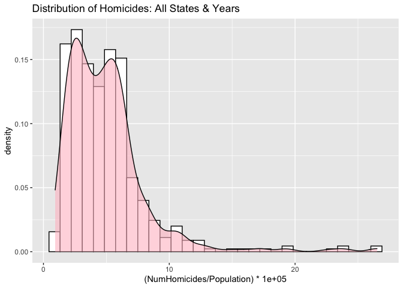<!-- -->

``` r
# library
library(ggridges)
# library(viridis)
# library(hrbrthemes)
```

# Distributions by Years

``` r
# Plot
ggplot(df, aes(x = (NumHomicides/Population) *100000, y = Year, group= Year, fill = factor(stat(quantile)))) +
  stat_density_ridges(
    geom = "density_ridges_gradient",
    calc_ecdf = TRUE,
    quantiles = c(0.025, 0.975)
  ) +
  scale_fill_manual(
    name = "Probability", values = c("#FF0000A0", "#A0A0A0A0", "#0000FFA0"),
    labels = c("(0, 0.025]", "(0.025, 0.975]", "(0.975, 1]")
  ) +
  labs(title = 'Homicide Distribution by Years') 
```

    ## Picking joint bandwidth of 1.02

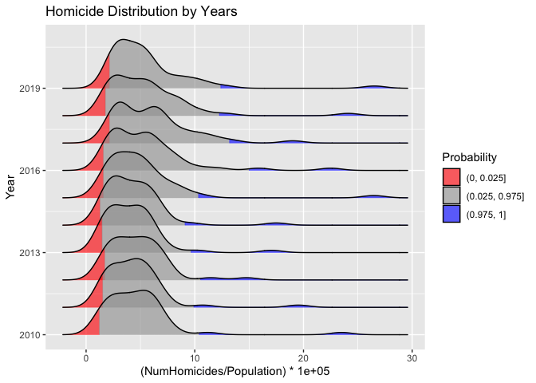<!-- -->

# Distributions by State

``` r
temp <- df %>% filter(State != "DISTRICT OF COLUMBIA")
# Plot
ggplot(temp, aes(x = (NumHomicides/Population) *100000, y = State, group= State, fill = factor(stat(quantile)))) +
  stat_density_ridges(
    geom = "density_ridges_gradient",
    calc_ecdf = TRUE,
    quantiles = c(0.025, 0.975)
  ) +
  scale_fill_manual(
    name = "Probability", values = c("#FF0000A0", "#A0A0A0A0", "#0000FFA0"),
    labels = c("(0, 0.025]", "(0.025, 0.975]", "(0.975, 1]")
  ) +
  labs(title = 'Homicide Distribution by State') 
```

    ## Picking joint bandwidth of 0.423

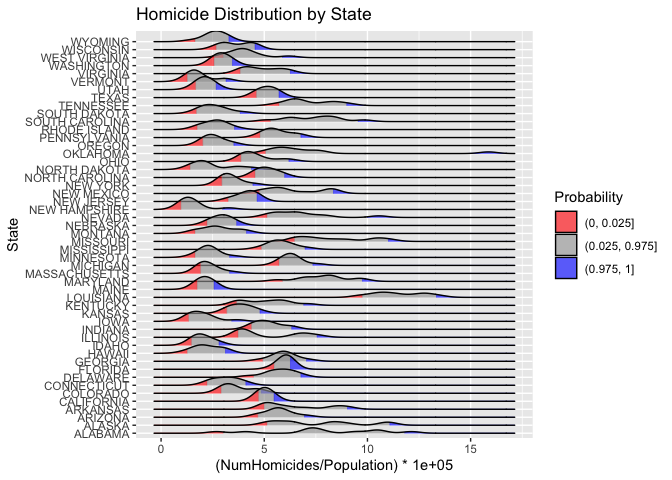<!-- -->
California as Middle Low: Idaho, Hawaii, Maine, Iowa, Massachusetts, etc
High: Maryland, Michigan, Missouri, Tennessee, South Carolina, Louisiana

# Distribution: Cannabis Medical

``` r
df$CannabisMedical <- factor(df$CannabisMedical, levels = c(0,1), labels = c("No", "Yes"))

ggplot(data=df, aes(x=log(NumHomicides), group = CannabisMedical, fill = CannabisMedical)) +
  geom_density(alpha=.6, na.rm=T) +
  labs(title = "Distribution of Homicides: All by Medical Cannabis")
```

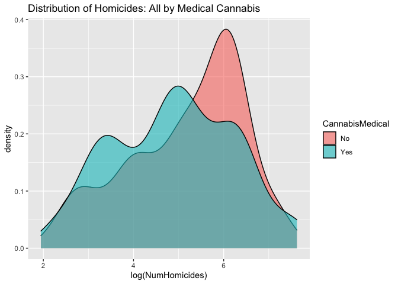<!-- -->

``` r
df$CannabisRecreational <- factor(df$CannabisRecreational, levels = c(0,1), labels = c("No", "Yes"))

ggplot(data=df, aes(x=log(NumHomicides), group= CannabisRecreational, fill = CannabisRecreational)) +
  geom_density(alpha=.6, na.rm=T) +
  labs(title = "Distribution of Homicides: All by Cannabis Legal")
```

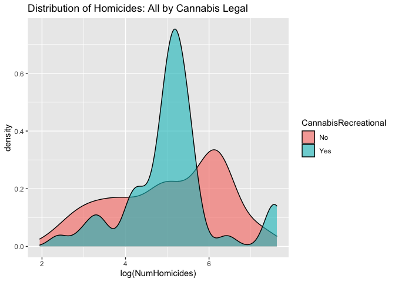<!-- -->

# Beds vs Number of Homicides

``` r
temp <- df %>% filter(!is.na(SubAbuseInpatientCareBeds))

ggplot(temp, aes(x=log(SubAbuseInpatientCareBeds), y=(NumHomicides/Population) *100000, col=round(Population,-4))) +
  geom_point() +
  geom_smooth() +
  labs(title="Relationship Log Beds vs. NumHomicides/Population")
```

    ## `geom_smooth()` using method = 'loess' and formula 'y ~ x'

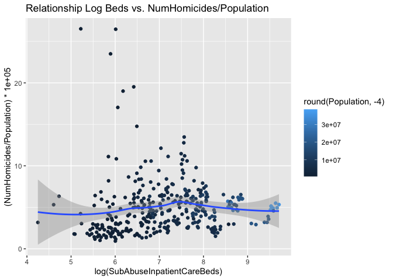<!-- -->

# Law Enforcement Officers

``` r
ggplot(df, aes(x=log(LawEnforcementOfficers), y=(NumHomicides/Population) *100000, col=round(Population,-4))) +
  geom_point(na.rm = T) +
  geom_smooth(na.rm = T) +
  labs(title="Relationship Log Officers vs. NumHomicides/Population")
```

    ## `geom_smooth()` using method = 'loess' and formula 'y ~ x'

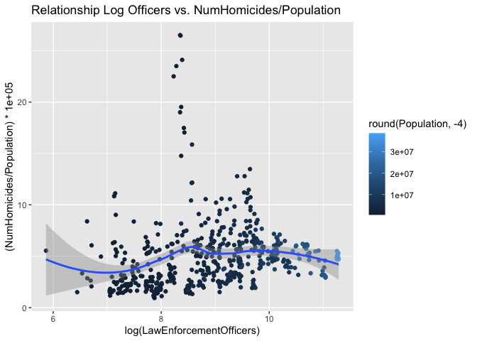<!-- -->

``` r
library(PerformanceAnalytics)
```

    ## Loading required package: xts

    ## Loading required package: zoo

    ## 
    ## Attaching package: 'zoo'

    ## The following objects are masked from 'package:base':
    ## 
    ##     as.Date, as.Date.numeric

    ## 
    ## Attaching package: 'xts'

    ## The following objects are masked from 'package:dplyr':
    ## 
    ##     first, last

    ## 
    ## Attaching package: 'PerformanceAnalytics'

    ## The following object is masked from 'package:graphics':
    ## 
    ##     legend

# SubSelecting Numerical Variables

``` r
cols <- c("Population", "AnyOtherWeapon1", "Machinegun3", "ShortBarreledRifle5", "ShortBarreledShotgun6", "NumDrugUsers", "NumAlcoholUsers", "LawEnforcementOfficers", "RealGDP", "RealGDPperCapita", "GiniIndex", "SeriousMentalIllness", "UnenemploymentRate", "RapeVC","RobberyVC", "AggravatedAssaultVC", "PropertyCrime", "SubAbuseInpatientCareBeds", "NumHomicides")
temp <- df[cols]
```

# Converting to Pop Ratios

``` r
# All except Gini, GDP
cols <- c("NumDrugUsers", "LawEnforcementOfficers", "SeriousMentalIllness", "RapeVC","RobberyVC",
          "AggravatedAssaultVC", "PropertyCrime", "SubAbuseInpatientCareBeds", "NumHomicides")

unit_of_people <- 100000

# convert to Pop estimate
temp[cols] <- (temp[cols] / temp[["Population"]]) * unit_of_people

# Convert to logs
cols <- c("AnyOtherWeapon1", "Machinegun3", "ShortBarreledRifle5", "ShortBarreledShotgun6", "RealGDP", "Population")
temp[cols] <- log(temp[cols])

# Create logNumber of Homicides
temp$LogNumHomicides <- log(temp$NumHomicides)
```

# Look at Corr with Numerical Variables: Guns

``` r
cols <- c("AnyOtherWeapon1", "Machinegun3", "ShortBarreledRifle5", "ShortBarreledShotgun6", "LogNumHomicides")
chart.Correlation(temp[cols])
```

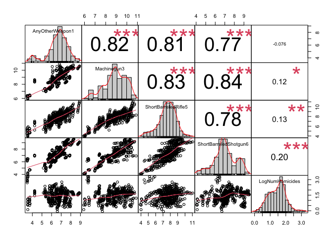<!-- -->

# Look at Corr with Numerical Variables: Crimes & LEO

``` r
cols <- c("LawEnforcementOfficers", "RapeVC","RobberyVC","AggravatedAssaultVC", 
          "PropertyCrime", "LogNumHomicides")

chart.Correlation(temp[cols])
```

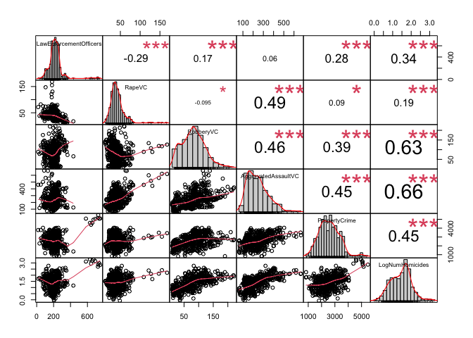<!-- -->

# Look at Corr with Numerical Variables: Economic

``` r
cols <- c("Population", "RealGDP","RealGDPperCapita", "GiniIndex", "UnenemploymentRate", "LogNumHomicides")

chart.Correlation(temp[cols])
```

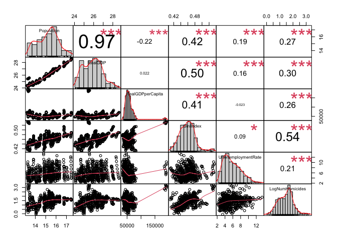<!-- -->

# Look at Corr with Numerical Variables: Mental & Substance

``` r
cols <- c("NumAlcoholUsers", "NumDrugUsers", "SeriousMentalIllness", "SubAbuseInpatientCareBeds", "LogNumHomicides")

chart.Correlation(temp[cols])
```

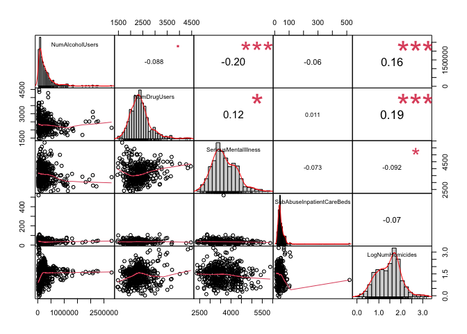<!-- --> \#
Preparing Data for Modeling

``` r
# Removing DC - not a state
df <- df %>% filter(StateCode !="DC")
# Grouping Firearms
df <- df %>% mutate(Firearms = AnyOtherWeapon1 + Machinegun3 + ShortBarreledRifle5 + ShortBarreledShotgun6)
# Grouping Violent Crime Except Murder
df <- df %>% mutate(VCNotMurder = RapeVC + AggravatedAssaultVC + RobberyVC)
# Selecting data of interest for modeling
data <- df %>% select(Year, State, NumHomicides, Firearms, NumDrugUsers, NumAlcoholUsers, SeriousMentalIllness,
                      Population, RealGDP, GiniIndex, UnenemploymentRate, LawEnforcementOfficers, 
                      CannabisMedical, CannabisRecreational, SubAbuseInpatientCareBeds,
                      VCNotMurder,PropertyCrime,
                      PermitAllFirearms, reportall, defactoreg
                      )
# Rename Variables in Data
data <- data %>% rename(ViolentCrime = VCNotMurder, BedsForAbuse = SubAbuseInpatientCareBeds,
                        UnemploymentRate = UnenemploymentRate,
                        ReportAllFirearms = reportall, GunRegistration = defactoreg)
# Checking data
colSums(is.na(data))
```

    ##                   Year                  State           NumHomicides 
    ##                      0                      0                      0 
    ##               Firearms           NumDrugUsers        NumAlcoholUsers 
    ##                     50                     50                      0 
    ##   SeriousMentalIllness             Population                RealGDP 
    ##                     50                      0                      0 
    ##              GiniIndex       UnemploymentRate LawEnforcementOfficers 
    ##                      0                      0                      2 
    ##        CannabisMedical   CannabisRecreational           BedsForAbuse 
    ##                      0                      0                    150 
    ##           ViolentCrime          PropertyCrime      PermitAllFirearms 
    ##                      0                      0                      0 
    ##      ReportAllFirearms        GunRegistration 
    ##                      0                      0

## Creating New Variable Transformation

``` r
# Factorize
cols <- c("PermitAllFirearms", "ReportAllFirearms", "GunRegistration")
for (col in cols){
  data[[col]] <- factor(data[[col]], levels = c(0,1), labels = c("No", "Yes"))  
}

# Year to Factor  
data$Year <- relevel(factor(data$Year), "2010")


# convert to Pop estimate - all except laws, gini, and unemployment rate
unit_of_people <- 100000
# cols
cols <- c("NumDrugUsers",  "NumAlcoholUsers", "LawEnforcementOfficers", "SeriousMentalIllness", "ViolentCrime", 
          "PropertyCrime", "BedsForAbuse", "NumHomicides", "RealGDP", "Firearms")
data[cols] <- (data[cols] / data[["Population"]]) * unit_of_people
```

# Modeling

## Fixed Effects - Causes

``` r
# base model - only causes
lm1 <- glm(log(NumHomicides) ~ log(Firearms) + NumDrugUsers + NumAlcoholUsers + SeriousMentalIllness +
            GiniIndex + UnemploymentRate + log(RealGDP) + Year, data=data, family = gaussian(link = "identity"))

plot(lm1, which = c(1,2))
```

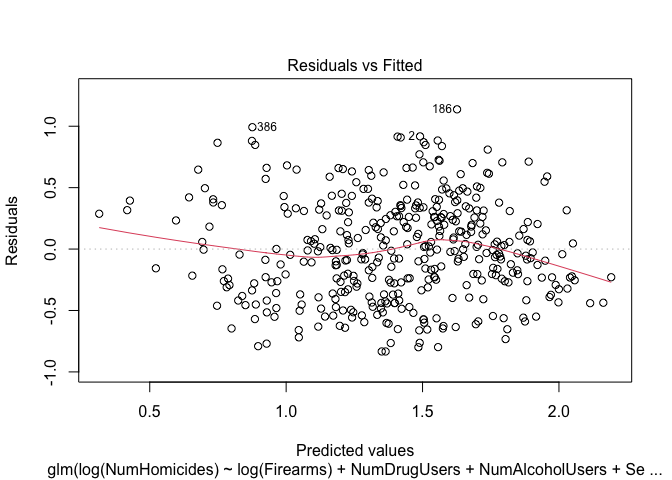<!-- -->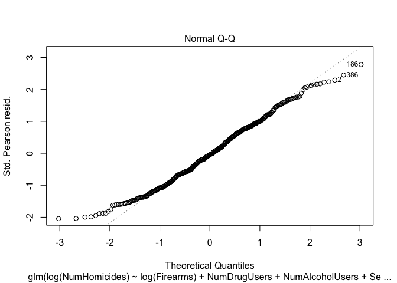<!-- -->

``` r
# Normality
shapiro.test(lm1$res)
```

    ## 
    ##  Shapiro-Wilk normality test
    ## 
    ## data:  lm1$res
    ## W = 0.98767, p-value = 0.001815

``` r
# Homoskedasticity
bartlett.test(list(lm1$res, lm1$fit))
```

    ## 
    ##  Bartlett test of homogeneity of variances
    ## 
    ## data:  list(lm1$res, lm1$fit)
    ## Bartlett's K-squared = 12.841, df = 1, p-value = 0.0003391

``` r
library(car)
```

    ## Loading required package: carData

    ## 
    ## Attaching package: 'car'

    ## The following object is masked from 'package:dplyr':
    ## 
    ##     recode

``` r
vif(lm1)
```

    ##                           GVIF Df GVIF^(1/(2*Df))
    ## log(Firearms)         1.316655  1        1.147456
    ## NumDrugUsers          2.107086  1        1.451581
    ## NumAlcoholUsers       5.726764  1        2.393066
    ## SeriousMentalIllness  2.960778  1        1.720691
    ## GiniIndex             1.466586  1        1.211027
    ## UnemploymentRate      3.874170  1        1.968291
    ## log(RealGDP)          1.720685  1        1.311749
    ## Year                 45.295673  7        1.313076

``` r
library(lmtest)
dwtest(lm1)
```

    ## 
    ##  Durbin-Watson test
    ## 
    ## data:  lm1
    ## DW = 2.5701, p-value = 1
    ## alternative hypothesis: true autocorrelation is greater than 0

``` r
stargazer::stargazer(lm1, type="text", single.row = T)
```

    ## 
    ## ================================================
    ##                          Dependent variable:    
    ##                      ---------------------------
    ##                           log(NumHomicides)     
    ## ------------------------------------------------
    ## log(Firearms)               0.030 (0.022)       
    ## NumDrugUsers              -0.00002 (0.0001)     
    ## NumAlcoholUsers         -0.0001*** (0.00003)    
    ## SeriousMentalIllness     -0.0001** (0.0001)     
    ## GiniIndex                 4.733*** (1.308)      
    ## UnemploymentRate          0.155*** (0.020)      
    ## log(RealGDP)              -0.371*** (0.141)     
    ## Year2012                   -0.137 (0.129)       
    ## Year2013                  -0.547*** (0.189)     
    ## Year2014                  -0.394** (0.196)      
    ## Year2016                    0.265 (0.167)       
    ## Year2017                  0.495*** (0.166)      
    ## Year2018                  0.459*** (0.173)      
    ## Year2019                  0.553*** (0.175)      
    ## Constant                   7.585** (3.378)      
    ## ------------------------------------------------
    ## Observations                     400            
    ## Log Likelihood                -208.597          
    ## Akaike Inf. Crit.              447.194          
    ## ================================================
    ## Note:                *p<0.1; **p<0.05; ***p<0.01

## Fixed Effects - Causes & Interventions(LE & AbuseBeds)

``` r
# base model - only causes
lm2 <- glm(log(NumHomicides) ~ log(Firearms) + NumDrugUsers + NumAlcoholUsers + SeriousMentalIllness +
           GiniIndex + UnemploymentRate + log(RealGDP) + Year + log(LawEnforcementOfficers), 
           data=data, family = gaussian(link = "identity"))

plot(lm2, which = c(1,2))
```

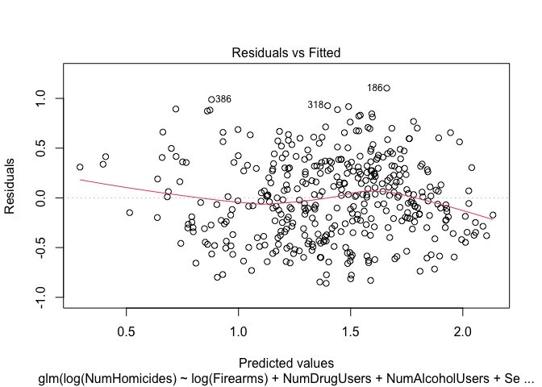<!-- -->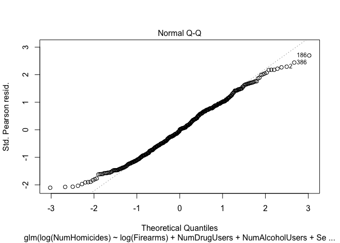<!-- -->

``` r
# Normality
shapiro.test(lm2$res)
```

    ## 
    ##  Shapiro-Wilk normality test
    ## 
    ## data:  lm2$res
    ## W = 0.98916, p-value = 0.004704

``` r
# Homoskedasticity
bartlett.test(list(lm2$res, lm2$fit))
```

    ## 
    ##  Bartlett test of homogeneity of variances
    ## 
    ## data:  list(lm2$res, lm2$fit)
    ## Bartlett's K-squared = 11.943, df = 1, p-value = 0.0005485

``` r
library(car)
vif(lm2)
```

    ##                                  GVIF Df GVIF^(1/(2*Df))
    ## log(Firearms)                1.335369  1        1.155582
    ## NumDrugUsers                 2.105580  1        1.451062
    ## NumAlcoholUsers              5.703293  1        2.388157
    ## SeriousMentalIllness         2.974016  1        1.724534
    ## GiniIndex                    1.530155  1        1.236994
    ## UnemploymentRate             3.920714  1        1.980079
    ## log(RealGDP)                 1.834942  1        1.354600
    ## Year                        70.997562  7        1.355913
    ## log(LawEnforcementOfficers)  1.864707  1        1.365543

``` r
library(lmtest)
dwtest(lm2)
```

    ## 
    ##  Durbin-Watson test
    ## 
    ## data:  lm2
    ## DW = 2.5482, p-value = 1
    ## alternative hypothesis: true autocorrelation is greater than 0

``` r
stargazer::stargazer(lm1, lm2, type="text", single.row = T)
```

    ## 
    ## =====================================================================
    ##                                        Dependent variable:           
    ##                             -----------------------------------------
    ##                                         log(NumHomicides)            
    ##                                     (1)                  (2)         
    ## ---------------------------------------------------------------------
    ## log(Firearms)                  0.030 (0.022)        0.034 (0.022)    
    ## NumDrugUsers                 -0.00002 (0.0001)    -0.00002 (0.0001)  
    ## NumAlcoholUsers             -0.0001*** (0.00003) -0.0001*** (0.00003)
    ## SeriousMentalIllness         -0.0001** (0.0001)   -0.0001** (0.0001) 
    ## GiniIndex                     4.733*** (1.308)     4.358*** (1.336)  
    ## UnemploymentRate              0.155*** (0.020)     0.159*** (0.020)  
    ## log(RealGDP)                 -0.371*** (0.141)    -0.425*** (0.146)  
    ## Year2012                       -0.137 (0.129)       -0.124 (0.129)   
    ## Year2013                     -0.547*** (0.189)    -0.519*** (0.191)  
    ## Year2014                      -0.394** (0.196)     -0.365* (0.197)   
    ## Year2016                       0.265 (0.167)       0.360** (0.180)   
    ## Year2017                      0.495*** (0.166)     0.525*** (0.168)  
    ## Year2018                      0.459*** (0.173)     0.487*** (0.174)  
    ## Year2019                      0.553*** (0.175)     0.583*** (0.177)  
    ## log(LawEnforcementOfficers)                         0.112 (0.080)    
    ## Constant                      7.585** (3.378)      8.288** (3.414)   
    ## ---------------------------------------------------------------------
    ## Observations                        400                  399         
    ## Log Likelihood                    -208.597             -207.537      
    ## Akaike Inf. Crit.                 447.194              447.074       
    ## =====================================================================
    ## Note:                                     *p<0.1; **p<0.05; ***p<0.01

## Model with Multilevels - Causes & Interventions

``` r
library(lme4)
```

    ## Loading required package: Matrix

    ## Registered S3 methods overwritten by 'lme4':
    ##   method                          from
    ##   cooks.distance.influence.merMod car 
    ##   influence.merMod                car 
    ##   dfbeta.influence.merMod         car 
    ##   dfbetas.influence.merMod        car

``` r
re1 <- lmer(log(NumHomicides) ~ log(Firearms) + NumDrugUsers + NumAlcoholUsers + SeriousMentalIllness +
            GiniIndex + UnemploymentRate + log(RealGDP) + Year  + log(LawEnforcementOfficers) +
            PermitAllFirearms + ReportAllFirearms + GunRegistration + CannabisRecreational + CannabisMedical
            + (1| State), data=data, REML = F)
```

    ## Warning: Some predictor variables are on very different scales: consider
    ## rescaling

``` r
stargazer::stargazer(lm1, lm2, re1, type="text", single.row = T)
```

    ## 
    ## ========================================================================================
    ##                                                 Dependent variable:                     
    ##                             ------------------------------------------------------------
    ##                                                  log(NumHomicides)                      
    ##                                              normal                         linear      
    ##                                                                         mixed-effects   
    ##                                     (1)                  (2)                 (3)        
    ## ----------------------------------------------------------------------------------------
    ## log(Firearms)                  0.030 (0.022)        0.034 (0.022)       -0.050 (0.046)  
    ## NumDrugUsers                 -0.00002 (0.0001)    -0.00002 (0.0001)   0.00004 (0.00005) 
    ## NumAlcoholUsers             -0.0001*** (0.00003) -0.0001*** (0.00003) -0.00002 (0.00002)
    ## SeriousMentalIllness         -0.0001** (0.0001)   -0.0001** (0.0001)  -0.00001 (0.00004)
    ## GiniIndex                     4.733*** (1.308)     4.358*** (1.336)    8.293*** (2.577) 
    ## UnemploymentRate              0.155*** (0.020)     0.159*** (0.020)    0.049*** (0.014) 
    ## log(RealGDP)                 -0.371*** (0.141)    -0.425*** (0.146)     -0.257 (0.232)  
    ## Year2012                       -0.137 (0.129)       -0.124 (0.129)      0.046 (0.069)   
    ## Year2013                     -0.547*** (0.189)    -0.519*** (0.191)     -0.133 (0.108)  
    ## Year2014                      -0.394** (0.196)     -0.365* (0.197)      -0.079 (0.112)  
    ## Year2016                       0.265 (0.167)       0.360** (0.180)     0.208** (0.104)  
    ## Year2017                      0.495*** (0.166)     0.525*** (0.168)    0.362*** (0.098) 
    ## Year2018                      0.459*** (0.173)     0.487*** (0.174)    0.259** (0.103)  
    ## Year2019                      0.553*** (0.175)     0.583*** (0.177)    0.305*** (0.106) 
    ## log(LawEnforcementOfficers)                         0.112 (0.080)       0.001 (0.053)   
    ## PermitAllFirearmsYes                                                  -0.324*** (0.101) 
    ## ReportAllFirearmsYes                                                    -0.028 (0.118)  
    ## GunRegistrationYes                                                      0.035 (0.148)   
    ## CannabisRecreationalYes                                                 0.055 (0.056)   
    ## CannabisMedicalYes                                                      -0.013 (0.038)  
    ## Constant                      7.585** (3.378)      8.288** (3.414)      3.359 (5.476)   
    ## ----------------------------------------------------------------------------------------
    ## Observations                        400                  399                 399        
    ## Log Likelihood                    -208.597             -207.537             27.187      
    ## Akaike Inf. Crit.                 447.194              447.074              -8.374      
    ## Bayesian Inf. Crit.                                                         83.372      
    ## ========================================================================================
    ## Note:                                                        *p<0.1; **p<0.05; ***p<0.01

``` r
summary(re1)
```

    ## Linear mixed model fit by maximum likelihood  ['lmerMod']
    ## Formula: log(NumHomicides) ~ log(Firearms) + NumDrugUsers + NumAlcoholUsers +  
    ##     SeriousMentalIllness + GiniIndex + UnemploymentRate + log(RealGDP) +  
    ##     Year + log(LawEnforcementOfficers) + PermitAllFirearms +  
    ##     ReportAllFirearms + GunRegistration + CannabisRecreational +  
    ##     CannabisMedical + (1 | State)
    ##    Data: data
    ## 
    ##      AIC      BIC   logLik deviance df.resid 
    ##     -8.4     83.4     27.2    -54.4      376 
    ## 
    ## Scaled residuals: 
    ##     Min      1Q  Median      3Q     Max 
    ## -5.7123 -0.4834 -0.0365  0.5776  3.8509 
    ## 
    ## Random effects:
    ##  Groups   Name        Variance Std.Dev.
    ##  State    (Intercept) 0.14117  0.3757  
    ##  Residual             0.03267  0.1807  
    ## Number of obs: 399, groups:  State, 50
    ## 
    ## Fixed effects:
    ##                               Estimate Std. Error t value
    ## (Intercept)                  3.359e+00  5.476e+00   0.613
    ## log(Firearms)               -5.016e-02  4.642e-02  -1.080
    ## NumDrugUsers                 3.572e-05  4.728e-05   0.756
    ## NumAlcoholUsers             -2.398e-05  1.982e-05  -1.210
    ## SeriousMentalIllness        -1.172e-05  3.858e-05  -0.304
    ## GiniIndex                    8.293e+00  2.577e+00   3.218
    ## UnemploymentRate             4.922e-02  1.403e-02   3.508
    ## log(RealGDP)                -2.570e-01  2.323e-01  -1.106
    ## Year2012                     4.559e-02  6.926e-02   0.658
    ## Year2013                    -1.334e-01  1.077e-01  -1.239
    ## Year2014                    -7.883e-02  1.119e-01  -0.704
    ## Year2016                     2.081e-01  1.039e-01   2.002
    ## Year2017                     3.615e-01  9.843e-02   3.673
    ## Year2018                     2.592e-01  1.034e-01   2.507
    ## Year2019                     3.055e-01  1.055e-01   2.894
    ## log(LawEnforcementOfficers)  1.129e-03  5.271e-02   0.021
    ## PermitAllFirearmsYes        -3.242e-01  1.011e-01  -3.207
    ## ReportAllFirearmsYes        -2.779e-02  1.176e-01  -0.236
    ## GunRegistrationYes           3.475e-02  1.482e-01   0.234
    ## CannabisRecreationalYes      5.540e-02  5.583e-02   0.992
    ## CannabisMedicalYes          -1.265e-02  3.841e-02  -0.329

    ## 
    ## Correlation matrix not shown by default, as p = 21 > 12.
    ## Use print(x, correlation=TRUE)  or
    ##     vcov(x)        if you need it

    ## fit warnings:
    ## Some predictor variables are on very different scales: consider rescaling

``` r
as.data.frame(ranef(re1))
```

    ##    grpvar        term            grp      condval     condsd
    ## 1   State (Intercept)        ALABAMA  0.346946739 0.06299664
    ## 2   State (Intercept)         ALASKA  0.906429244 0.06299664
    ## 3   State (Intercept)        ARIZONA  0.117500732 0.06299664
    ## 4   State (Intercept)       ARKANSAS  0.334479910 0.06299664
    ## 5   State (Intercept)     CALIFORNIA  0.031407445 0.06299664
    ## 6   State (Intercept)       COLORADO -0.112342643 0.06299664
    ## 7   State (Intercept)    CONNECTICUT -0.275634988 0.06299664
    ## 8   State (Intercept)       DELAWARE  0.467794012 0.06299664
    ## 9   State (Intercept)        FLORIDA  0.065826294 0.06299664
    ## 10  State (Intercept)        GEORGIA  0.106000223 0.06299664
    ## 11  State (Intercept)         HAWAII -0.161524383 0.06299664
    ## 12  State (Intercept)          IDAHO -0.568497592 0.06299664
    ## 13  State (Intercept)       ILLINOIS  0.288668395 0.06299664
    ## 14  State (Intercept)        INDIANA  0.311881933 0.06299664
    ## 15  State (Intercept)           IOWA -0.423561643 0.06299664
    ## 16  State (Intercept)         KANSAS -0.015486215 0.06299664
    ## 17  State (Intercept)       KENTUCKY -0.044483444 0.06299664
    ## 18  State (Intercept)      LOUISIANA  0.708486099 0.06299664
    ## 19  State (Intercept)          MAINE -0.570579197 0.06299664
    ## 20  State (Intercept)       MARYLAND  0.717465726 0.06299664
    ## 21  State (Intercept)  MASSACHUSETTS -0.455405605 0.06299664
    ## 22  State (Intercept)       MICHIGAN  0.266100898 0.06299664
    ## 23  State (Intercept)      MINNESOTA -0.413388348 0.06299664
    ## 24  State (Intercept)    MISSISSIPPI -0.016518398 0.06299664
    ## 25  State (Intercept)       MISSOURI  0.573898872 0.06299664
    ## 26  State (Intercept)        MONTANA -0.344108095 0.06299664
    ## 27  State (Intercept)       NEBRASKA -0.036456894 0.06299664
    ## 28  State (Intercept)         NEVADA  0.304124367 0.06299664
    ## 29  State (Intercept)  NEW HAMPSHIRE -0.655207032 0.06299664
    ## 30  State (Intercept)     NEW JERSEY  0.104700190 0.06299664
    ## 31  State (Intercept)     NEW MEXICO  0.246154427 0.06299664
    ## 32  State (Intercept)       NEW YORK -0.703728519 0.06299664
    ## 33  State (Intercept) NORTH CAROLINA -0.030773978 0.06299664
    ## 34  State (Intercept)   NORTH DAKOTA -0.133155840 0.06299664
    ## 35  State (Intercept)           OHIO  0.045830839 0.06299664
    ## 36  State (Intercept)       OKLAHOMA  0.483059387 0.06299664
    ## 37  State (Intercept)         OREGON -0.485832560 0.06299664
    ## 38  State (Intercept)   PENNSYLVANIA  0.199032986 0.06299664
    ## 39  State (Intercept)   RHODE ISLAND -0.408541543 0.06299664
    ## 40  State (Intercept) SOUTH CAROLINA  0.357362830 0.06299664
    ## 41  State (Intercept)   SOUTH DAKOTA -0.266330436 0.06299664
    ## 42  State (Intercept)      TENNESSEE  0.342171520 0.06299664
    ## 43  State (Intercept)          TEXAS  0.036590182 0.06299664
    ## 44  State (Intercept)           UTAH -0.346214899 0.06299664
    ## 45  State (Intercept)        VERMONT -0.395529209 0.06299664
    ## 46  State (Intercept)       VIRGINIA  0.013155040 0.06299664
    ## 47  State (Intercept)     WASHINGTON -0.341017659 0.06299664
    ## 48  State (Intercept)  WEST VIRGINIA -0.141564094 0.06721142
    ## 49  State (Intercept)      WISCONSIN -0.021962238 0.06299664
    ## 50  State (Intercept)        WYOMING -0.007222838 0.06299664

## Assumption Checking LMM

``` r
library(DHARMa)
```

    ## This is DHARMa 0.3.4. For overview type '?DHARMa'. For recent changes, type news(package = 'DHARMa') Note: Syntax of plotResiduals has changed in 0.3.0, see ?plotResiduals for details

``` r
simulationOutput <- simulateResiduals(fittedModel = re1, plot = F)
plot(simulationOutput)
```

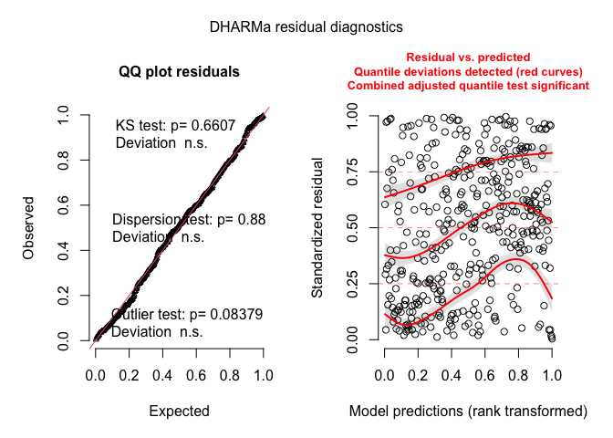<!-- -->

``` r
# Normality - Failing
shapiro.test(residuals(re1))
```

    ## 
    ##  Shapiro-Wilk normality test
    ## 
    ## data:  residuals(re1)
    ## W = 0.96549, p-value = 4.377e-08

``` r
# Homoskedasticity - Failing
bartlett.test(list(residuals(re1), fitted(re1)))
```

    ## 
    ##  Bartlett test of homogeneity of variances
    ## 
    ## data:  list(residuals(re1), fitted(re1))
    ## Bartlett's K-squared = 389.13, df = 1, p-value < 2.2e-16

``` r
# Multicollinearity - Failing
vif(re1)
```

    ##                                   GVIF Df GVIF^(1/(2*Df))
    ## log(Firearms)                 2.102595  1        1.450033
    ## NumDrugUsers                  2.532501  1        1.591383
    ## NumAlcoholUsers              10.212954  1        3.195771
    ## SeriousMentalIllness          3.829495  1        1.956910
    ## GiniIndex                     2.887759  1        1.699341
    ## UnemploymentRate              7.751285  1        2.784113
    ## log(RealGDP)                  2.048118  1        1.431125
    ## Year                        813.907615  7        1.613980
    ## log(LawEnforcementOfficers)   2.412228  1        1.553135
    ## PermitAllFirearms             1.556897  1        1.247757
    ## ReportAllFirearms             1.213217  1        1.101461
    ## GunRegistration               1.602157  1        1.265763
    ## CannabisRecreational          1.566558  1        1.251622
    ## CannabisMedical               1.381705  1        1.175459

``` r
# Independence
acf(residuals(re1))
```

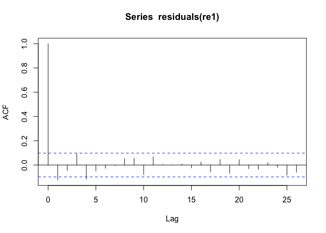<!-- --> \#
Notes

-   Not sure if autocorrelation is what could be causing high
    multicollinearity in Year, alcoholusers, and Unemployment

-   Residuals also appear to be slanted and wide -5 to 3.8

-   Look into creating lags for lawenforcement & laws

-   Try Next:

    -   stacked level of gun laws, marijuana laws
    -   glmer
