R Notebook
================
Jesid
2021-04-08

``` r
library(here)
```

    ## here() starts at /Users/jacosta3/OneDrive - University of South Florida/ISM6137/R_Projects/ViolenceNHomicides

``` r
library(readxl)
library(dplyr)
```

    ## 
    ## Attaching package: 'dplyr'

    ## The following objects are masked from 'package:stats':
    ## 
    ##     filter, lag

    ## The following objects are masked from 'package:base':
    ## 
    ##     intersect, setdiff, setequal, union

``` r
library(ggplot2)
```

# Read Data

``` r
df <- read_excel(here("data", "HomicideData_Original_revised.xlsx"), sheet="HomicideData")
colSums(is.na(df))
```

    ##                                State                            StateCode 
    ##                                    0                                    0 
    ##                                 Year                         NumHomicides 
    ##                                    0                                    0 
    ##                      AnyOtherWeapon1                   DestructiveDevice2 
    ##                                   51                                   51 
    ##                          Machinegun3                            Silencer4 
    ##                                   51                                   51 
    ##                  ShortBarreledRifle5                ShortBarreledShotgun6 
    ##                                   51                                   51 
    ##                         TotalWeapons                         NumDrugUsers 
    ##                                   51                                   51 
    ##                      NumAlcoholUsers               LawEnforcementOfficers 
    ##                                    0                                    2 
    ##              LawEnforcementCivilians         TotalLawEnforcementEmployees 
    ##                                    2                                    2 
    ##                           Population                                White 
    ##                                    0                                    0 
    ##                                Black                             Hispanic 
    ##                                    0                                    0 
    ##                                Asian                        Children 0-18 
    ##                                    0                                    0 
    ##                         Adults 19-25                         Adults 26-34 
    ##                                    0                                    0 
    ##                         Adults 35-54                         Adults 55-64 
    ##                                    0                                    0 
    ##                                  65+                          Non Citizen 
    ##                                    0                                    0 
    ##                            Education                              RealGDP 
    ##                                   60                                    0 
    ##                     RealGDPperCapita                            GiniIndex 
    ##                                    0                                    0 
    ##                 SeriousMentalIllness                   UnenemploymentRate 
    ##                                   51                                    0 
    ##                   MurderNSlaugtherVC                               RapeVC 
    ##                                   10                                   10 
    ##                            RobberyVC                  AggravatedAssaultVC 
    ##                                   10                                   10 
    ##                         ViolentCrime                        PropertyCrime 
    ##                                    0                                    0 
    ## UniversalBackgroundChecksAllFirearms    UniversalBackgroundChecksHandguns 
    ##                                   10                                   10 
    ##             WaitingPeriodAllFirearms                WaitingPeriodHandguns 
    ##                                   10                                   10 
    ##                    PermitAllFirearms                       PermitHandguns 
    ##                                   10                                   10 
    ##       PermitCarryingConcealedWeapons                    BanAssaultWeapons 
    ##                                   10                                   10 
    ##      BackgroundCheckGunshowsFirearms      BackgroundCheckGunshowsHandguns 
    ##                                   10                                   10 
    ##            SubAbuseInpatientCareBeds                      CannabisMedical 
    ##                                  153                                    0 
    ##                 CannabisRecreational                       relinquishment 
    ##                                    0                                   10 
    ##                           recordsall                          recordsallh 
    ##                                   10                                   10 
    ##                        recordsdealer                       recordsdealerh 
    ##                                   10                                   10 
    ##                            reportall                           reportallh 
    ##                                   10                                   10 
    ##                         reportdealer                        reportdealerh 
    ##                                   10                                   10 
    ##                                purge                         registration 
    ##                                   10                                   10 
    ##                        registrationh                           defactoreg 
    ##                                   10                                   10 
    ##                          defactoregh 
    ##                                   10

# Distribution of DV: All Years All States

``` r
ggplot(data=df, aes(x=(NumHomicides/Population) *100000)) +
  geom_histogram(aes(y=..density..), col='black', fill='white') +
  geom_density(alpha=.6, fill="pink") +
  labs(title = "Distribution of Homicides: All States & Years")
```

    ## `stat_bin()` using `bins = 30`. Pick better value with `binwidth`.

<!-- -->

# Preparing Data for Modeling

``` r
# Removing DC - not a state
df <- df %>% filter(StateCode !="DC")
# Grouping Firearms
df <- df %>% mutate(Firearms = AnyOtherWeapon1 + Machinegun3 + ShortBarreledRifle5 + ShortBarreledShotgun6)
# Grouping Violent Crime Except Murder
df <- df %>% mutate(VCNotMurder = RapeVC + AggravatedAssaultVC + RobberyVC)
# Selecting data of interest for modeling
data <- df %>% select(Year, State, NumHomicides, Firearms, NumDrugUsers, NumAlcoholUsers, SeriousMentalIllness,
                      Population, RealGDP, GiniIndex, UnenemploymentRate, LawEnforcementOfficers, 
                      CannabisMedical, CannabisRecreational, SubAbuseInpatientCareBeds,
                      VCNotMurder,PropertyCrime, White, Black, Hispanic, Asian, `Children 0-18`, `Adults 19-25`, `Adults 26-34`, Education,
                      PermitAllFirearms, reportall, defactoreg, relinquishment
                      )
# Rename Variables in Data
data <- data %>% rename(ViolentCrime = VCNotMurder, BedsForAbuse = SubAbuseInpatientCareBeds,
                        UnemploymentRate = UnenemploymentRate,
                        ReportAllFirearms = reportall, GunRegistration = defactoreg,
                        Children18orUnder = `Children 0-18`,
                        RelinquishGun = relinquishment,
                        Adult19to25 = `Adults 19-25`,
                        Adult26to34 = `Adults 26-34`)
# Checking data
colSums(is.na(data))
```

    ##                   Year                  State           NumHomicides 
    ##                      0                      0                      0 
    ##               Firearms           NumDrugUsers        NumAlcoholUsers 
    ##                     50                     50                      0 
    ##   SeriousMentalIllness             Population                RealGDP 
    ##                     50                      0                      0 
    ##              GiniIndex       UnemploymentRate LawEnforcementOfficers 
    ##                      0                      0                      2 
    ##        CannabisMedical   CannabisRecreational           BedsForAbuse 
    ##                      0                      0                    150 
    ##           ViolentCrime          PropertyCrime                  White 
    ##                      0                      0                      0 
    ##                  Black               Hispanic                  Asian 
    ##                      0                      0                      0 
    ##      Children18orUnder            Adult19to25            Adult26to34 
    ##                      0                      0                      0 
    ##              Education      PermitAllFirearms      ReportAllFirearms 
    ##                     50                      0                      0 
    ##        GunRegistration          RelinquishGun 
    ##                      0                      0

## Creating New Variable Transformation

``` r
# Factorize
cols <- c("PermitAllFirearms", "ReportAllFirearms", "GunRegistration", "CannabisMedical", "CannabisRecreational","RelinquishGun")
for (col in cols){
  data[[col]] <- factor(data[[col]], levels = c(0,1), labels = c("No", "Yes"))  
}

# Year to Factor  
data$Year <- relevel(factor(data$Year), "2010")

# convert to Pop estimate - all except laws, gini, and unemployment rate
unit_of_people <- 100000
# cols
cols <- c("NumDrugUsers",  "NumAlcoholUsers", "LawEnforcementOfficers", "SeriousMentalIllness", "ViolentCrime", 
          "PropertyCrime", "BedsForAbuse", "NumHomicides", "Firearms", "White", "Black", "Hispanic", "Asian",
          "Children18orUnder","Adult19to25", "Adult26to34")
data[cols] <- (data[cols] / data[["Population"]]) * unit_of_people
# Real GDP per Capita
data$RealGDP <- data$RealGDP/data$Population
# convert Gini to percentage
data['GiniIndex'] = data['GiniIndex'] * 100
```

## Create Lags

``` r
# testing lags
data <- data %>%
  arrange(Year) %>%
  group_by(State) %>%
  mutate(OneLagLawEnforcement = lag(LawEnforcementOfficers),
         OneLagGunPermit = lag(PermitAllFirearms),
         OneLagGunRegister = lag(GunRegistration),
         OneLagGunReport = lag(ReportAllFirearms),
         OneLagGunRelinquish = lag(RelinquishGun))
```

# Modeling

## Fixed Effects - Causes

``` r
# base model - only causes
lm1 <- glm(log(NumHomicides) ~ log(Firearms) + NumDrugUsers + NumAlcoholUsers + SeriousMentalIllness +
           GiniIndex + UnemploymentRate + log(RealGDP)  + Black + Hispanic + Asian + 
           Children18orUnder + Adult19to25 + Education + Year + State, 
           data=data, family = gaussian(link = "identity"))

plot(lm1, which = c(1,2))
```

<!-- --><!-- -->

``` r
# Normality
shapiro.test(lm1$res)
```

    ## 
    ##  Shapiro-Wilk normality test
    ## 
    ## data:  lm1$res
    ## W = 0.97993, p-value = 8.517e-05

``` r
# Homoskedasticity
bartlett.test(list(lm1$res, lm1$fit))
```

    ## 
    ##  Bartlett test of homogeneity of variances
    ## 
    ## data:  list(lm1$res, lm1$fit)
    ## Bartlett's K-squared = 451.9, df = 1, p-value < 2.2e-16

``` r
library(car)
```

    ## Loading required package: carData

    ## 
    ## Attaching package: 'car'

    ## The following object is masked from 'package:dplyr':
    ## 
    ##     recode

``` r
vif(lm1)
```

    ##                              GVIF Df GVIF^(1/(2*Df))
    ## log(Firearms)        1.519285e+02  1       12.325928
    ## NumDrugUsers         4.478557e+00  1        2.116260
    ## NumAlcoholUsers      1.385371e+01  1        3.722057
    ## SeriousMentalIllness 7.535068e+00  1        2.745008
    ## GiniIndex            1.582714e+02  1       12.580596
    ## UnemploymentRate     1.443798e+01  1        3.799734
    ## log(RealGDP)         5.878552e+01  1        7.667172
    ## Black                2.152744e+03  1       46.397669
    ## Hispanic             1.343788e+03  1       36.657711
    ## Asian                1.002202e+03  1       31.657578
    ## Children18orUnder    4.883017e+01  1        6.987859
    ## Adult19to25          1.740555e+01  1        4.171995
    ## Education            1.132877e+01  1        3.365824
    ## Year                 9.821473e+02  6        1.775612
    ## State                7.649989e+17 49        1.522251

``` r
library(lmtest)
```

    ## Loading required package: zoo

    ## 
    ## Attaching package: 'zoo'

    ## The following objects are masked from 'package:base':
    ## 
    ##     as.Date, as.Date.numeric

``` r
dwtest(lm1)
```

    ## 
    ##  Durbin-Watson test
    ## 
    ## data:  lm1
    ## DW = 2.3256, p-value = 0.9944
    ## alternative hypothesis: true autocorrelation is greater than 0

``` r
# stargazer::stargazer(lm1, type="text", single.row = T)
```

## Fixed Effects - Causes & Interventions(Law Enforcement)

``` r
# base model - only causes
lm2 <- glm(log(NumHomicides) ~ log(Firearms) + NumDrugUsers + NumAlcoholUsers + SeriousMentalIllness +
           GiniIndex + UnemploymentRate + log(RealGDP) + log(LawEnforcementOfficers) + Black + Hispanic + 
             Asian + Children18orUnder + Adult19to25 + Education + Year + State, 
           data=data, family = gaussian(link = "identity"))

plot(lm2, which = c(1,2))
```

<!-- --><!-- -->

``` r
# Normality
shapiro.test(lm2$res)
```

    ## 
    ##  Shapiro-Wilk normality test
    ## 
    ## data:  lm2$res
    ## W = 0.98113, p-value = 0.0001543

``` r
# Homoskedasticity
bartlett.test(list(lm2$res, lm2$fit))
```

    ## 
    ##  Bartlett test of homogeneity of variances
    ## 
    ## data:  list(lm2$res, lm2$fit)
    ## Bartlett's K-squared = 451.38, df = 1, p-value < 2.2e-16

``` r
library(car)
vif(lm2)
```

    ##                                     GVIF Df GVIF^(1/(2*Df))
    ## log(Firearms)               1.518500e+02  1       12.322745
    ## NumDrugUsers                4.486354e+00  1        2.118102
    ## NumAlcoholUsers             1.395335e+01  1        3.735418
    ## SeriousMentalIllness        7.502325e+00  1        2.739037
    ## GiniIndex                   1.583492e+02  1       12.583690
    ## UnemploymentRate            1.443520e+01  1        3.799368
    ## log(RealGDP)                5.841764e+01  1        7.643143
    ## log(LawEnforcementOfficers) 4.320266e+00  1        2.078525
    ## Black                       2.158222e+03  1       46.456667
    ## Hispanic                    1.344148e+03  1       36.662624
    ## Asian                       1.003040e+03  1       31.670803
    ## Children18orUnder           4.907519e+01  1        7.005368
    ## Adult19to25                 1.744047e+01  1        4.176178
    ## Education                   1.140744e+01  1        3.377491
    ## Year                        2.071003e+03  6        1.889506
    ## State                       1.603862e+18 49        1.533794

``` r
library(lmtest)
dwtest(lm2)
```

    ## 
    ##  Durbin-Watson test
    ## 
    ## data:  lm2
    ## DW = 2.3222, p-value = 0.9938
    ## alternative hypothesis: true autocorrelation is greater than 0

``` r
# stargazer::stargazer(lm1, lm2, type="text", single.row = T)
```

## Fixed Effects - With Policies

``` r
# base model - only causes
lm3 <- glm(log(NumHomicides) ~ log(Firearms) + (PermitAllFirearms + GunRegistration + RelinquishGun) + ReportAllFirearms + 
             NumDrugUsers + NumAlcoholUsers + SeriousMentalIllness + GiniIndex + UnemploymentRate + 
             log(RealGDP) + log(LawEnforcementOfficers) + Black + Hispanic + 
             Asian + Children18orUnder + Adult19to25 + Education + Year + State, 
           data=data, family = gaussian(link = "identity"))

plot(lm3, which = c(1,2))
```

<!-- --><!-- -->

``` r
# Normality
shapiro.test(lm3$res)
```

    ## 
    ##  Shapiro-Wilk normality test
    ## 
    ## data:  lm3$res
    ## W = 0.9802, p-value = 9.916e-05

``` r
# Homoskedasticity
bartlett.test(list(lm3$res, lm3$fit))
```

    ## 
    ##  Bartlett test of homogeneity of variances
    ## 
    ## data:  list(lm3$res, lm3$fit)
    ## Bartlett's K-squared = 458.21, df = 1, p-value < 2.2e-16

``` r
library(car)
vif(lm3)
```

    ##                                     GVIF Df GVIF^(1/(2*Df))
    ## log(Firearms)               1.594460e+02  1       12.627195
    ## PermitAllFirearms           1.724593e+01  1        4.152822
    ## GunRegistration             1.585766e+01  1        3.982167
    ## RelinquishGun               1.124897e+01  1        3.353948
    ## ReportAllFirearms           1.856140e+01  1        4.308294
    ## NumDrugUsers                4.600796e+00  1        2.144947
    ## NumAlcoholUsers             1.417062e+01  1        3.764388
    ## SeriousMentalIllness        7.562500e+00  1        2.750000
    ## GiniIndex                   1.616443e+02  1       12.713940
    ## UnemploymentRate            1.470258e+01  1        3.834395
    ## log(RealGDP)                6.080933e+01  1        7.798034
    ## log(LawEnforcementOfficers) 4.331302e+00  1        2.081178
    ## Black                       2.249333e+03  1       47.427133
    ## Hispanic                    1.385173e+03  1       37.217915
    ## Asian                       1.086416e+03  1       32.960824
    ## Children18orUnder           5.227840e+01  1        7.230381
    ## Adult19to25                 1.782318e+01  1        4.221751
    ## Education                   1.183574e+01  1        3.440311
    ## Year                        2.216604e+03  6        1.900235
    ## State                       1.843914e+21 49        1.648152

``` r
library(lmtest)
dwtest(lm3)
```

    ## 
    ##  Durbin-Watson test
    ## 
    ## data:  lm3
    ## DW = 2.2935, p-value = 0.9879
    ## alternative hypothesis: true autocorrelation is greater than 0

``` r
# stargazer::stargazer(lm1, lm2, lm3, type="text", single.row = T)
```

## Fixed Effects - With Policies & Interactions

``` r
# base model - only causes
lm4 <- glm(log(NumHomicides) ~ log(Firearms)*(PermitAllFirearms + GunRegistration + RelinquishGun) + ReportAllFirearms + 
             NumDrugUsers + NumAlcoholUsers + SeriousMentalIllness + GiniIndex + UnemploymentRate + 
             log(RealGDP) + log(LawEnforcementOfficers) + Black + Hispanic + 
             Asian + Children18orUnder + Adult19to25 + Education + Year + State, 
           data=data, family = gaussian(link = "identity"))

plot(lm4, which = c(1,2))
```

<!-- --><!-- -->

``` r
# Normality
shapiro.test(lm4$res)
```

    ## 
    ##  Shapiro-Wilk normality test
    ## 
    ## data:  lm4$res
    ## W = 0.98043, p-value = 0.0001107

``` r
# Homoskedasticity
bartlett.test(list(lm4$res, lm4$fit))
```

    ## 
    ##  Bartlett test of homogeneity of variances
    ## 
    ## data:  list(lm4$res, lm4$fit)
    ## Bartlett's K-squared = 461.29, df = 1, p-value < 2.2e-16

``` r
library(car)
vif(lm4)
```

    ##                                         GVIF Df GVIF^(1/(2*Df))
    ## log(Firearms)                   2.012982e+02  1       14.187959
    ## PermitAllFirearms               5.689661e+02  1       23.853009
    ## GunRegistration                 5.983516e+03  1       77.353192
    ## RelinquishGun                   4.149018e+02  1       20.369138
    ## ReportAllFirearms               1.874957e+01  1        4.330077
    ## NumDrugUsers                    4.609850e+00  1        2.147056
    ## NumAlcoholUsers                 1.431543e+01  1        3.783574
    ## SeriousMentalIllness            7.624032e+00  1        2.761165
    ## GiniIndex                       1.637935e+02  1       12.798184
    ## UnemploymentRate                1.476622e+01  1        3.842684
    ## log(RealGDP)                    6.311185e+01  1        7.944297
    ## log(LawEnforcementOfficers)     4.350850e+00  1        2.085869
    ## Black                           2.285908e+03  1       47.811175
    ## Hispanic                        1.591184e+03  1       39.889646
    ## Asian                           1.140828e+03  1       33.776151
    ## Children18orUnder               6.161203e+01  1        7.849333
    ## Adult19to25                     1.822477e+01  1        4.269048
    ## Education                       1.234911e+01  1        3.514130
    ## Year                            2.580957e+03  6        1.924487
    ## State                           2.129000e+24 49        1.771115
    ## log(Firearms):PermitAllFirearms 3.410037e+02  1       18.466285
    ## log(Firearms):GunRegistration   4.785794e+03  1       69.179436
    ## log(Firearms):RelinquishGun     6.259270e+02  1       25.018532

``` r
library(lmtest)
dwtest(lm4)
```

    ## 
    ##  Durbin-Watson test
    ## 
    ## data:  lm4
    ## DW = 2.2883, p-value = 0.9864
    ## alternative hypothesis: true autocorrelation is greater than 0

### Compare Linear Models

``` r
stargazer::stargazer(lm1, lm2, lm3, lm4, type="text", single.row = T)
```

    ## 
    ## ======================================================================================================================
    ##                                                                    Dependent variable:                                
    ##                                    -----------------------------------------------------------------------------------
    ##                                                                     log(NumHomicides)                                 
    ##                                            (1)                  (2)                  (3)                  (4)         
    ## ----------------------------------------------------------------------------------------------------------------------
    ## log(Firearms)                         -0.106 (0.099)       -0.104 (0.100)       -0.114 (0.102)       -0.074 (0.114)   
    ## PermitAllFirearmsYes                                                           -0.220** (0.111)      0.316 (0.637)    
    ## GunRegistrationYes                                                              -0.008 (0.156)       -1.409 (3.037)   
    ## RelinquishGunYes                                                                -0.035 (0.092)       -0.742 (0.561)   
    ## ReportAllFirearmsYes                                                            0.030 (0.131)        0.044 (0.132)    
    ## NumDrugUsers                        0.0001* (0.00005)    0.0001* (0.00005)    0.0001* (0.00005)    0.0001* (0.00005)  
    ## NumAlcoholUsers                     -0.00003 (0.00002)   -0.00003 (0.00002)   -0.00003 (0.00002)  -0.00003* (0.00002) 
    ## SeriousMentalIllness                0.00004 (0.00004)    0.00003 (0.00004)    0.00004 (0.00004)    0.00004 (0.00004)  
    ## GiniIndex                             0.018 (0.057)        0.017 (0.057)        0.034 (0.057)        0.043 (0.058)    
    ## UnemploymentRate                      0.006 (0.016)        0.006 (0.016)        0.004 (0.016)        0.004 (0.016)    
    ## log(RealGDP)                          -0.220 (0.347)       -0.221 (0.348)       -0.201 (0.354)       -0.270 (0.361)   
    ## log(LawEnforcementOfficers)                                0.036 (0.050)        0.032 (0.050)        0.035 (0.050)    
    ## Black                               -0.0001 (0.00004)    -0.0001 (0.00004)    -0.0001 (0.00004)    -0.0001 (0.00004)  
    ## Hispanic                           -0.0001*** (0.00003) -0.0001*** (0.00003) -0.0001*** (0.00003) -0.0001*** (0.00003)
    ## Asian                                0.0001 (0.00005)    0.00005 (0.00005)     0.0001 (0.0001)      0.0001 (0.0001)   
    ## Children18orUnder                  0.0001*** (0.00002)  0.0001*** (0.00002)  0.0001*** (0.00002)  0.0001*** (0.00002) 
    ## Adult19to25                         -0.00003 (0.00004)   -0.00003 (0.00004)   -0.00002 (0.00004)   -0.00002 (0.00004) 
    ## Education                             0.006 (0.010)        0.007 (0.010)        0.010 (0.011)        0.011 (0.011)    
    ## Year2012                              0.105 (0.066)        0.107 (0.066)        0.094 (0.067)        0.091 (0.067)    
    ## Year2013                              -0.062 (0.102)       -0.056 (0.104)       -0.080 (0.105)       -0.091 (0.106)   
    ## Year2014                              0.0001 (0.108)       0.002 (0.110)        -0.029 (0.111)       -0.040 (0.112)   
    ## Year2016                             0.318*** (0.107)     0.344*** (0.113)     0.299*** (0.115)     0.283** (0.118)   
    ## Year2017                             0.494*** (0.116)     0.499*** (0.116)     0.448*** (0.118)     0.424*** (0.123)  
    ## Year2018                             0.421*** (0.125)     0.425*** (0.126)     0.368*** (0.128)     0.336** (0.134)   
    ## StateALASKA                           -1.444 (1.152)       -1.484 (1.156)       -1.612 (1.189)       -1.540 (1.198)   
    ## StateARIZONA                          1.646 (1.275)        1.645 (1.279)        1.223 (1.298)        1.174 (1.309)    
    ## StateARKANSAS                         -0.575 (0.494)       -0.602 (0.496)       -0.688 (0.502)       -0.738 (0.504)   
    ## StateCALIFORNIA                       2.246 (1.479)        2.277 (1.483)        1.674 (1.520)        1.653 (1.555)    
    ## StateCOLORADO                         0.128 (1.139)        0.106 (1.142)        -0.236 (1.165)       -0.257 (1.168)   
    ## StateCONNECTICUT                      -0.352 (0.843)       -0.373 (0.846)       -0.560 (0.861)       -1.021 (0.939)   
    ## StateDELAWARE                         0.120 (0.444)        0.111 (0.445)        0.023 (0.456)        0.062 (0.463)    
    ## StateFLORIDA                         2.000** (0.830)      2.012** (0.832)      1.676** (0.845)       1.610* (0.867)   
    ## StateGEORGIA                          0.289 (0.264)        0.301 (0.266)        0.269 (0.266)        0.300 (0.279)    
    ## StateHAWAII                          -3.895* (2.229)      -3.883* (2.235)      -4.291* (2.314)       -3.692 (2.591)   
    ## StateIDAHO                           -2.018* (1.138)      -2.061* (1.143)      -2.239* (1.160)      -2.260* (1.165)   
    ## StateILLINOIS                         0.181 (0.755)        0.182 (0.757)        0.137 (0.779)        0.065 (0.804)    
    ## StateINDIANA                          -1.139 (0.792)       -1.158 (0.795)       -1.253 (0.810)       -1.246 (0.814)   
    ## StateIOWA                            -2.420** (1.040)     -2.466** (1.044)     -2.597** (1.064)     -2.612** (1.069)  
    ## StateKANSAS                           -1.207 (0.958)       -1.250 (0.962)       -1.446 (0.985)       -1.431 (0.989)   
    ## StateKENTUCKY                        -1.739** (0.816)     -1.769** (0.819)     -1.899** (0.836)     -1.915** (0.845)  
    ## StateLOUISIANA                       0.524** (0.265)      0.526** (0.266)      0.546** (0.266)      0.597** (0.271)   
    ## StateMAINE                           -2.632** (1.094)     -2.686** (1.099)     -2.829** (1.117)     -2.865** (1.125)  
    ## StateMARYLAND                         0.668* (0.392)       0.674* (0.394)       0.610 (0.398)        0.676 (0.418)    
    ## StateMASSACHUSETTS                    -1.557 (0.970)       -1.586 (0.973)      -1.689* (0.985)      -1.707* (1.009)   
    ## StateMICHIGAN                         -0.950 (0.603)       -0.969 (0.605)      -1.089* (0.624)       -1.040 (0.634)   
    ## StateMINNESOTA                       -2.474** (0.959)    -2.509*** (0.963)    -2.670*** (0.996)     -2.608** (1.008)  
    ## StateMISSISSIPPI                      -0.250 (0.502)       -0.213 (0.505)       -0.096 (0.515)       -0.077 (0.517)   
    ## StateMISSOURI                         -1.056 (0.704)       -1.095 (0.707)      -1.204* (0.728)       -1.144 (0.745)   
    ## StateMONTANA                         -2.538** (1.107)     -2.586** (1.111)     -2.731** (1.130)     -2.742** (1.140)  
    ## StateNEBRASKA                         -1.462 (1.002)       -1.506 (1.006)       -1.666 (1.024)       -1.691 (1.026)   
    ## StateNEVADA                           1.553 (1.174)        1.562 (1.177)        1.160 (1.206)        1.194 (1.223)    
    ## StateNEW HAMPSHIRE                  -2.966*** (1.140)    -3.022*** (1.145)    -3.189*** (1.171)    -3.162*** (1.181)  
    ## StateNEW JERSEY                       0.228 (0.880)        0.214 (0.882)        0.068 (0.925)        0.077 (0.947)    
    ## StateNEW MEXICO                      4.155** (1.702)      4.189** (1.707)      3.601** (1.724)       3.413* (1.772)   
    ## StateNEW YORK                         -0.003 (0.842)       -0.004 (0.844)       -0.410 (0.879)       -0.265 (0.892)   
    ## StateNORTH CAROLINA                   -0.337 (0.337)       -0.346 (0.338)       -0.456 (0.351)       -0.408 (0.357)   
    ## StateNORTH DAKOTA                    -2.302** (1.079)     -2.365** (1.084)     -2.521** (1.101)     -2.588** (1.108)  
    ## StateOHIO                            -1.493** (0.656)     -1.508** (0.659)     -1.605** (0.677)     -1.570** (0.687)  
    ## StateOKLAHOMA                         -0.663 (0.863)       -0.699 (0.867)       -0.867 (0.885)       -0.879 (0.887)   
    ## StateOREGON                           -1.384 (1.135)       -1.407 (1.138)       -1.713 (1.164)       -1.733 (1.166)   
    ## StatePENNSYLVANIA                     -0.794 (0.735)       -0.823 (0.738)       -0.968 (0.746)       -1.249 (0.791)   
    ## StateRHODE ISLAND                     -0.937 (1.028)       -0.965 (1.031)       -1.083 (1.062)       -1.161 (1.069)   
    ## StateSOUTH CAROLINA                   0.006 (0.131)        0.004 (0.131)        -0.002 (0.131)       0.025 (0.134)    
    ## StateSOUTH DAKOTA                    -2.779** (1.094)     -2.835** (1.099)    -2.940*** (1.123)     -2.906** (1.139)  
    ## StateTENNESSEE                        -0.622 (0.446)       -0.653 (0.448)       -0.753 (0.460)       -0.751 (0.465)   
    ## StateTEXAS                           2.845** (1.197)      2.869** (1.200)      2.404** (1.218)       2.338* (1.253)   
    ## StateUTAH                            -2.342** (1.179)     -2.387** (1.184)     -2.535** (1.204)     -2.526** (1.209)  
    ## StateVERMONT                         -2.558** (1.122)     -2.618** (1.127)     -2.757** (1.139)     -2.877** (1.145)  
    ## StateVIRGINIA                         -0.834 (0.595)       -0.839 (0.597)       -1.033 (0.635)       -0.870 (0.668)   
    ## StateWASHINGTON                       -1.535 (1.140)       -1.547 (1.144)       -1.854 (1.189)       -1.779 (1.198)   
    ## StateWEST VIRGINIA                   -2.114** (1.000)     -2.174** (1.006)     -2.311** (1.022)     -2.356** (1.031)  
    ## StateWISCONSIN                       -1.716* (0.957)      -1.760* (0.960)      -1.917* (0.986)      -1.845* (1.001)   
    ## StateWYOMING                          -1.583 (1.179)       -1.642 (1.184)       -1.790 (1.204)       -1.779 (1.208)   
    ## log(Firearms):PermitAllFirearmsYes                                                                   -0.098 (0.103)   
    ## log(Firearms):GunRegistrationYes                                                                     0.266 (0.610)    
    ## log(Firearms):RelinquishGunYes                                                                       0.174 (0.136)    
    ## Constant                              2.760 (4.863)        2.590 (4.883)        1.671 (4.907)        1.827 (4.917)    
    ## ----------------------------------------------------------------------------------------------------------------------
    ## Observations                               350                  349                  349                  349         
    ## Log Likelihood                           177.217              176.647              180.369              182.044       
    ## Akaike Inf. Crit.                        -216.435             -213.295             -212.739             -210.088      
    ## ======================================================================================================================
    ## Note:                                                                                      *p<0.1; **p<0.05; ***p<0.01

## Fixed Effects - Lags On Laws

``` r
# base model - only causes
lm5 <- glm(log(NumHomicides) ~ log(Firearms)*(OneLagGunPermit + OneLagGunRegister + OneLagGunRelinquish) + OneLagGunReport + 
             NumDrugUsers + NumAlcoholUsers + SeriousMentalIllness + GiniIndex + UnemploymentRate + 
             log(RealGDP) + log(OneLagLawEnforcement) + Black + Hispanic + 
             Asian + Children18orUnder + Adult19to25 + Education + Year + State, 
           data=data, family = gaussian(link = "identity"))

plot(lm5, which = c(1,2))
```

<!-- --><!-- -->

``` r
# Normality
shapiro.test(lm5$res)
```

    ## 
    ##  Shapiro-Wilk normality test
    ## 
    ## data:  lm5$res
    ## W = 0.9774, p-value = 2.739e-05

``` r
# Homoskedasticity
bartlett.test(list(lm5$res, lm5$fit))
```

    ## 
    ##  Bartlett test of homogeneity of variances
    ## 
    ## data:  list(lm5$res, lm5$fit)
    ## Bartlett's K-squared = 466.98, df = 1, p-value < 2.2e-16

``` r
library(car)
vif(lm5)
```

    ##                                           GVIF Df GVIF^(1/(2*Df))
    ## log(Firearms)                     2.191772e+02  1       14.804635
    ## OneLagGunPermit                   1.849487e+03  1       43.005663
    ## OneLagGunRegister                 6.784448e+03  1       82.367762
    ## OneLagGunRelinquish               1.099001e+03  1       33.151186
    ## OneLagGunReport                   1.883375e+01  1        4.339786
    ## NumDrugUsers                      4.670499e+00  1        2.161134
    ## NumAlcoholUsers                   1.446024e+01  1        3.802662
    ## SeriousMentalIllness              7.634102e+00  1        2.762988
    ## GiniIndex                         1.624234e+02  1       12.744545
    ## UnemploymentRate                  1.483736e+01  1        3.851929
    ## log(RealGDP)                      6.723105e+01  1        8.199454
    ## log(OneLagLawEnforcement)         4.167249e+00  1        2.041384
    ## Black                             2.300819e+03  1       47.966850
    ## Hispanic                          1.602388e+03  1       40.029837
    ## Asian                             1.141869e+03  1       33.791550
    ## Children18orUnder                 6.135884e+01  1        7.833189
    ## Adult19to25                       1.877304e+01  1        4.332787
    ## Education                         1.266946e+01  1        3.559419
    ## Year                              2.469727e+03  6        1.917435
    ## State                             2.530545e+25 49        1.816421
    ## log(Firearms):OneLagGunPermit     8.808696e+02  1       29.679447
    ## log(Firearms):OneLagGunRegister   4.949295e+03  1       70.351228
    ## log(Firearms):OneLagGunRelinquish 1.921282e+03  1       43.832430

``` r
library(lmtest)
dwtest(lm5)
```

    ## 
    ##  Durbin-Watson test
    ## 
    ## data:  lm5
    ## DW = 2.2511, p-value = 0.9706
    ## alternative hypothesis: true autocorrelation is greater than 0

## Fixed Effects - Lags On Laws (Using Poisson Distribution)

``` r
# base model - only causes
lm6 <- glm(round(NumHomicides,0) ~ log(Firearms)*(OneLagGunPermit + OneLagGunRegister + OneLagGunRelinquish) + OneLagGunReport + 
             NumDrugUsers + NumAlcoholUsers + SeriousMentalIllness + GiniIndex + UnemploymentRate + 
             log(RealGDP) + log(OneLagLawEnforcement) + Black + Hispanic + 
             Asian + Children18orUnder + Adult19to25 + Education + Year + State, 
           data=data, family = poisson(link = "log"))

plot(lm6, which = c(1,2))
```

<!-- --><!-- -->

``` r
# Homoskedasticity
bartlett.test(list(lm6$res, lm6$fit))
```

    ## 
    ##  Bartlett test of homogeneity of variances
    ## 
    ## data:  list(lm6$res, lm6$fit)
    ## Bartlett's K-squared = 1337.9, df = 1, p-value < 2.2e-16

``` r
library(car)
# Multicollineairty
vif(lm6)
```

    ##                                           GVIF Df GVIF^(1/(2*Df))
    ## log(Firearms)                     1.968783e+02  1       14.031334
    ## OneLagGunPermit                   1.596866e+03  1       39.960808
    ## OneLagGunRegister                 6.987206e+03  1       83.589510
    ## OneLagGunRelinquish               1.032887e+03  1       32.138554
    ## OneLagGunReport                   2.228279e+01  1        4.720465
    ## NumDrugUsers                      4.100036e+00  1        2.024855
    ## NumAlcoholUsers                   1.351759e+01  1        3.676627
    ## SeriousMentalIllness              7.055764e+00  1        2.656269
    ## GiniIndex                         1.490578e+02  1       12.208924
    ## UnemploymentRate                  1.522867e+01  1        3.902392
    ## log(RealGDP)                      7.025200e+01  1        8.381646
    ## log(OneLagLawEnforcement)         4.097496e+00  1        2.024227
    ## Black                             2.899495e+03  1       53.846955
    ## Hispanic                          1.813848e+03  1       42.589289
    ## Asian                             8.044882e+02  1       28.363501
    ## Children18orUnder                 4.641911e+01  1        6.813157
    ## Adult19to25                       1.542575e+01  1        3.927563
    ## Education                         1.345445e+01  1        3.668031
    ## Year                              2.501673e+03  6        1.919490
    ## State                             3.645232e+25 49        1.823198
    ## log(Firearms):OneLagGunPermit     7.434927e+02  1       27.267062
    ## log(Firearms):OneLagGunRegister   5.474447e+03  1       73.989504
    ## log(Firearms):OneLagGunRelinquish 1.809048e+03  1       42.532909

``` r
# Independence
dwtest(lm6)
```

    ## 
    ##  Durbin-Watson test
    ## 
    ## data:  lm6
    ## DW = 2.1665, p-value = 0.876
    ## alternative hypothesis: true autocorrelation is greater than 0

``` r
stargazer::stargazer(lm5, lm6, type="text", single.row = T)
```

    ## 
    ## ================================================================================
    ##                                                  Dependent variable:            
    ##                                      -------------------------------------------
    ##                                       log(NumHomicides)   round(NumHomicides, 0)
    ##                                             normal               Poisson        
    ##                                              (1)                   (2)          
    ## --------------------------------------------------------------------------------
    ## log(Firearms)                           -0.012 (0.118)        -0.061 (0.365)    
    ## OneLagGunPermitYes                      1.143 (1.147)         0.658 (3.523)     
    ## OneLagGunRegisterYes                    0.461 (3.285)         1.483 (12.374)    
    ## OneLagGunRelinquishYes                -2.842*** (0.936)       -3.464 (2.909)    
    ## OneLagGunReportYes                      0.051 (0.131)         0.156 (0.492)     
    ## NumDrugUsers                          0.0001* (0.00005)      0.0001 (0.0001)    
    ## NumAlcoholUsers                       -0.00003 (0.00002)    -0.00002 (0.0001)   
    ## SeriousMentalIllness                  0.00004 (0.00004)      0.00003 (0.0001)   
    ## GiniIndex                               0.036 (0.057)         -0.016 (0.171)    
    ## UnemploymentRate                        0.003 (0.016)         -0.005 (0.048)    
    ## log(RealGDP)                            -0.270 (0.368)        -0.800 (1.113)    
    ## log(OneLagLawEnforcement)               -0.024 (0.048)        0.005 (0.125)     
    ## Black                                 -0.00005 (0.00004)    -0.00004 (0.0001)   
    ## Hispanic                             -0.0001*** (0.00003)    -0.0001 (0.0001)   
    ## Asian                                  0.0001 (0.0001)       0.00003 (0.0002)   
    ## Children18orUnder                    0.0001*** (0.00002)     0.0001 (0.0001)    
    ## Adult19to25                           -0.00002 (0.00004)     0.00000 (0.0001)   
    ## Education                               0.009 (0.011)         0.020 (0.032)     
    ## Year2012                                0.083 (0.066)         0.060 (0.189)     
    ## Year2013                                -0.107 (0.104)        -0.068 (0.302)    
    ## Year2014                                -0.061 (0.112)        -0.007 (0.324)    
    ## Year2016                               0.229** (0.113)        0.278 (0.330)     
    ## Year2017                               0.365*** (0.128)       0.417 (0.380)     
    ## Year2018                               0.290** (0.135)        0.334 (0.401)     
    ## StateALASKA                             -1.181 (1.184)        -0.937 (3.521)    
    ## StateARIZONA                            1.508 (1.291)         1.113 (3.908)     
    ## StateARKANSAS                           -0.581 (0.498)        -0.619 (1.501)    
    ## StateCALIFORNIA                         1.863 (1.535)         1.757 (4.542)     
    ## StateCOLORADO                           0.100 (1.154)         -0.084 (3.514)    
    ## StateCONNECTICUT                       -2.458** (1.059)       -2.655 (3.219)    
    ## StateDELAWARE                           0.094 (0.459)         0.193 (1.336)     
    ## StateFLORIDA                           1.728** (0.855)        1.415 (2.548)     
    ## StateGEORGIA                            0.203 (0.279)         0.330 (0.797)     
    ## StateHAWAII                             -4.011 (2.560)        -3.306 (7.895)    
    ## StateIDAHO                              -1.821 (1.154)        -1.997 (3.495)    
    ## StateILLINOIS                           0.037 (0.914)         0.390 (2.776)     
    ## StateINDIANA                            -0.980 (0.807)        -1.005 (2.416)    
    ## StateIOWA                              -2.267** (1.056)       -2.226 (3.177)    
    ## StateKANSAS                             -1.038 (0.979)        -1.147 (2.969)    
    ## StateKENTUCKY                          -1.562* (0.839)        -1.455 (2.517)    
    ## StateLOUISIANA                         0.561** (0.270)        0.694 (0.783)     
    ## StateMAINE                             -2.442** (1.114)       -2.457 (3.348)    
    ## StateMARYLAND                           0.564 (0.416)         0.623 (1.196)     
    ## StateMASSACHUSETTS                     -2.049** (1.010)       -2.129 (3.067)    
    ## StateMICHIGAN                           -0.752 (0.630)        -0.769 (1.896)    
    ## StateMINNESOTA                         -2.225** (0.999)       -2.159 (2.984)    
    ## StateMISSISSIPPI                        -0.304 (0.511)        -0.336 (1.546)    
    ## StateMISSOURI                           -0.762 (0.742)        -0.801 (2.233)    
    ## StateMONTANA                           -2.286** (1.130)       -2.302 (3.413)    
    ## StateNEBRASKA                           -1.386 (1.014)        -1.400 (3.066)    
    ## StateNEVADA                             1.459 (1.207)         1.229 (3.569)     
    ## StateNEW HAMPSHIRE                     -2.701** (1.169)       -2.846 (3.528)    
    ## StateNEW JERSEY                         0.305 (1.009)         0.756 (3.030)     
    ## StateNEW MEXICO                        3.579** (1.750)        2.986 (5.265)     
    ## StateNEW YORK                           0.086 (0.888)         0.318 (2.664)     
    ## StateNORTH CAROLINA                     -0.257 (0.354)        -0.270 (1.054)    
    ## StateNORTH DAKOTA                      -2.233** (1.094)       -2.022 (3.296)    
    ## StateOHIO                              -1.294* (0.683)        -1.212 (2.048)    
    ## StateOKLAHOMA                           -0.534 (0.879)        -0.488 (2.659)    
    ## StateOREGON                             -1.338 (1.153)        -1.422 (3.498)    
    ## StatePENNSYLVANIA                      -2.082** (0.843)       -2.369 (2.539)    
    ## StateRHODE ISLAND                       -0.815 (1.132)        -0.524 (3.475)    
    ## StateSOUTH CAROLINA                     0.041 (0.133)         -0.078 (0.358)    
    ## StateSOUTH DAKOTA                      -2.436** (1.129)       -2.363 (3.386)    
    ## StateTENNESSEE                          -0.535 (0.460)        -0.483 (1.386)    
    ## StateTEXAS                             2.453** (1.237)        2.197 (3.663)     
    ## StateUTAH                              -2.108* (1.197)        -2.260 (3.616)    
    ## StateVERMONT                           -2.595** (1.132)       -2.381 (3.406)    
    ## StateVIRGINIA                           -0.573 (0.666)        -0.593 (2.007)    
    ## StateWASHINGTON                         -1.380 (1.185)        -1.181 (3.552)    
    ## StateWEST VIRGINIA                     -1.925* (1.021)        -1.928 (3.058)    
    ## StateWISCONSIN                          -1.399 (0.992)        -1.531 (2.996)    
    ## StateWYOMING                            -1.358 (1.194)        -1.513 (3.612)    
    ## log(Firearms):OneLagGunPermitYes        -0.259 (0.166)        -0.230 (0.509)    
    ## log(Firearms):OneLagGunRegisterYes      -0.102 (0.635)        -0.231 (2.419)    
    ## log(Firearms):OneLagGunRelinquishYes   0.737*** (0.242)       0.908 (0.740)     
    ## Constant                                1.832 (5.004)         9.290 (15.298)    
    ## --------------------------------------------------------------------------------
    ## Observations                                 349                   349          
    ## Log Likelihood                             186.050               -590.644       
    ## Akaike Inf. Crit.                          -218.099             1,335.289       
    ## ================================================================================
    ## Note:                                                *p<0.1; **p<0.05; ***p<0.01

## Model with Multilevels - Causes & Interventions(Without Lags)

``` r
library(lme4)
```

    ## Loading required package: Matrix

    ## Registered S3 methods overwritten by 'lme4':
    ##   method                          from
    ##   cooks.distance.influence.merMod car 
    ##   influence.merMod                car 
    ##   dfbeta.influence.merMod         car 
    ##   dfbetas.influence.merMod        car

``` r
re1 <- lmer(log(NumHomicides) ~ NumDrugUsers + NumAlcoholUsers + SeriousMentalIllness +
            GiniIndex + UnemploymentRate + log(RealGDP) + log(LawEnforcementOfficers) +
            log(Firearms) + (PermitAllFirearms + RelinquishGun + GunRegistration) + ReportAllFirearms +
            CannabisRecreational + CannabisMedical + (1| State) +  (1 | Year) + Black + Hispanic + Asian + 
            Children18orUnder + Adult19to25 + Education, 
            data=data, REML = F)
```

    ## Warning: Some predictor variables are on very different scales: consider
    ## rescaling

``` r
# ranef(re1)

# Normality - Failing
shapiro.test(residuals(re1))
```

    ## 
    ##  Shapiro-Wilk normality test
    ## 
    ## data:  residuals(re1)
    ## W = 0.9765, p-value = 1.847e-05

``` r
# Homoskedasticity - Failing
bartlett.test(list(residuals(re1), fitted(re1)))
```

    ## 
    ##  Bartlett test of homogeneity of variances
    ## 
    ## data:  list(residuals(re1), fitted(re1))
    ## Bartlett's K-squared = 418.92, df = 1, p-value < 2.2e-16

``` r
# Multicollinearity - Failing
vif(re1)
```

    ##                NumDrugUsers             NumAlcoholUsers 
    ##                    1.299620                    1.136719 
    ##        SeriousMentalIllness                   GiniIndex 
    ##                    1.174194                    1.906948 
    ##            UnemploymentRate                log(RealGDP) 
    ##                    1.426616                    1.514380 
    ## log(LawEnforcementOfficers)               log(Firearms) 
    ##                    1.030966                    1.393340 
    ##           PermitAllFirearms               RelinquishGun 
    ##                    1.593735                    1.293490 
    ##             GunRegistration           ReportAllFirearms 
    ##                    1.693937                    1.400515 
    ##        CannabisRecreational             CannabisMedical 
    ##                    1.458642                    1.152030 
    ##                       Black                    Hispanic 
    ##                    1.634404                    2.072161 
    ##                       Asian           Children18orUnder 
    ##                    1.813468                    4.796658 
    ##                 Adult19to25                   Education 
    ##                    4.553897                    1.260360

## Assumption Checking LMM

``` r
library(DHARMa)
```

    ## This is DHARMa 0.3.4. For overview type '?DHARMa'. For recent changes, type news(package = 'DHARMa') Note: Syntax of plotResiduals has changed in 0.3.0, see ?plotResiduals for details

``` r
simulationOutput <- simulateResiduals(fittedModel = re1, plot = F)
plot(simulationOutput)
```

<!-- -->
\#\# Model with Multilevels - Causes & Interventions(With Interactions)

``` r
library(lme4)

re2 <- lmer(log(NumHomicides) ~ NumDrugUsers + NumAlcoholUsers + SeriousMentalIllness +
            GiniIndex + UnemploymentRate + log(RealGDP) + log(LawEnforcementOfficers) +
            log(Firearms)*(PermitAllFirearms + GunRegistration + RelinquishGun) + ReportAllFirearms +
            CannabisRecreational + CannabisMedical + (1| State) +  (1 | Year) + Black + Hispanic + Asian + 
              Children18orUnder + Adult19to25 + Education, data=data)
```

    ## Warning: Some predictor variables are on very different scales: consider
    ## rescaling

``` r
# ranef(re2)

# Multicollinearity - Failing
vif(re2)
```

    ##                    NumDrugUsers                 NumAlcoholUsers 
    ##                        1.324600                        1.134595 
    ##            SeriousMentalIllness                       GiniIndex 
    ##                        1.180370                        1.898172 
    ##                UnemploymentRate                    log(RealGDP) 
    ##                        1.482617                        1.724615 
    ##     log(LawEnforcementOfficers)                   log(Firearms) 
    ##                        1.032237                        1.547606 
    ##               PermitAllFirearms                 GunRegistration 
    ##                       35.995400                      432.296587 
    ##                   RelinquishGun               ReportAllFirearms 
    ##                       28.689750                        1.502725 
    ##            CannabisRecreational                 CannabisMedical 
    ##                        1.743952                        1.158853 
    ##                           Black                        Hispanic 
    ##                        1.625698                        2.277653 
    ##                           Asian               Children18orUnder 
    ##                        3.861777                        5.037300 
    ##                     Adult19to25                       Education 
    ##                        4.717516                        1.251604 
    ## log(Firearms):PermitAllFirearms   log(Firearms):GunRegistration 
    ##                       33.165684                      413.643896 
    ##     log(Firearms):RelinquishGun 
    ##                       29.630514

``` r
# Assumption Checking
simulationOutput <- simulateResiduals(fittedModel = re2, plot = F)
plot(simulationOutput)
```

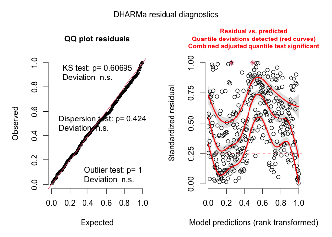<!-- -->

``` r
testDispersion(simulationOutput = simulationOutput)
```

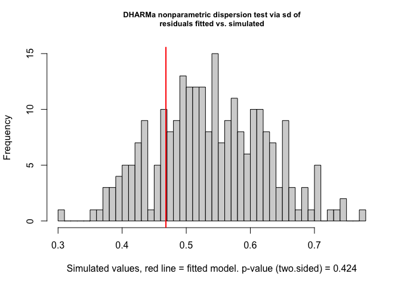<!-- -->

    ## 
    ##  DHARMa nonparametric dispersion test via sd of residuals fitted vs.
    ##  simulated
    ## 
    ## data:  simulationOutput
    ## dispersion = 0.86973, p-value = 0.424
    ## alternative hypothesis: two.sided

## Model with Multilevels - Causes & Interventions (With Lags)

``` r
re3 <- lmer(log(NumHomicides) ~ NumDrugUsers + NumAlcoholUsers + SeriousMentalIllness +
            GiniIndex + UnemploymentRate + log(RealGDP) + log(OneLagLawEnforcement) +
            log(Firearms) + (OneLagGunRegister+OneLagGunPermit + OneLagGunRelinquish) + OneLagGunReport  + CannabisRecreational+ 
            CannabisMedical + (1| State) +  (1 | Year) + Black + Hispanic + Asian + Children18orUnder + Adult19to25 + Education, 
            data=data, REML = F)
```

    ## Warning: Some predictor variables are on very different scales: consider
    ## rescaling

``` r
# ranef(re3)

# Multicollinearity - Failing
vif(re3)
```

    ##              NumDrugUsers           NumAlcoholUsers      SeriousMentalIllness 
    ##                  1.281570                  1.155104                  1.174555 
    ##                 GiniIndex          UnemploymentRate              log(RealGDP) 
    ##                  1.896122                  1.441300                  1.510768 
    ## log(OneLagLawEnforcement)             log(Firearms)         OneLagGunRegister 
    ##                  1.058703                  1.391632                  2.346469 
    ##           OneLagGunPermit       OneLagGunRelinquish           OneLagGunReport 
    ##                  2.111681                  1.273539                  1.404728 
    ##      CannabisRecreational           CannabisMedical                     Black 
    ##                  1.547052                  1.161327                  1.631308 
    ##                  Hispanic                     Asian         Children18orUnder 
    ##                  2.106400                  1.819548                  4.926291 
    ##               Adult19to25                 Education 
    ##                  4.641142                  1.284629

``` r
# Assumption Checking
simulationOutput <- simulateResiduals(fittedModel = re3, plot = F)
plot(simulationOutput)
```

<!-- -->

``` r
testDispersion(simulationOutput = simulationOutput)
```

<!-- -->

    ## 
    ##  DHARMa nonparametric dispersion test via sd of residuals fitted vs.
    ##  simulated
    ## 
    ## data:  simulationOutput
    ## dispersion = 0.99477, p-value = 0.984
    ## alternative hypothesis: two.sided

## Model with Multilevels - Causes & Interventions (With Lags & Interaction)

``` r
re4 <- lmer(log(NumHomicides) ~ NumDrugUsers*CannabisRecreational+ NumAlcoholUsers + SeriousMentalIllness +
            GiniIndex + UnemploymentRate + log(RealGDP) + log(OneLagLawEnforcement) +
            log(Firearms)*(OneLagGunPermit) + OneLagGunRegister + OneLagGunRelinquish + OneLagGunReport  +
             CannabisMedical + (1| State) +  (1 | Year) + Black + Hispanic + Asian + Children18orUnder + 
            Adult19to25 + Education, data=data, REML = F)
```

    ## Warning: Some predictor variables are on very different scales: consider
    ## rescaling

``` r
# ranef(re3)

# Multicollinearity - Failing
vif(re4)
```

    ##                      NumDrugUsers              CannabisRecreational 
    ##                          1.542963                         38.524237 
    ##                   NumAlcoholUsers              SeriousMentalIllness 
    ##                          1.167989                          1.194071 
    ##                         GiniIndex                  UnemploymentRate 
    ##                          1.905078                          1.451959 
    ##                      log(RealGDP)         log(OneLagLawEnforcement) 
    ##                          1.520535                          1.061681 
    ##                     log(Firearms)                   OneLagGunPermit 
    ##                          1.567296                         44.479248 
    ##                 OneLagGunRegister               OneLagGunRelinquish 
    ##                          3.397071                          1.281021 
    ##                   OneLagGunReport                   CannabisMedical 
    ##                          1.407348                          1.174961 
    ##                             Black                          Hispanic 
    ##                          1.642032                          2.128752 
    ##                             Asian                 Children18orUnder 
    ##                          1.836572                          5.018046 
    ##                       Adult19to25                         Education 
    ##                          4.709026                          1.297422 
    ## NumDrugUsers:CannabisRecreational     log(Firearms):OneLagGunPermit 
    ##                         40.201543                         35.064817

``` r
# Assumption Checking
simulationOutput <- simulateResiduals(fittedModel = re4, plot = F)
plot(simulationOutput)
```

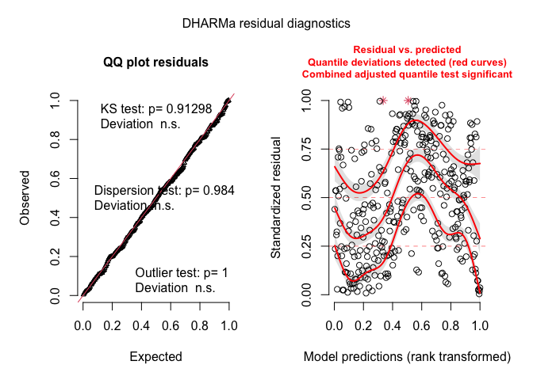<!-- -->

``` r
testDispersion(simulationOutput = simulationOutput)
```

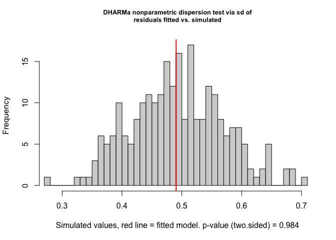<!-- -->

    ## 
    ##  DHARMa nonparametric dispersion test via sd of residuals fitted vs.
    ##  simulated
    ## 
    ## data:  simulationOutput
    ## dispersion = 0.99441, p-value = 0.984
    ## alternative hypothesis: two.sided

## Model with Multilevels - Poisson GLMM

``` r
library(lme4)

re5 <- glmer(round(NumHomicides,0) ~  NumDrugUsers + NumAlcoholUsers + SeriousMentalIllness +
            GiniIndex + UnemploymentRate + log(RealGDP) + log(OneLagLawEnforcement) +
            log(Firearms)*(OneLagGunPermit ) + OneLagGunRegister + OneLagGunRelinquish + OneLagGunReport  + CannabisRecreational+
            CannabisMedical + (1| State) +  (1 | Year) + Black + Hispanic + Asian + Children18orUnder + Adult19to25 +
            Education, data=data, family = poisson(link="log"))
```

    ## Warning: Some predictor variables are on very different scales: consider
    ## rescaling

    ## boundary (singular) fit: see ?isSingular

``` r
# ranef(re1)

# Multicollinearity - Failing
vif(re5)
```

    ## Warning in vcov.merMod(mod): variance-covariance matrix computed from finite-difference Hessian is
    ## not positive definite or contains NA values: falling back to var-cov estimated from RX

    ##                  NumDrugUsers               NumAlcoholUsers 
    ##                      1.834160                      1.503319 
    ##          SeriousMentalIllness                     GiniIndex 
    ##                      1.604071                      3.021469 
    ##              UnemploymentRate                  log(RealGDP) 
    ##                      2.903964                      1.840798 
    ##     log(OneLagLawEnforcement)                 log(Firearms) 
    ##                      1.239365                      1.872565 
    ##               OneLagGunPermit             OneLagGunRegister 
    ##                     34.038090                      2.891306 
    ##           OneLagGunRelinquish               OneLagGunReport 
    ##                      1.700264                      2.330319 
    ##          CannabisRecreational               CannabisMedical 
    ##                      1.615725                      1.468703 
    ##                         Black                      Hispanic 
    ##                      2.377840                      2.296709 
    ##                         Asian             Children18orUnder 
    ##                      2.942449                      3.636453 
    ##                   Adult19to25                     Education 
    ##                      3.589177                      2.530152 
    ## log(Firearms):OneLagGunPermit 
    ##                     29.817025

``` r
# Assumption Checking
simulationOutput <- simulateResiduals(fittedModel = re5, plot = F)
plot(simulationOutput)
```

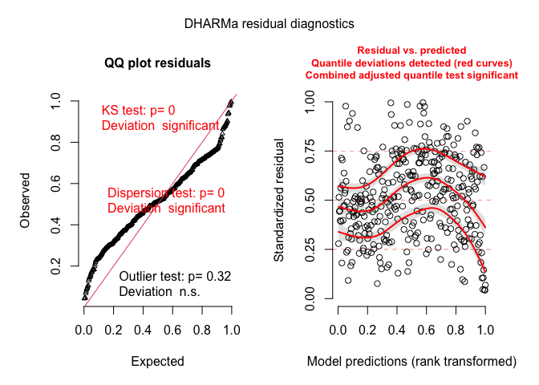<!-- -->

``` r
testDispersion(simulationOutput = simulationOutput)
```

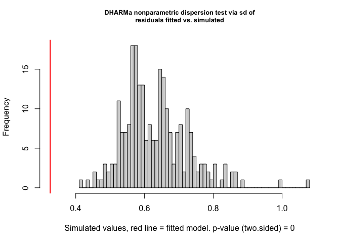<!-- -->

    ## 
    ##  DHARMa nonparametric dispersion test via sd of residuals fitted vs.
    ##  simulated
    ## 
    ## data:  simulationOutput
    ## dispersion = 0.51459, p-value < 2.2e-16
    ## alternative hypothesis: two.sided

### Compare Poisson & Log

    ## 
    ## ===============================================================================================================================================
    ##                                                                                 Dependent variable:                                            
    ##                                      ----------------------------------------------------------------------------------------------------------
    ##                                                                       log(NumHomicides)                                  round(NumHomicides, 0)
    ##                                                                            linear                                         generalized linear 
    ##                                                                         mixed-effects                                       mixed-effects    
    ##                                              (1)                  (2)                  (3)                  (4)                   (5)          
    ## -----------------------------------------------------------------------------------------------------------------------------------------------
    ## NumDrugUsers                           0.0001 (0.00005)     0.0001* (0.0001)    0.0001* (0.00005)     0.0001* (0.0001)      0.0001 (0.0001)    
    ## NumAlcoholUsers                       -0.00001 (0.00002)   -0.00001 (0.00002)   -0.00001 (0.00002)   -0.00001 (0.00002)    0.00003 (0.00002)   
    ## SeriousMentalIllness                  0.00002 (0.00004)    0.00003 (0.00004)    0.00002 (0.00004)    0.00002 (0.00004)     -0.00002 (0.0001)   
    ## GiniIndex                               0.034 (0.029)        0.027 (0.031)        0.036 (0.029)        0.033 (0.029)         0.058 (0.040)     
    ## UnemploymentRate                        0.010 (0.013)        0.006 (0.014)        0.008 (0.013)        0.006 (0.013)         -0.018 (0.023)    
    ## log(RealGDP)                            -0.156 (0.222)       -0.274 (0.250)       -0.118 (0.224)       -0.137 (0.225)        -0.221 (0.311)    
    ## log(LawEnforcementOfficers)             0.015 (0.048)        0.018 (0.049)                                                                     
    ## log(OneLagLawEnforcement)                                                         -0.058 (0.045)       -0.054 (0.045)        -0.124 (0.079)    
    ## log(Firearms)                           -0.028 (0.045)       -0.006 (0.051)       -0.023 (0.045)       0.0005 (0.048)        -0.003 (0.058)    
    ## PermitAllFirearmsYes                  -0.306*** (0.097)      0.677 (0.476)                                                                     
    ## RelinquishGunYes                        -0.018 (0.086)       -0.473 (0.417)                                                                    
    ## GunRegistrationYes                      0.047 (0.142)        -1.338 (2.345)                                                                    
    ## ReportAllFirearmsYes                    -0.065 (0.119)       -0.053 (0.128)                                                                    
    ## OneLagGunRegisterYes                                                              0.075 (0.169)        -0.094 (0.202)        -0.115 (0.347)    
    ## OneLagGunPermitYes                                                              -0.308*** (0.112)      0.419 (0.513)         0.282 (0.797)     
    ## OneLagGunRelinquishYes                                                            -0.029 (0.089)       -0.018 (0.089)        0.004 (0.180)     
    ## OneLagGunReportYes                                                                -0.072 (0.119)       -0.064 (0.119)        -0.238 (0.249)    
    ## CannabisRecreationalYes                 0.033 (0.059)        0.008 (0.065)        0.025 (0.061)        0.168 (0.305)         0.134 (0.154)     
    ## CannabisMedicalYes                      0.016 (0.038)        0.013 (0.039)        0.016 (0.038)        0.011 (0.038)         0.055 (0.085)     
    ## Black                                0.00003*** (0.00001) 0.00003*** (0.00001) 0.00003*** (0.00001) 0.00003*** (0.00001)  0.00003*** (0.00001) 
    ## Hispanic                              0.00001 (0.00001)    0.00001 (0.00001)    0.00001 (0.00001)    0.00001 (0.00001)     0.00001 (0.00001)   
    ## Asian                                 0.00000 (0.00001)    0.00001 (0.00002)    0.00000 (0.00001)    0.00000 (0.00001)     0.00001 (0.00002)   
    ## Children18orUnder                    0.00003** (0.00001)  0.00002** (0.00001)  0.00003** (0.00001)  0.00003** (0.00001)    0.00003 (0.00002)   
    ## Adult19to25                           -0.0001* (0.00004)   -0.0001 (0.00004)    -0.0001* (0.00004)   -0.0001* (0.00004)     -0.0001 (0.0001)   
    ## Education                               -0.001 (0.009)       -0.002 (0.010)       -0.002 (0.009)       -0.004 (0.009)        -0.018 (0.021)    
    ## log(Firearms):PermitAllFirearmsYes                          -0.170** (0.079)                                                                   
    ## log(Firearms):GunRegistrationYes                             0.257 (0.472)                                                                     
    ## log(Firearms):RelinquishGunYes                               0.108 (0.096)                                                                     
    ## NumDrugUsers:CannabisRecreationalYes                                                                 -0.00005 (0.0001)                         
    ## log(Firearms):OneLagGunPermitYes                                                                       -0.114 (0.078)        -0.098 (0.151)    
    ## Constant                                0.969 (2.969)        2.446 (3.309)        0.945 (2.977)        1.190 (2.980)         2.748 (4.373)     
    ## -----------------------------------------------------------------------------------------------------------------------------------------------
    ## Observations                                 349                  349                  349                  349                   349          
    ## Log Likelihood                              43.893              -65.344               44.257               45.386               -648.469       
    ## Akaike Inf. Crit.                          -39.786              184.687              -40.514              -38.773              1,344.938       
    ## Bayesian Inf. Crit.                         52.735              288.774               52.008               61.459              1,437.459       
    ## ===============================================================================================================================================
    ## Note:                                                                                                               *p<0.1; **p<0.05; ***p<0.01

## Effects

``` r
library(effects)
```

    ## lattice theme set by effectsTheme()
    ## See ?effectsTheme for details.

``` r
effects <- allEffects(re4)
#Plot All
for (i in 1:length(effects)) {
  print(plot(effects, selection = i))
}
```

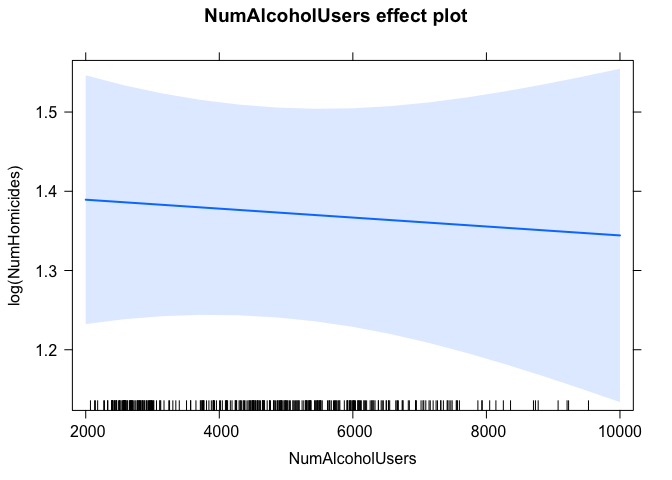<!-- -->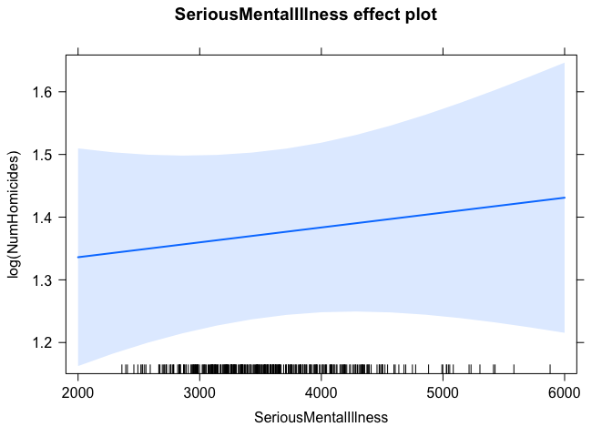<!-- -->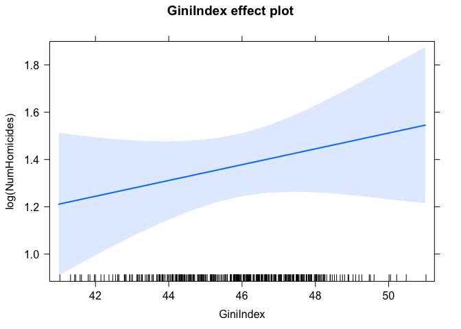<!-- -->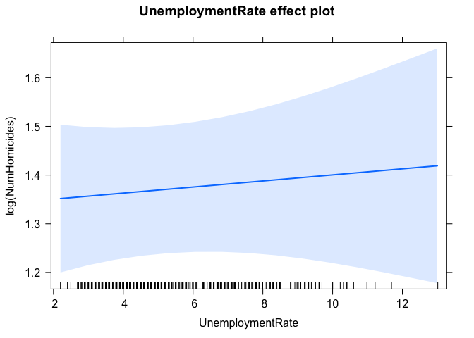<!-- -->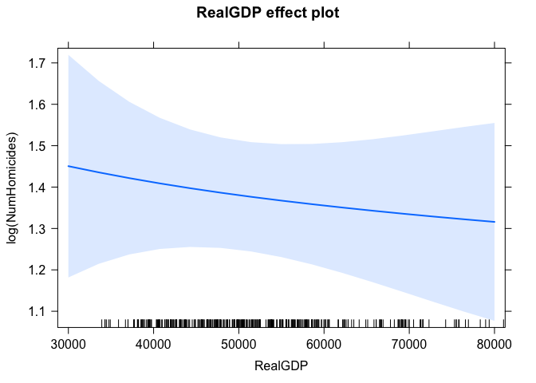<!-- -->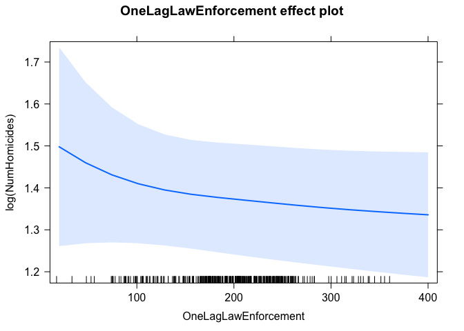<!-- -->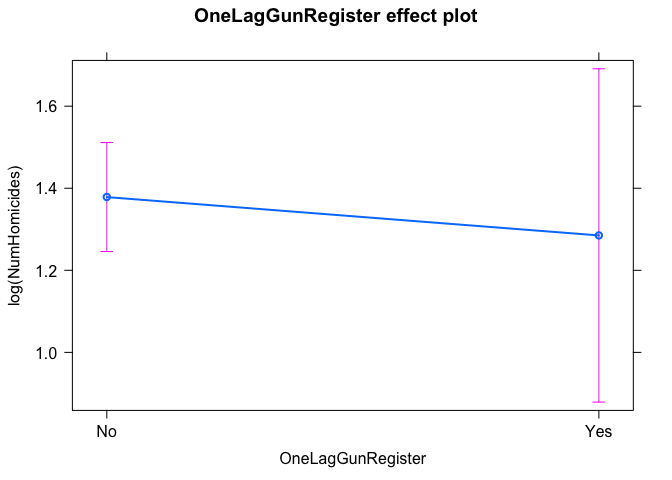<!-- -->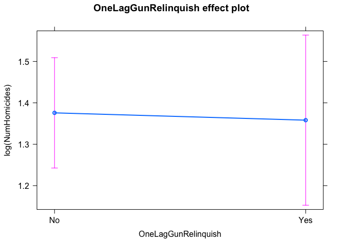<!-- -->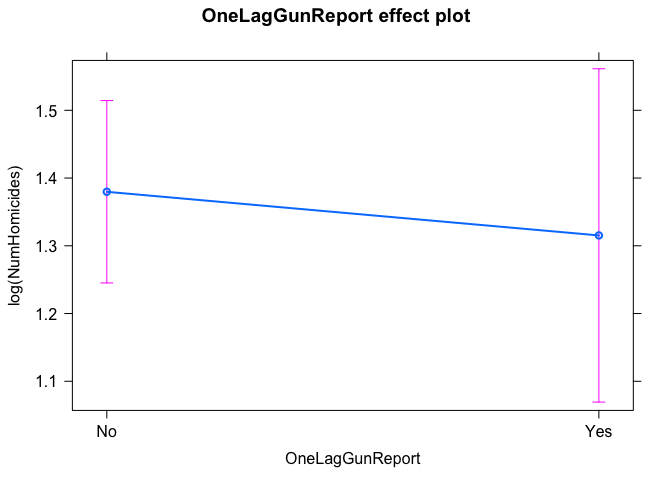<!-- -->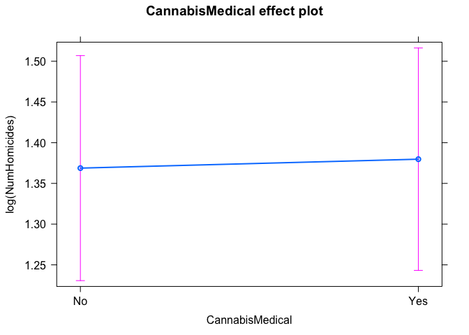<!-- -->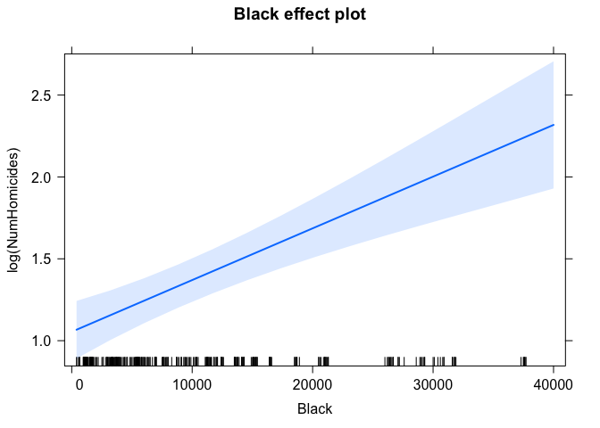<!-- -->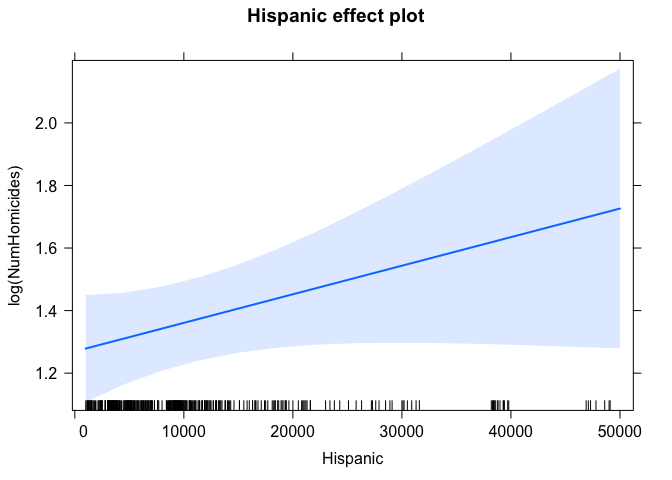<!-- -->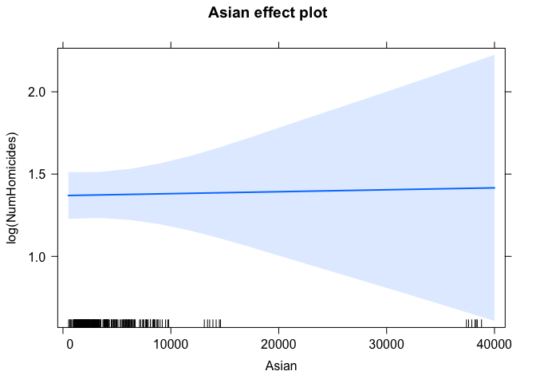<!-- -->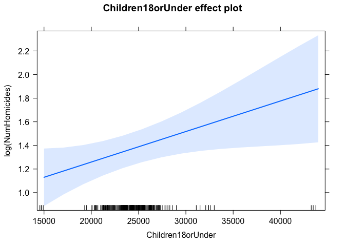<!-- -->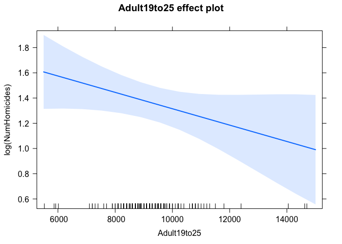<!-- -->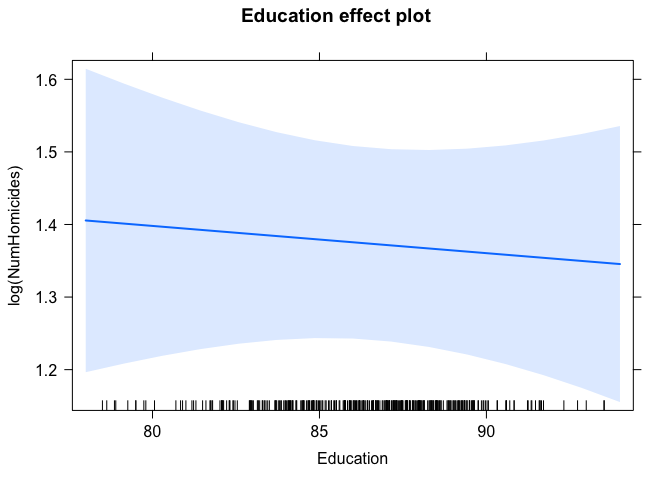<!-- -->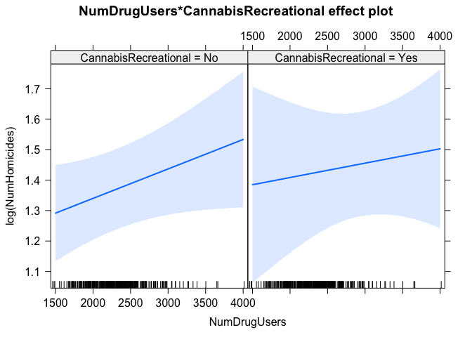<!-- -->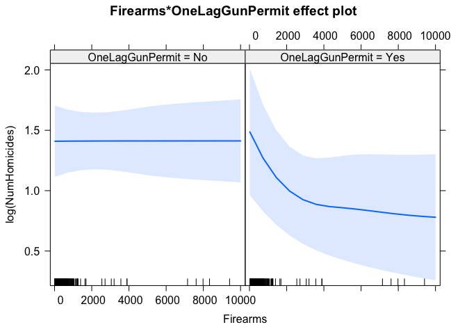<!-- -->
