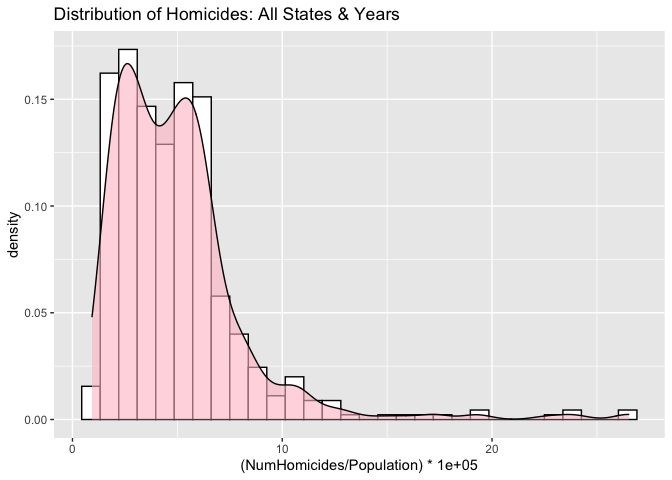
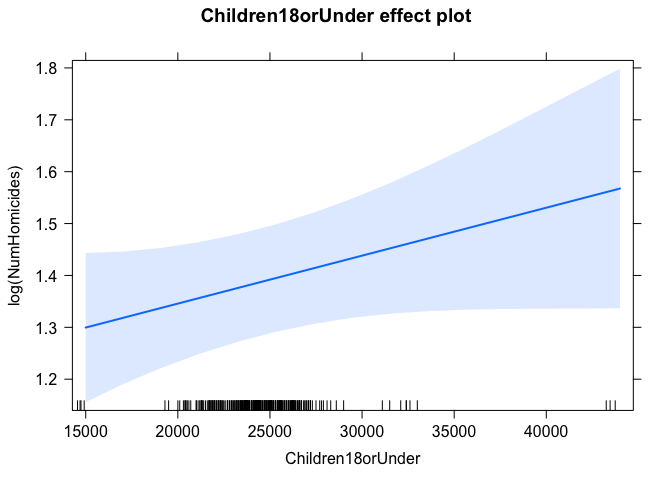

R Notebook
================
Jesid
2021-04-20

``` r
library(here)
```

    ## here() starts at /Users/jesidacosta/OneDrive - University of South Florida/ISM6137/R_Projects/ViolenceNHomicides

``` r
library(readxl)
library(dplyr)
```

    ## 
    ## Attaching package: 'dplyr'

    ## The following objects are masked from 'package:stats':
    ## 
    ##     filter, lag

    ## The following objects are masked from 'package:base':
    ## 
    ##     intersect, setdiff, setequal, union

``` r
library(ggplot2)
```

# Read Data

``` r
df <- read_excel(here("data", "HomicideData_Original_revised.xlsx"), sheet="HomicideData")
colSums(is.na(df))
```

    ##                                State                            StateCode 
    ##                                    0                                    0 
    ##                                 Year                         NumHomicides 
    ##                                    0                                    0 
    ##                      AnyOtherWeapon1                   DestructiveDevice2 
    ##                                   51                                   51 
    ##                          Machinegun3                            Silencer4 
    ##                                   51                                   51 
    ##                  ShortBarreledRifle5                ShortBarreledShotgun6 
    ##                                   51                                   51 
    ##                         TotalWeapons                         NumDrugUsers 
    ##                                   51                                   51 
    ##                      NumAlcoholUsers               LawEnforcementOfficers 
    ##                                    0                                    2 
    ##              LawEnforcementCivilians         TotalLawEnforcementEmployees 
    ##                                    2                                    2 
    ##                           Population                                White 
    ##                                    0                                    0 
    ##                                Black                             Hispanic 
    ##                                    0                                    0 
    ##                                Asian                        Children 0-18 
    ##                                    0                                    0 
    ##                         Adults 19-25                         Adults 26-34 
    ##                                    0                                    0 
    ##                         Adults 35-54                         Adults 55-64 
    ##                                    0                                    0 
    ##                                  65+                          Non Citizen 
    ##                                    0                                    0 
    ##                            Education                              RealGDP 
    ##                                   60                                    0 
    ##                     RealGDPperCapita                            GiniIndex 
    ##                                    0                                    0 
    ##                 SeriousMentalIllness                   UnenemploymentRate 
    ##                                   51                                    0 
    ##                   MurderNSlaugtherVC                               RapeVC 
    ##                                   10                                   10 
    ##                            RobberyVC                  AggravatedAssaultVC 
    ##                                   10                                   10 
    ##                         ViolentCrime                        PropertyCrime 
    ##                                    0                                    0 
    ## UniversalBackgroundChecksAllFirearms    UniversalBackgroundChecksHandguns 
    ##                                   10                                   10 
    ##             WaitingPeriodAllFirearms                WaitingPeriodHandguns 
    ##                                   10                                   10 
    ##                    PermitAllFirearms                       PermitHandguns 
    ##                                   10                                   10 
    ##       PermitCarryingConcealedWeapons                    BanAssaultWeapons 
    ##                                   10                                   10 
    ##      BackgroundCheckGunshowsFirearms      BackgroundCheckGunshowsHandguns 
    ##                                   10                                   10 
    ##            SubAbuseInpatientCareBeds                      UniversalPermit 
    ##                                  153                                   10 
    ##                      CannabisMedical                 CannabisRecreational 
    ##                                    0                                    0 
    ##                       relinquishment                           recordsall 
    ##                                   10                                   10 
    ##                          recordsallh                        recordsdealer 
    ##                                   10                                   10 
    ##                       recordsdealerh                            reportall 
    ##                                   10                                   10 
    ##                           reportallh                         reportdealer 
    ##                                   10                                   10 
    ##                        reportdealerh                                purge 
    ##                                   10                                   10 
    ##                         registration                        registrationh 
    ##                                   10                                   10 
    ##                           defactoreg                          defactoregh 
    ##                                   10                                   10

# Distribution of DV: All Years All States

``` r
ggplot(data=df, aes(x=(NumHomicides/Population) *100000)) +
  geom_histogram(aes(y=..density..), col='black', fill='white') +
  geom_density(alpha=.6, fill="pink") +
  labs(title = "Distribution of Homicides: All States & Years")
```

    ## `stat_bin()` using `bins = 30`. Pick better value with `binwidth`.

<!-- -->

# Preparing Data for Modeling

``` r
# Removing DC - not a state
df <- df %>% filter(StateCode !="DC")
# Grouping Firearms
df <- df %>% mutate(Firearms = AnyOtherWeapon1 + Machinegun3 + ShortBarreledRifle5 + ShortBarreledShotgun6)
# Grouping Violent Crime Except Murder
df <- df %>% mutate(VCNotMurder = RapeVC + AggravatedAssaultVC + RobberyVC)
# Selecting data of interest for modeling
data <- df %>% select(Year, State, NumHomicides, Firearms, NumDrugUsers, NumAlcoholUsers, SeriousMentalIllness,
                      Population, RealGDP, GiniIndex, UnenemploymentRate, LawEnforcementOfficers, 
                      CannabisMedical, CannabisRecreational, SubAbuseInpatientCareBeds,
                      VCNotMurder,PropertyCrime, White, Black, Hispanic, Asian, `Children 0-18`, `Adults 19-25`, `Adults 26-34`, Education,
                      PermitAllFirearms, reportall, defactoreg, relinquishment, UniversalBackgroundChecksAllFirearms, UniversalPermit
                      )
# Rename Variables in Data
data <- data %>% rename(ViolentCrime = VCNotMurder, BedsForAbuse = SubAbuseInpatientCareBeds,
                        UnemploymentRate = UnenemploymentRate,
                        ReportAllFirearms = reportall, GunRegistration = defactoreg,
                        Children18orUnder = `Children 0-18`,
                        RelinquishGun = relinquishment,
                        Adult19to25 = `Adults 19-25`,
                        Adult26to34 = `Adults 26-34`,
                        UniversalBackgroundCheck = UniversalBackgroundChecksAllFirearms)
# Checking data
colSums(is.na(data))
```

    ##                     Year                    State             NumHomicides 
    ##                        0                        0                        0 
    ##                 Firearms             NumDrugUsers          NumAlcoholUsers 
    ##                       50                       50                        0 
    ##     SeriousMentalIllness               Population                  RealGDP 
    ##                       50                        0                        0 
    ##                GiniIndex         UnemploymentRate   LawEnforcementOfficers 
    ##                        0                        0                        2 
    ##          CannabisMedical     CannabisRecreational             BedsForAbuse 
    ##                        0                        0                      150 
    ##             ViolentCrime            PropertyCrime                    White 
    ##                        0                        0                        0 
    ##                    Black                 Hispanic                    Asian 
    ##                        0                        0                        0 
    ##        Children18orUnder              Adult19to25              Adult26to34 
    ##                        0                        0                        0 
    ##                Education        PermitAllFirearms        ReportAllFirearms 
    ##                       50                        0                        0 
    ##          GunRegistration            RelinquishGun UniversalBackgroundCheck 
    ##                        0                        0                        0 
    ##          UniversalPermit 
    ##                        0

## Creating New Variable Transformation

``` r
# Factorize
cols <- c("PermitAllFirearms", "ReportAllFirearms", "GunRegistration", "CannabisMedical", "CannabisRecreational","RelinquishGun", "UniversalBackgroundCheck")
for (col in cols){
  data[[col]] <- factor(data[[col]], levels = c(0,1), labels = c("No", "Yes"))  
}

# Year to Factor  
data$Year <- relevel(factor(data$Year), "2010")

# convert to Pop estimate - all except laws, gini, and unemployment rate
unit_of_people <- 100000
# cols
cols <- c("NumDrugUsers",  "NumAlcoholUsers", "LawEnforcementOfficers", "SeriousMentalIllness", "ViolentCrime", 
          "PropertyCrime", "BedsForAbuse", "NumHomicides", "Firearms", "White", "Black", "Hispanic", "Asian",
          "Children18orUnder","Adult19to25", "Adult26to34")
data[cols] <- (data[cols] / data[["Population"]]) * unit_of_people
# Real GDP per Capita
data$RealGDP <- data$RealGDP/data$Population
# convert Gini to percentage
data['GiniIndex'] = data['GiniIndex'] * 100
```

## Create Lags

``` r
# testing lags
data <- data %>%
  arrange(Year) %>%
  group_by(State) %>%
  mutate(OneLagLawEnforcement = lag(LawEnforcementOfficers),
         OneLagGunPermit = lag(PermitAllFirearms),
         OneLagGunRegister = lag(GunRegistration),
         OneLagGunReport = lag(ReportAllFirearms),
         OneLagGunRelinquish = lag(RelinquishGun),
         OneLagBackground = lag(UniversalBackgroundCheck),
         OneLagCannabisRec = lag(CannabisRecreational), 
         OneLagCannabisMed = lag(CannabisMedical),
         OneLagViolentCrime = lag(ViolentCrime),
         OneLagFirearms = lag(Firearms),
         TwoLagLawEnforcement = lag(LawEnforcementOfficers, 2),
         TwoLagGunPermit = lag(PermitAllFirearms, 2),
         TwoLagGunRegister = lag(GunRegistration, 2),
         TwoLagGunReport = lag(ReportAllFirearms, 2),
         TwoLagGunRelinquish = lag(RelinquishGun, 2),
         TwoLagBackground = lag(UniversalBackgroundCheck, 2),
         TwoLagCannabisRec = lag(CannabisRecreational, 2), 
         TwoLagCannabisMed = lag(CannabisMedical, 2),
         TwoLagViolentCrime = lag(ViolentCrime, 2),
         TwoLagFirearms = lag(Firearms,2))
```

# Modeling

## Fixed Effects - Causes

``` r
# base model - only causes
lm1 <- glm(log(NumHomicides) ~ log(Firearms) + NumDrugUsers + NumAlcoholUsers + SeriousMentalIllness +
           GiniIndex + UnemploymentRate + log(RealGDP)  + Black + Hispanic + Asian + 
           Children18orUnder + Adult19to25 + Education + Year + State, 
           data=data, family = gaussian(link = "identity"))

plot(lm1, which = c(1,2))
```

<!-- --><!-- -->

``` r
# Normality
shapiro.test(lm1$res)
```

    ## 
    ##  Shapiro-Wilk normality test
    ## 
    ## data:  lm1$res
    ## W = 0.97993, p-value = 8.517e-05

``` r
# Homoskedasticity
bartlett.test(list(lm1$res, lm1$fit))
```

    ## 
    ##  Bartlett test of homogeneity of variances
    ## 
    ## data:  list(lm1$res, lm1$fit)
    ## Bartlett's K-squared = 451.9, df = 1, p-value < 2.2e-16

``` r
library(car)
```

    ## Loading required package: carData

    ## 
    ## Attaching package: 'car'

    ## The following object is masked from 'package:dplyr':
    ## 
    ##     recode

``` r
vif(lm1)
```

    ##                              GVIF Df GVIF^(1/(2*Df))
    ## log(Firearms)        1.519285e+02  1       12.325928
    ## NumDrugUsers         4.478557e+00  1        2.116260
    ## NumAlcoholUsers      1.385371e+01  1        3.722057
    ## SeriousMentalIllness 7.535068e+00  1        2.745008
    ## GiniIndex            1.582714e+02  1       12.580596
    ## UnemploymentRate     1.443798e+01  1        3.799734
    ## log(RealGDP)         5.878552e+01  1        7.667172
    ## Black                2.152744e+03  1       46.397669
    ## Hispanic             1.343788e+03  1       36.657711
    ## Asian                1.002202e+03  1       31.657578
    ## Children18orUnder    4.883017e+01  1        6.987859
    ## Adult19to25          1.740555e+01  1        4.171995
    ## Education            1.132877e+01  1        3.365824
    ## Year                 9.821473e+02  6        1.775612
    ## State                7.649989e+17 49        1.522251

``` r
library(lmtest)
```

    ## Loading required package: zoo

    ## 
    ## Attaching package: 'zoo'

    ## The following objects are masked from 'package:base':
    ## 
    ##     as.Date, as.Date.numeric

``` r
dwtest(lm1)
```

    ## 
    ##  Durbin-Watson test
    ## 
    ## data:  lm1
    ## DW = 2.3256, p-value = 0.9944
    ## alternative hypothesis: true autocorrelation is greater than 0

``` r
# stargazer::stargazer(lm1, type="text", single.row = T)
```

## Fixed Effects - Causes & Interventions(Law Enforcement)

``` r
# base model - only causes
lm2 <- glm(log(NumHomicides) ~ log(Firearms) + NumDrugUsers + NumAlcoholUsers + SeriousMentalIllness +
           GiniIndex + UnemploymentRate + log(RealGDP) + log(LawEnforcementOfficers) + Black + Hispanic + 
             Asian + Children18orUnder + Adult19to25 + Education + Year + State, 
           data=data, family = gaussian(link = "identity"))

plot(lm2, which = c(1,2))
```

<!-- --><!-- -->

``` r
# Normality
shapiro.test(lm2$res)
```

    ## 
    ##  Shapiro-Wilk normality test
    ## 
    ## data:  lm2$res
    ## W = 0.98113, p-value = 0.0001543

``` r
# Homoskedasticity
bartlett.test(list(lm2$res, lm2$fit))
```

    ## 
    ##  Bartlett test of homogeneity of variances
    ## 
    ## data:  list(lm2$res, lm2$fit)
    ## Bartlett's K-squared = 451.38, df = 1, p-value < 2.2e-16

``` r
library(car)
vif(lm2)
```

    ##                                     GVIF Df GVIF^(1/(2*Df))
    ## log(Firearms)               1.518500e+02  1       12.322745
    ## NumDrugUsers                4.486354e+00  1        2.118102
    ## NumAlcoholUsers             1.395335e+01  1        3.735418
    ## SeriousMentalIllness        7.502325e+00  1        2.739037
    ## GiniIndex                   1.583492e+02  1       12.583690
    ## UnemploymentRate            1.443520e+01  1        3.799368
    ## log(RealGDP)                5.841764e+01  1        7.643143
    ## log(LawEnforcementOfficers) 4.320266e+00  1        2.078525
    ## Black                       2.158222e+03  1       46.456667
    ## Hispanic                    1.344148e+03  1       36.662624
    ## Asian                       1.003040e+03  1       31.670803
    ## Children18orUnder           4.907519e+01  1        7.005368
    ## Adult19to25                 1.744047e+01  1        4.176178
    ## Education                   1.140744e+01  1        3.377491
    ## Year                        2.071003e+03  6        1.889506
    ## State                       1.603862e+18 49        1.533794

``` r
library(lmtest)
dwtest(lm2)
```

    ## 
    ##  Durbin-Watson test
    ## 
    ## data:  lm2
    ## DW = 2.3222, p-value = 0.9938
    ## alternative hypothesis: true autocorrelation is greater than 0

``` r
# stargazer::stargazer(lm1, lm2, type="text", single.row = T)
```

## Fixed Effects - With Policies

``` r
# base model - only causes
lm3 <- glm(log(NumHomicides) ~ log(Firearms) + (PermitAllFirearms + GunRegistration + RelinquishGun + UniversalBackgroundCheck) + ReportAllFirearms + 
             NumDrugUsers + NumAlcoholUsers + SeriousMentalIllness + GiniIndex + UnemploymentRate  +
             log(RealGDP) + log(LawEnforcementOfficers) + Black + Hispanic + 
             Asian + Children18orUnder + Adult19to25 + Education + Year + State, 
           data=data, family = gaussian(link = "identity"))

plot(lm3, which = c(1,2))
```

<!-- --><!-- -->

``` r
# Normality
shapiro.test(lm3$res)
```

    ## 
    ##  Shapiro-Wilk normality test
    ## 
    ## data:  lm3$res
    ## W = 0.98078, p-value = 0.0001308

``` r
# Homoskedasticity
bartlett.test(list(lm3$res, lm3$fit))
```

    ## 
    ##  Bartlett test of homogeneity of variances
    ## 
    ## data:  list(lm3$res, lm3$fit)
    ## Bartlett's K-squared = 459.45, df = 1, p-value < 2.2e-16

``` r
library(car)
vif(lm3)
```

    ##                                     GVIF Df GVIF^(1/(2*Df))
    ## log(Firearms)               1.595460e+02  1       12.631152
    ## PermitAllFirearms           1.745277e+01  1        4.177651
    ## GunRegistration             1.591798e+01  1        3.989734
    ## RelinquishGun               1.155838e+01  1        3.399762
    ## UniversalBackgroundCheck    5.189110e+00  1        2.277962
    ## ReportAllFirearms           2.101759e+01  1        4.584494
    ## NumDrugUsers                4.826460e+00  1        2.196921
    ## NumAlcoholUsers             1.419293e+01  1        3.767351
    ## SeriousMentalIllness        7.612494e+00  1        2.759075
    ## GiniIndex                   1.616895e+02  1       12.715719
    ## UnemploymentRate            1.471162e+01  1        3.835573
    ## log(RealGDP)                6.125762e+01  1        7.826724
    ## log(LawEnforcementOfficers) 4.334899e+00  1        2.082042
    ## Black                       2.257212e+03  1       47.510121
    ## Hispanic                    1.391441e+03  1       37.302020
    ## Asian                       1.120061e+03  1       33.467315
    ## Children18orUnder           5.240758e+01  1        7.239308
    ## Adult19to25                 1.800654e+01  1        4.243412
    ## Education                   1.187091e+01  1        3.445418
    ## Year                        2.313392e+03  6        1.907015
    ## State                       4.413830e+21 49        1.662897

``` r
library(lmtest)
dwtest(lm3)
```

    ## 
    ##  Durbin-Watson test
    ## 
    ## data:  lm3
    ## DW = 2.2933, p-value = 0.9879
    ## alternative hypothesis: true autocorrelation is greater than 0

``` r
# stargazer::stargazer(lm1, lm2, lm3, type="text", single.row = T)
```

## Fixed Effects - With Policies & Interactions

``` r
# base model - only causes
lm4 <- glm(log(NumHomicides) ~ log(Firearms)*(PermitAllFirearms + UniversalBackgroundCheck) + GunRegistration + RelinquishGun + ReportAllFirearms + 
             NumDrugUsers + NumAlcoholUsers + SeriousMentalIllness + GiniIndex + UnemploymentRate + 
             log(RealGDP) + log(LawEnforcementOfficers) + Black + Hispanic + 
             Asian + Children18orUnder + Adult19to25 + Education + Year + State, 
           data=data, family = gaussian(link = "identity"))

plot(lm4, which = c(1,2))
```

<!-- --><!-- -->

``` r
# Normality
shapiro.test(lm4$res)
```

    ## 
    ##  Shapiro-Wilk normality test
    ## 
    ## data:  lm4$res
    ## W = 0.98026, p-value = 0.0001019

``` r
# Homoskedasticity
bartlett.test(list(lm4$res, lm4$fit))
```

    ## 
    ##  Bartlett test of homogeneity of variances
    ## 
    ## data:  list(lm4$res, lm4$fit)
    ## Bartlett's K-squared = 459.93, df = 1, p-value < 2.2e-16

``` r
library(car)
vif(lm4)
```

    ##                                                GVIF Df GVIF^(1/(2*Df))
    ## log(Firearms)                          2.008907e+02  1       14.173591
    ## PermitAllFirearms                      5.543475e+02  1       23.544585
    ## UniversalBackgroundCheck               8.240221e+01  1        9.077567
    ## GunRegistration                        2.080376e+01  1        4.561114
    ## RelinquishGun                          1.318099e+01  1        3.630563
    ## ReportAllFirearms                      2.105518e+01  1        4.588592
    ## NumDrugUsers                           4.835580e+00  1        2.198995
    ## NumAlcoholUsers                        1.448029e+01  1        3.805297
    ## SeriousMentalIllness                   7.670187e+00  1        2.769510
    ## GiniIndex                              1.623365e+02  1       12.741135
    ## UnemploymentRate                       1.484568e+01  1        3.853009
    ## log(RealGDP)                           6.265792e+01  1        7.915675
    ## log(LawEnforcementOfficers)            4.339839e+00  1        2.083228
    ## Black                                  2.278044e+03  1       47.728854
    ## Hispanic                               1.560737e+03  1       39.506163
    ## Asian                                  1.120644e+03  1       33.476025
    ## Children18orUnder                      6.087681e+01  1        7.802359
    ## Adult19to25                            1.837013e+01  1        4.286038
    ## Education                              1.212612e+01  1        3.482258
    ## Year                                   2.772188e+03  6        1.935985
    ## State                                  6.889953e+22 49        1.710185
    ## log(Firearms):PermitAllFirearms        3.216761e+02  1       17.935330
    ## log(Firearms):UniversalBackgroundCheck 7.267613e+01  1        8.525030

``` r
library(lmtest)
dwtest(lm4)
```

    ## 
    ##  Durbin-Watson test
    ## 
    ## data:  lm4
    ## DW = 2.2889, p-value = 0.9865
    ## alternative hypothesis: true autocorrelation is greater than 0

### Compare Linear Models

``` r
stargazer::stargazer(lm1, lm2, lm3, lm4, type="text", single.row = T)
```

    ## 
    ## =============================================================================================================================
    ##                                                                           Dependent variable:                                
    ##                                           -----------------------------------------------------------------------------------
    ##                                                                            log(NumHomicides)                                 
    ##                                                   (1)                  (2)                  (3)                  (4)         
    ## -----------------------------------------------------------------------------------------------------------------------------
    ## log(Firearms)                                -0.106 (0.099)       -0.104 (0.100)       -0.111 (0.102)       -0.078 (0.115)   
    ## PermitAllFirearmsYes                                                                  -0.233** (0.111)      0.163 (0.630)    
    ## GunRegistrationYes                                                                     -0.018 (0.157)       -0.072 (0.179)   
    ## RelinquishGunYes                                                                       -0.020 (0.094)       -0.018 (0.100)   
    ## UniversalBackgroundCheckYes                                                            -0.058 (0.057)       -0.050 (0.227)   
    ## ReportAllFirearmsYes                                                                   0.079 (0.140)        0.082 (0.140)    
    ## NumDrugUsers                               0.0001* (0.00005)    0.0001* (0.00005)    0.0001** (0.00005)   0.0001** (0.00005) 
    ## NumAlcoholUsers                            -0.00003 (0.00002)   -0.00003 (0.00002)   -0.00003 (0.00002)   -0.00003 (0.00002) 
    ## SeriousMentalIllness                       0.00004 (0.00004)    0.00003 (0.00004)    0.00003 (0.00004)    0.00004 (0.00004)  
    ## GiniIndex                                    0.018 (0.057)        0.017 (0.057)        0.035 (0.057)        0.037 (0.058)    
    ## UnemploymentRate                             0.006 (0.016)        0.006 (0.016)        0.004 (0.016)        0.004 (0.016)    
    ## log(RealGDP)                                 -0.220 (0.347)       -0.221 (0.348)       -0.169 (0.355)       -0.204 (0.360)   
    ## log(LawEnforcementOfficers)                                       0.036 (0.050)        0.033 (0.050)        0.034 (0.050)    
    ## Black                                      -0.0001 (0.00004)    -0.0001 (0.00004)    -0.0001 (0.00004)    -0.0001 (0.00004)  
    ## Hispanic                                  -0.0001*** (0.00003) -0.0001*** (0.00003) -0.0001*** (0.00003) -0.0001*** (0.00003)
    ## Asian                                       0.0001 (0.00005)    0.00005 (0.00005)     0.0001 (0.0001)      0.0001 (0.0001)   
    ## Children18orUnder                         0.0001*** (0.00002)  0.0001*** (0.00002)  0.0001*** (0.00002)  0.0001*** (0.00002) 
    ## Adult19to25                                -0.00003 (0.00004)   -0.00003 (0.00004)   -0.00003 (0.00004)   -0.00002 (0.00004) 
    ## Education                                    0.006 (0.010)        0.007 (0.010)        0.011 (0.011)        0.010 (0.011)    
    ## Year2012                                     0.105 (0.066)        0.107 (0.066)        0.082 (0.068)        0.079 (0.068)    
    ## Year2013                                     -0.062 (0.102)       -0.056 (0.104)       -0.093 (0.106)       -0.101 (0.108)   
    ## Year2014                                     0.0001 (0.108)       0.002 (0.110)        -0.044 (0.112)       -0.053 (0.114)   
    ## Year2016                                    0.318*** (0.107)     0.344*** (0.113)     0.280** (0.117)      0.264** (0.121)   
    ## Year2017                                    0.494*** (0.116)     0.499*** (0.116)     0.426*** (0.120)     0.405*** (0.126)  
    ## Year2018                                    0.421*** (0.125)     0.425*** (0.126)     0.347*** (0.130)     0.322** (0.138)   
    ## StateALASKA                                  -1.444 (1.152)       -1.484 (1.156)       -1.609 (1.189)       -1.522 (1.200)   
    ## StateARIZONA                                 1.646 (1.275)        1.645 (1.279)        1.211 (1.298)        1.135 (1.307)    
    ## StateARKANSAS                                -0.575 (0.494)       -0.602 (0.496)       -0.666 (0.502)       -0.674 (0.504)   
    ## StateCALIFORNIA                              2.246 (1.479)        2.277 (1.483)        1.541 (1.525)        1.416 (1.542)    
    ## StateCOLORADO                                0.128 (1.139)        0.106 (1.142)        -0.201 (1.165)       -0.221 (1.169)   
    ## StateCONNECTICUT                             -0.352 (0.843)       -0.373 (0.846)       -0.601 (0.862)       -0.611 (0.866)   
    ## StateDELAWARE                                0.120 (0.444)        0.111 (0.445)        0.020 (0.456)        0.013 (0.458)    
    ## StateFLORIDA                                2.000** (0.830)      2.012** (0.832)       1.642* (0.845)       1.534* (0.864)   
    ## StateGEORGIA                                 0.289 (0.264)        0.301 (0.266)        0.219 (0.270)        0.196 (0.274)    
    ## StateHAWAII                                 -3.895* (2.229)      -3.883* (2.235)      -4.635** (2.338)     -4.586* (2.346)   
    ## StateIDAHO                                  -2.018* (1.138)      -2.061* (1.143)      -2.177* (1.162)      -2.130* (1.168)   
    ## StateILLINOIS                                0.181 (0.755)        0.182 (0.757)        0.100 (0.780)        -0.005 (0.799)   
    ## StateINDIANA                                 -1.139 (0.792)       -1.158 (0.795)       -1.219 (0.811)       -1.175 (0.816)   
    ## StateIOWA                                   -2.420** (1.040)     -2.466** (1.044)     -2.554** (1.065)     -2.504** (1.071)  
    ## StateKANSAS                                  -1.207 (0.958)       -1.250 (0.962)       -1.419 (0.985)       -1.366 (0.992)   
    ## StateKENTUCKY                               -1.739** (0.816)     -1.769** (0.819)     -1.851** (0.837)     -1.787** (0.846)  
    ## StateLOUISIANA                              0.524** (0.265)      0.526** (0.266)       0.523* (0.267)      0.538** (0.269)   
    ## StateMAINE                                  -2.632** (1.094)     -2.686** (1.099)     -2.769** (1.119)     -2.709** (1.126)  
    ## StateMARYLAND                                0.668* (0.392)       0.674* (0.394)       0.534 (0.405)        0.514 (0.408)    
    ## StateMASSACHUSETTS                           -1.557 (0.970)       -1.586 (0.973)      -1.765* (0.987)      -1.743* (0.991)   
    ## StateMICHIGAN                                -0.950 (0.603)       -0.969 (0.605)      -1.072* (0.624)       -1.002 (0.636)   
    ## StateMINNESOTA                              -2.474** (0.959)    -2.509*** (0.963)    -2.658*** (0.995)     -2.562** (1.010)  
    ## StateMISSISSIPPI                             -0.250 (0.502)       -0.213 (0.505)       -0.112 (0.515)       -0.128 (0.518)   
    ## StateMISSOURI                                -1.056 (0.704)       -1.095 (0.707)       -1.170 (0.728)       -1.070 (0.748)   
    ## StateMONTANA                                -2.538** (1.107)     -2.586** (1.111)     -2.661** (1.132)     -2.584** (1.143)  
    ## StateNEBRASKA                                -1.462 (1.002)       -1.506 (1.006)       -1.640 (1.024)       -1.617 (1.028)   
    ## StateNEVADA                                  1.553 (1.174)        1.562 (1.177)        1.111 (1.207)        1.062 (1.213)    
    ## StateNEW HAMPSHIRE                         -2.966*** (1.140)    -3.022*** (1.145)    -3.150*** (1.171)     -3.061** (1.183)  
    ## StateNEW JERSEY                              0.228 (0.880)        0.214 (0.882)        0.001 (0.927)        -0.082 (0.939)   
    ## StateNEW MEXICO                             4.155** (1.702)      4.189** (1.707)      3.570** (1.724)       3.327* (1.770)   
    ## StateNEW YORK                                -0.003 (0.842)       -0.004 (0.844)       -0.465 (0.881)       -0.438 (0.886)   
    ## StateNORTH CAROLINA                          -0.337 (0.337)       -0.346 (0.338)       -0.472 (0.351)       -0.443 (0.355)   
    ## StateNORTH DAKOTA                           -2.302** (1.079)     -2.365** (1.084)     -2.470** (1.102)     -2.436** (1.107)  
    ## StateOHIO                                   -1.493** (0.656)     -1.508** (0.659)     -1.579** (0.677)     -1.507** (0.689)  
    ## StateOKLAHOMA                                -0.663 (0.863)       -0.699 (0.867)       -0.832 (0.885)       -0.798 (0.890)   
    ## StateOREGON                                  -1.384 (1.135)       -1.407 (1.138)       -1.699 (1.164)       -1.679 (1.168)   
    ## StatePENNSYLVANIA                            -0.794 (0.735)       -0.823 (0.738)       -0.971 (0.746)       -0.927 (0.751)   
    ## StateRHODE ISLAND                            -0.937 (1.028)       -0.965 (1.031)       -1.011 (1.064)       -1.086 (1.077)   
    ## StateSOUTH CAROLINA                          0.006 (0.131)        0.004 (0.131)        -0.009 (0.131)       -0.001 (0.132)   
    ## StateSOUTH DAKOTA                           -2.779** (1.094)     -2.835** (1.099)     -2.876** (1.124)     -2.766** (1.141)  
    ## StateTENNESSEE                               -0.622 (0.446)       -0.653 (0.448)       -0.740 (0.460)       -0.705 (0.465)   
    ## StateTEXAS                                  2.845** (1.197)      2.869** (1.200)       2.337* (1.220)       2.188* (1.246)   
    ## StateUTAH                                   -2.342** (1.179)     -2.387** (1.184)     -2.483** (1.205)     -2.418** (1.213)  
    ## StateVERMONT                                -2.558** (1.122)     -2.618** (1.127)     -2.706** (1.140)     -2.719** (1.143)  
    ## StateVIRGINIA                                -0.834 (0.595)       -0.839 (0.597)      -1.076* (0.637)       -0.962 (0.663)   
    ## StateWASHINGTON                              -1.535 (1.140)       -1.547 (1.144)       -1.851 (1.189)       -1.785 (1.198)   
    ## StateWEST VIRGINIA                          -2.114** (1.000)     -2.174** (1.006)     -2.244** (1.024)     -2.186** (1.031)  
    ## StateWISCONSIN                              -1.716* (0.957)      -1.760* (0.960)      -1.882* (0.987)      -1.778* (1.004)   
    ## StateWYOMING                                 -1.583 (1.179)       -1.642 (1.184)       -1.740 (1.205)       -1.684 (1.212)   
    ## log(Firearms):PermitAllFirearmsYes                                                                          -0.064 (0.100)   
    ## log(Firearms):UniversalBackgroundCheckYes                                                                   -0.001 (0.038)   
    ## Constant                                     2.760 (4.863)        2.590 (4.883)        1.202 (4.927)        1.370 (4.949)    
    ## -----------------------------------------------------------------------------------------------------------------------------
    ## Observations                                      350                  349                  349                  349         
    ## Log Likelihood                                  177.217              176.647              181.041              181.307       
    ## Akaike Inf. Crit.                               -216.435             -213.295             -212.082             -208.615      
    ## =============================================================================================================================
    ## Note:                                                                                             *p<0.1; **p<0.05; ***p<0.01

## Fixed Effects - Lags On Laws

``` r
# base model - only causes
lm5 <- glm(log(NumHomicides) ~ log(Firearms)*(OneLagGunPermit + OneLagBackground ) + OneLagGunRegister + OneLagGunRelinquish + OneLagGunReport + 
             NumDrugUsers + NumAlcoholUsers + SeriousMentalIllness + GiniIndex + UnemploymentRate + 
             log(RealGDP) + log(OneLagLawEnforcement) + Black + Hispanic + 
             Asian + Children18orUnder + Adult19to25 + Education + Year + State, 
           data=data, family = gaussian(link = "identity"))

plot(lm5, which = c(1,2))
```

<!-- --><!-- -->

``` r
# Normality
shapiro.test(lm5$res)
```

    ## 
    ##  Shapiro-Wilk normality test
    ## 
    ## data:  lm5$res
    ## W = 0.97726, p-value = 2.574e-05

``` r
# Homoskedasticity
bartlett.test(list(lm5$res, lm5$fit))
```

    ## 
    ##  Bartlett test of homogeneity of variances
    ## 
    ## data:  list(lm5$res, lm5$fit)
    ## Bartlett's K-squared = 464.33, df = 1, p-value < 2.2e-16

``` r
library(car)
vif(lm5)
```

    ##                                        GVIF Df GVIF^(1/(2*Df))
    ## log(Firearms)                  2.203661e+02  1       14.844732
    ## OneLagGunPermit                1.836718e+03  1       42.856945
    ## OneLagBackground               1.975483e+02  1       14.055189
    ## OneLagGunRegister              8.967101e+01  1        9.469478
    ## OneLagGunRelinquish            1.832196e+01  1        4.280416
    ## OneLagGunReport                2.329197e+01  1        4.826175
    ## NumDrugUsers                   4.938370e+00  1        2.222244
    ## NumAlcoholUsers                1.433198e+01  1        3.785760
    ## SeriousMentalIllness           7.753445e+00  1        2.784501
    ## GiniIndex                      1.614952e+02  1       12.708077
    ## UnemploymentRate               1.481451e+01  1        3.848962
    ## log(RealGDP)                   6.774863e+01  1        8.230956
    ## log(OneLagLawEnforcement)      4.266978e+00  1        2.065666
    ## Black                          2.293683e+03  1       47.892412
    ## Hispanic                       1.585445e+03  1       39.817651
    ## Asian                          1.116334e+03  1       33.411587
    ## Children18orUnder              6.082741e+01  1        7.799193
    ## Adult19to25                    1.888005e+01  1        4.345118
    ## Education                      1.249585e+01  1        3.534946
    ## Year                           2.581642e+03  6        1.924530
    ## State                          6.129861e+23 49        1.748755
    ## log(Firearms):OneLagGunPermit  8.482240e+02  1       29.124286
    ## log(Firearms):OneLagBackground 1.964038e+02  1       14.014414

``` r
library(lmtest)
dwtest(lm5)
```

    ## 
    ##  Durbin-Watson test
    ## 
    ## data:  lm5
    ## DW = 2.2468, p-value = 0.9675
    ## alternative hypothesis: true autocorrelation is greater than 0

## Fixed Effects - Lags On Laws (Using Poisson Distribution)

``` r
# base model - only causes
lm6 <- glm(round(NumHomicides,0) ~ log(Firearms)*(OneLagGunPermit + OneLagBackground) + OneLagGunRegister + OneLagGunRelinquish + OneLagGunReport + 
             NumDrugUsers + NumAlcoholUsers + SeriousMentalIllness + GiniIndex + UnemploymentRate + 
             log(RealGDP) + log(OneLagLawEnforcement) + Black + Hispanic + 
             Asian + Children18orUnder + Adult19to25 + Education + Year + State, 
           data=data, family = poisson(link = "log"))

plot(lm6, which = c(1,2))
```

<!-- --><!-- -->

``` r
# Homoskedasticity
bartlett.test(list(lm6$res, lm6$fit))
```

    ## 
    ##  Bartlett test of homogeneity of variances
    ## 
    ## data:  list(lm6$res, lm6$fit)
    ## Bartlett's K-squared = 1334.7, df = 1, p-value < 2.2e-16

``` r
library(car)
# Multicollineairty
vif(lm6)
```

    ##                                        GVIF Df GVIF^(1/(2*Df))
    ## log(Firearms)                  1.967390e+02  1       14.026368
    ## OneLagGunPermit                1.572364e+03  1       39.653050
    ## OneLagBackground               1.705559e+02  1       13.059706
    ## OneLagGunRegister              6.238022e+01  1        7.898115
    ## OneLagGunRelinquish            1.452639e+01  1        3.811350
    ## OneLagGunReport                2.550041e+01  1        5.049793
    ## NumDrugUsers                   4.389655e+00  1        2.095150
    ## NumAlcoholUsers                1.346846e+01  1        3.669940
    ## SeriousMentalIllness           7.172923e+00  1        2.678231
    ## GiniIndex                      1.507371e+02  1       12.277503
    ## UnemploymentRate               1.520091e+01  1        3.898834
    ## log(RealGDP)                   7.128262e+01  1        8.442904
    ## log(OneLagLawEnforcement)      4.164357e+00  1        2.040676
    ## Black                          2.927236e+03  1       54.103939
    ## Hispanic                       1.814199e+03  1       42.593414
    ## Asian                          7.988061e+02  1       28.263157
    ## Children18orUnder              4.616771e+01  1        6.794682
    ## Adult19to25                    1.555711e+01  1        3.944250
    ## Education                      1.336702e+01  1        3.656094
    ## Year                           2.585291e+03  6        1.924756
    ## State                          4.723954e+23 49        1.744113
    ## log(Firearms):OneLagGunPermit  7.078886e+02  1       26.606176
    ## log(Firearms):OneLagBackground 1.698133e+02  1       13.031243

``` r
# Independence
dwtest(lm6)
```

    ## 
    ##  Durbin-Watson test
    ## 
    ## data:  lm6
    ## DW = 2.1685, p-value = 0.8782
    ## alternative hypothesis: true autocorrelation is greater than 0

``` r
stargazer::stargazer(lm5, lm6, type="text", single.row = T)
```

    ## 
    ## =============================================================================
    ##                                               Dependent variable:            
    ##                                   -------------------------------------------
    ##                                    log(NumHomicides)   round(NumHomicides, 0)
    ##                                          normal               Poisson        
    ##                                           (1)                   (2)          
    ## -----------------------------------------------------------------------------
    ## log(Firearms)                        0.0002 (0.119)        -0.079 (0.365)    
    ## OneLagGunPermitYes                   1.270 (1.147)         0.634 (3.496)     
    ## OneLagBackgroundYes                 -0.863** (0.380)       -0.858 (1.110)    
    ## OneLagGunRegisterYes                 -0.411 (0.379)        -0.075 (1.169)    
    ## OneLagGunRelinquishYes               0.180 (0.121)         0.230 (0.345)     
    ## OneLagGunReportYes                   0.089 (0.146)         0.160 (0.526)     
    ## NumDrugUsers                       0.0001** (0.0001)      0.0001 (0.0002)    
    ## NumAlcoholUsers                   -0.00003* (0.00002)    -0.00002 (0.0001)   
    ## SeriousMentalIllness               0.00003 (0.00004)      0.00002 (0.0001)   
    ## GiniIndex                            0.034 (0.057)         -0.017 (0.172)    
    ## UnemploymentRate                     0.004 (0.016)         -0.004 (0.048)    
    ## log(RealGDP)                         -0.061 (0.371)        -0.625 (1.122)    
    ## log(OneLagLawEnforcement)            -0.008 (0.048)        0.019 (0.126)     
    ## Black                              -0.00005 (0.00004)    -0.00004 (0.0001)   
    ## Hispanic                          -0.0001*** (0.00003)    -0.0001 (0.0001)   
    ## Asian                               0.0001 (0.0001)       0.00003 (0.0002)   
    ## Children18orUnder                 0.0001*** (0.00002)     0.0001 (0.0001)    
    ## Adult19to25                        -0.00004 (0.00004)    -0.00001 (0.0001)   
    ## Education                            0.007 (0.011)         0.018 (0.032)     
    ## Year2012                             0.061 (0.067)         0.044 (0.191)     
    ## Year2013                             -0.140 (0.106)        -0.091 (0.304)    
    ## Year2014                             -0.097 (0.113)        -0.033 (0.326)    
    ## Year2016                             0.194* (0.115)        0.260 (0.335)     
    ## Year2017                            0.337** (0.130)        0.413 (0.383)     
    ## Year2018                             0.247* (0.138)        0.322 (0.407)     
    ## StateALASKA                          -1.391 (1.188)        -1.107 (3.536)    
    ## StateARIZONA                         1.323 (1.295)         0.896 (3.919)     
    ## StateARKANSAS                        -0.595 (0.500)        -0.629 (1.511)    
    ## StateCALIFORNIA                      1.561 (1.525)         1.568 (4.523)     
    ## StateCOLORADO                        -0.031 (1.161)        -0.247 (3.540)    
    ## StateCONNECTICUT                     -0.949 (0.878)        -0.650 (2.660)    
    ## StateDELAWARE                        -0.136 (0.463)        -0.006 (1.357)    
    ## StateFLORIDA                         1.564* (0.856)        1.253 (2.550)     
    ## StateGEORGIA                         0.081 (0.275)         0.251 (0.797)     
    ## StateHAWAII                         -4.806** (2.325)       -3.572 (6.992)    
    ## StateIDAHO                           -1.828 (1.161)        -2.056 (3.528)    
    ## StateILLINOIS                        -0.410 (0.922)        -0.053 (2.768)    
    ## StateINDIANA                         -1.032 (0.811)        -1.071 (2.435)    
    ## StateIOWA                           -2.334** (1.061)       -2.289 (3.202)    
    ## StateKANSAS                          -1.121 (0.984)        -1.259 (2.988)    
    ## StateKENTUCKY                       -1.548* (0.841)        -1.480 (2.529)    
    ## StateLOUISIANA                       0.507* (0.269)        0.642 (0.790)     
    ## StateMAINE                          -2.449** (1.118)       -2.491 (3.371)    
    ## StateMARYLAND                        0.338 (0.408)         0.487 (1.184)     
    ## StateMASSACHUSETTS                  -1.734* (0.978)        -1.596 (2.960)    
    ## StateMICHIGAN                        -0.784 (0.633)        -0.836 (1.904)    
    ## StateMINNESOTA                      -2.343** (1.002)       -2.282 (2.996)    
    ## StateMISSISSIPPI                     -0.258 (0.513)        -0.279 (1.550)    
    ## StateMISSOURI                        -0.777 (0.746)        -0.876 (2.245)    
    ## StateMONTANA                        -2.266** (1.136)       -2.333 (3.443)    
    ## StateNEBRASKA                        -1.503 (1.019)        -1.501 (3.089)    
    ## StateNEVADA                          1.200 (1.199)         0.986 (3.561)     
    ## StateNEW HAMPSHIRE                  -2.785** (1.174)       -2.952 (3.549)    
    ## StateNEW JERSEY                      -0.318 (1.007)        0.151 (2.998)     
    ## StateNEW MEXICO                      3.305* (1.758)        2.715 (5.284)     
    ## StateNEW YORK                        -0.196 (0.877)        0.004 (2.635)     
    ## StateNORTH CAROLINA                  -0.346 (0.351)        -0.376 (1.046)    
    ## StateNORTH DAKOTA                   -2.297** (1.095)       -2.063 (3.309)    
    ## StateOHIO                           -1.335* (0.685)        -1.280 (2.056)    
    ## StateOKLAHOMA                        -0.591 (0.883)        -0.572 (2.675)    
    ## StateOREGON                          -1.453 (1.158)        -1.544 (3.515)    
    ## StatePENNSYLVANIA                    -0.967 (0.747)        -0.936 (2.248)    
    ## StateRHODE ISLAND                    -0.966 (1.131)        -0.777 (3.459)    
    ## StateSOUTH CAROLINA                  0.027 (0.131)         -0.102 (0.353)    
    ## StateSOUTH DAKOTA                   -2.466** (1.134)       -2.442 (3.409)    
    ## StateTENNESSEE                       -0.573 (0.461)        -0.536 (1.389)    
    ## StateTEXAS                           2.144* (1.236)        1.918 (3.663)     
    ## StateUTAH                           -2.161* (1.204)        -2.344 (3.652)    
    ## StateVERMONT                        -2.660** (1.133)       -2.391 (3.422)    
    ## StateVIRGINIA                        -0.719 (0.658)        -0.773 (1.987)    
    ## StateWASHINGTON                      -1.548 (1.187)        -1.339 (3.560)    
    ## StateWEST VIRGINIA                  -1.890* (1.023)        -1.933 (3.076)    
    ## StateWISCONSIN                       -1.454 (0.998)        -1.639 (3.016)    
    ## StateWYOMING                         -1.474 (1.201)        -1.649 (3.640)    
    ## log(Firearms):OneLagGunPermitYes     -0.223 (0.164)        -0.156 (0.497)    
    ## log(Firearms):OneLagBackgroundYes    0.134* (0.069)        0.139 (0.200)     
    ## Constant                             -0.216 (5.122)        7.798 (15.681)    
    ## -----------------------------------------------------------------------------
    ## Observations                              349                   349          
    ## Log Likelihood                          184.614               -591.061       
    ## Akaike Inf. Crit.                       -215.227             1,336.121       
    ## =============================================================================
    ## Note:                                             *p<0.1; **p<0.05; ***p<0.01

## Model with Multilevels - Causes & Interventions(Without Lags)

``` r
library(lme4)
```

    ## Loading required package: Matrix

    ## Registered S3 methods overwritten by 'lme4':
    ##   method                          from
    ##   cooks.distance.influence.merMod car 
    ##   influence.merMod                car 
    ##   dfbeta.influence.merMod         car 
    ##   dfbetas.influence.merMod        car

``` r
re1 <- lmer(log(NumHomicides) ~ NumDrugUsers + NumAlcoholUsers + SeriousMentalIllness +
            GiniIndex + UnemploymentRate + log(RealGDP) + log(LawEnforcementOfficers) +
            log(Firearms) + (PermitAllFirearms + RelinquishGun + GunRegistration) + ReportAllFirearms +
            OneLagCannabisRec + OneLagCannabisMed + (1| State) +  (1 | Year) + Black + Hispanic + Asian + 
            Children18orUnder  + Education, 
            data=data, REML = F)
```

    ## Warning: Some predictor variables are on very different scales: consider
    ## rescaling

``` r
# ranef(re1)

# Normality - Failing
shapiro.test(residuals(re1))
```

    ## 
    ##  Shapiro-Wilk normality test
    ## 
    ## data:  residuals(re1)
    ## W = 0.9779, p-value = 3.435e-05

``` r
# Homoskedasticity - Failing
bartlett.test(list(residuals(re1), fitted(re1)))
```

    ## 
    ##  Bartlett test of homogeneity of variances
    ## 
    ## data:  list(residuals(re1), fitted(re1))
    ## Bartlett's K-squared = 415.87, df = 1, p-value < 2.2e-16

``` r
# Multicollinearity - Failing
vif(re1)
```

    ##                NumDrugUsers             NumAlcoholUsers 
    ##                    1.236850                    1.138760 
    ##        SeriousMentalIllness                   GiniIndex 
    ##                    1.178409                    1.926017 
    ##            UnemploymentRate                log(RealGDP) 
    ##                    1.388919                    1.441476 
    ## log(LawEnforcementOfficers)               log(Firearms) 
    ##                    1.034259                    1.380166 
    ##           PermitAllFirearms               RelinquishGun 
    ##                    1.577932                    1.266367 
    ##             GunRegistration           ReportAllFirearms 
    ##                    1.655464                    1.435619 
    ##           OneLagCannabisRec           OneLagCannabisMed 
    ##                    1.314843                    1.175760 
    ##                       Black                    Hispanic 
    ##                    1.648909                    2.060940 
    ##                       Asian           Children18orUnder 
    ##                    1.820227                    1.499119 
    ##                   Education 
    ##                    1.260467

## Assumption Checking LMM

``` r
library(DHARMa)
```

    ## This is DHARMa 0.4.1. For overview type '?DHARMa'. For recent changes, type news(package = 'DHARMa') Note: Syntax of plotResiduals has changed in 0.3.0, see ?plotResiduals for details

``` r
simulationOutput <- simulateResiduals(fittedModel = re1, plot = F)
plot(simulationOutput)
```

<!-- -->
\#\# Model with Multilevels - Causes & Interventions(With Interactions)

``` r
library(lme4)

re2 <- lmer(log(NumHomicides) ~ NumDrugUsers*CannabisRecreational + NumAlcoholUsers + SeriousMentalIllness +
            GiniIndex + UnemploymentRate + log(RealGDP) + log(LawEnforcementOfficers) +
            log(Firearms)*(PermitAllFirearms) + GunRegistration + RelinquishGun + ReportAllFirearms +
            CannabisMedical + (1| State) +  (1 | Year) + Black + Hispanic + Asian + 
            Children18orUnder + Education, data=data)
```

    ## Warning: Some predictor variables are on very different scales: consider
    ## rescaling

``` r
# ranef(re2)

# Multicollinearity - Failing
vif(re2)
```

    ##                      NumDrugUsers              CannabisRecreational 
    ##                          1.599915                         36.959379 
    ##                   NumAlcoholUsers              SeriousMentalIllness 
    ##                          1.141050                          1.178355 
    ##                         GiniIndex                  UnemploymentRate 
    ##                          1.884425                          1.422145 
    ##                      log(RealGDP)       log(LawEnforcementOfficers) 
    ##                          1.439588                          1.028264 
    ##                     log(Firearms)                 PermitAllFirearms 
    ##                          1.520867                         32.775599 
    ##                   GunRegistration                     RelinquishGun 
    ##                          1.932505                          1.274152 
    ##                 ReportAllFirearms                   CannabisMedical 
    ##                          1.388611                          1.161332 
    ##                             Black                          Hispanic 
    ##                          1.617935                          2.122990 
    ##                             Asian                 Children18orUnder 
    ##                          1.794718                          1.575471 
    ##                         Education NumDrugUsers:CannabisRecreational 
    ##                          1.246909                         39.235424 
    ##   log(Firearms):PermitAllFirearms 
    ##                         28.603237

``` r
# Assumption Checking
simulationOutput <- simulateResiduals(fittedModel = re2, plot = F)
plot(simulationOutput)
```

<!-- -->

``` r
testDispersion(simulationOutput = simulationOutput)
```

<!-- -->

    ## 
    ##  DHARMa nonparametric dispersion test via sd of residuals fitted vs.
    ##  simulated
    ## 
    ## data:  simulationOutput
    ## dispersion = 0.88553, p-value = 0.48
    ## alternative hypothesis: two.sided

## Model with Multilevels - Causes & Interventions (With Lags)

``` r
re3 <- lmer(log(NumHomicides) ~ NumDrugUsers + NumAlcoholUsers + SeriousMentalIllness +
            GiniIndex + UnemploymentRate + log(RealGDP) + log(OneLagLawEnforcement) +
            log(Firearms) + (OneLagGunRegister+OneLagGunPermit) + RelinquishGun + OneLagGunReport  + OneLagCannabisRec + 
            (1| State) +  (1 | Year) + Black + Hispanic + Asian + Children18orUnder + Education, 
            data=data, REML = F)
```

    ## Warning: Some predictor variables are on very different scales: consider
    ## rescaling

``` r
# ranef(re3)
```

## Model with Multilevels - Causes & Interventions (With Lags & Interaction)

``` r
re4 <- lmer(log(NumHomicides) ~ NumDrugUsers + CannabisRecreational + NumAlcoholUsers + SeriousMentalIllness +
            GiniIndex + UnemploymentRate + log(RealGDP) + log(LawEnforcementOfficers) +
            log(Firearms) + (PermitAllFirearms) + UniversalBackgroundCheck + GunRegistration + RelinquishGun + ViolentCrime + ReportAllFirearms
            + (1| State) +  (1 | Year) + Black + Hispanic + Asian + Children18orUnder + 
            Education, data=data, REML = F)
```

    ## Warning: Some predictor variables are on very different scales: consider
    ## rescaling

``` r
# ranef(re4)

# Multicollinearity - Failing
vif(re4)
```

    ##                NumDrugUsers        CannabisRecreational 
    ##                    1.303187                    1.532348 
    ##             NumAlcoholUsers        SeriousMentalIllness 
    ##                    1.162557                    1.242022 
    ##                   GiniIndex            UnemploymentRate 
    ##                    2.151962                    1.445583 
    ##                log(RealGDP) log(LawEnforcementOfficers) 
    ##                    1.501824                    1.046652 
    ##               log(Firearms)           PermitAllFirearms 
    ##                    1.473111                    1.696290 
    ##    UniversalBackgroundCheck             GunRegistration 
    ##                    1.494933                    1.913755 
    ##               RelinquishGun                ViolentCrime 
    ##                    1.377989                    1.334698 
    ##           ReportAllFirearms                       Black 
    ##                    1.647639                    1.918089 
    ##                    Hispanic                       Asian 
    ##                    2.144593                    2.089768 
    ##           Children18orUnder                   Education 
    ##                    1.322252                    1.382980

## Check Assumptions

``` r
# Assumption Checking
simulationOutput <- simulateResiduals(fittedModel = re4, plot = F)
plot(simulationOutput)
```

<!-- -->

``` r
testDispersion(simulationOutput = simulationOutput)
```

<!-- -->

    ## 
    ##  DHARMa nonparametric dispersion test via sd of residuals fitted vs.
    ##  simulated
    ## 
    ## data:  simulationOutput
    ## dispersion = 1.0136, p-value = 0.928
    ## alternative hypothesis: two.sided

### Compare Poisson & Log

    ## 
    ## ========================================================================================================================
    ##                                                                      Dependent variable:                                
    ##                                      -----------------------------------------------------------------------------------
    ##                                                                       log(NumHomicides)                                 
    ##                                           Base Model          Interactions        Lagged Effects      Lag&Interaction   
    ##                                              (1)                  (2)                  (3)                  (4)         
    ## ------------------------------------------------------------------------------------------------------------------------
    ## NumDrugUsers                           0.0001 (0.00005)     0.0001 (0.0001)      0.0001 (0.00005)    0.00005 (0.00005)  
    ## CannabisRecreationalYes                                      0.108 (0.302)                             0.026 (0.057)    
    ## NumAlcoholUsers                       -0.00001 (0.00002)   -0.00001 (0.00002)   -0.00001 (0.00002)   -0.00000 (0.00001) 
    ## SeriousMentalIllness                  0.00002 (0.00004)    0.00002 (0.00004)    0.00002 (0.00004)    0.00004 (0.00003)  
    ## GiniIndex                               0.030 (0.029)        0.030 (0.031)        0.031 (0.029)       0.049** (0.023)   
    ## UnemploymentRate                        0.013 (0.013)        0.011 (0.014)        0.013 (0.013)        -0.010 (0.012)   
    ## log(RealGDP)                            -0.238 (0.216)       -0.263 (0.228)       -0.206 (0.217)       -0.128 (0.172)   
    ## log(LawEnforcementOfficers)             0.013 (0.048)        0.015 (0.049)                             0.003 (0.044)    
    ## log(OneLagLawEnforcement)                                                         -0.043 (0.045)                        
    ## log(Firearms)                           -0.038 (0.045)       -0.007 (0.051)       -0.033 (0.045)       -0.035 (0.034)   
    ## PermitAllFirearmsYes                  -0.326*** (0.096)      0.564 (0.454)                            -0.212** (0.086)  
    ## OneLagGunRegisterYes                                                              0.132 (0.163)                         
    ## OneLagGunPermitYes                                                              -0.345*** (0.110)                       
    ## UniversalBackgroundCheckYes                                                                            -0.007 (0.053)   
    ## RelinquishGunYes                        -0.002 (0.085)       -0.003 (0.088)       -0.014 (0.085)       -0.004 (0.077)   
    ## ViolentCrime                                                                                         0.002*** (0.0002)  
    ## GunRegistrationYes                      0.076 (0.140)        -0.049 (0.157)                            -0.129 (0.131)   
    ## ReportAllFirearmsYes                    -0.067 (0.120)       -0.045 (0.123)                            -0.090 (0.107)   
    ## OneLagGunReportYes                                                                -0.073 (0.120)                        
    ## OneLagCannabisRecYes                    0.043 (0.059)                             0.035 (0.060)                         
    ## OneLagCannabisMedYes                    0.007 (0.040)                                                                   
    ## CannabisMedicalYes                                           0.011 (0.039)                                              
    ## Black                                0.00003*** (0.00001) 0.00003*** (0.00001) 0.00003*** (0.00001) 0.00002*** (0.00000)
    ## Hispanic                              0.00001 (0.00001)    0.00001 (0.00001)    0.00001 (0.00001)    -0.00000 (0.00000) 
    ## Asian                                 0.00000 (0.00001)    -0.00000 (0.00001)   0.00000 (0.00001)    0.00001 (0.00001)  
    ## Children18orUnder                     0.00001 (0.00001)    0.00001 (0.00001)    0.00001 (0.00001)    0.00001* (0.00001) 
    ## Education                               -0.002 (0.009)       -0.002 (0.010)       -0.003 (0.010)       -0.004 (0.009)   
    ## NumDrugUsers:CannabisRecreationalYes                       -0.00003 (0.0001)                                            
    ## log(Firearms):PermitAllFirearmsYes                          -0.148** (0.073)                                            
    ## Constant                                2.021 (2.924)        2.125 (3.085)        1.989 (2.943)        -0.164 (2.351)   
    ## ------------------------------------------------------------------------------------------------------------------------
    ## Observations                                 349                  349                  349                  349         
    ## Log Likelihood                              42.133              -64.994               42.374               74.673       
    ## Akaike Inf. Crit.                          -38.266              179.988              -40.749              -101.346      
    ## Bayesian Inf. Crit.                         50.401              276.365               44.063               -8.825       
    ## ========================================================================================================================
    ## Note:                                                                                        *p<0.1; **p<0.05; ***p<0.01

## Model with Multilevels - Adding VC Interaction with Relinquish

``` r
library(lme4)

re5 <- lmer(log(NumHomicides) ~ NumDrugUsers*CannabisRecreational + NumAlcoholUsers + SeriousMentalIllness +
            GiniIndex + UnemploymentRate + log(RealGDP) + log(LawEnforcementOfficers) +
            log(Firearms)*(PermitAllFirearms) + UniversalBackgroundCheck + GunRegistration + RelinquishGun*ViolentCrime + ReportAllFirearms
            + (1| State) +  (1 | Year) + Black + Hispanic + Asian + Children18orUnder + 
            Education, data=data, REML = F)
```

    ## Warning: Some predictor variables are on very different scales: consider
    ## rescaling

``` r
# ranef(re1)

# Multicollinearity - Failing
vif(re5)
```

    ##                      NumDrugUsers              CannabisRecreational 
    ##                          1.586532                         37.594562 
    ##                   NumAlcoholUsers              SeriousMentalIllness 
    ##                          1.178666                          1.246305 
    ##                         GiniIndex                  UnemploymentRate 
    ##                          2.163488                          1.475651 
    ##                      log(RealGDP)       log(LawEnforcementOfficers) 
    ##                          1.498542                          1.047785 
    ##                     log(Firearms)                 PermitAllFirearms 
    ##                          1.607142                         32.146259 
    ##          UniversalBackgroundCheck                   GunRegistration 
    ##                          1.524766                          2.104752 
    ##                     RelinquishGun                      ViolentCrime 
    ##                         31.572901                          1.401786 
    ##                 ReportAllFirearms                             Black 
    ##                          1.648037                          1.911534 
    ##                          Hispanic                             Asian 
    ##                          2.199051                          2.478036 
    ##                 Children18orUnder                         Education 
    ##                          1.348570                          1.376891 
    ## NumDrugUsers:CannabisRecreational   log(Firearms):PermitAllFirearms 
    ##                         40.614502                         28.739364 
    ##        RelinquishGun:ViolentCrime 
    ##                         29.891691

``` r
# Assumption Checking
simulationOutput <- simulateResiduals(fittedModel = re5, plot = F)
plot(simulationOutput)
```

<!-- -->

``` r
testDispersion(simulationOutput = simulationOutput)
```

<!-- -->

    ## 
    ##  DHARMa nonparametric dispersion test via sd of residuals fitted vs.
    ##  simulated
    ## 
    ## data:  simulationOutput
    ## dispersion = 1.0133, p-value = 0.912
    ## alternative hypothesis: two.sided

## Model with Multilevels - Adding Multiple Lags

``` r
re6 <- lmer(log(NumHomicides) ~ NumDrugUsers*(OneLagCannabisRec + CannabisRecreational) + NumAlcoholUsers + SeriousMentalIllness +
            GiniIndex + UnemploymentRate + log(RealGDP) + log(OneLagLawEnforcement) + log(LawEnforcementOfficers) +
            (log(OneLagFirearms) + log(Firearms))*(OneLagGunPermit + PermitAllFirearms) + OneLagBackground + UniversalBackgroundCheck + OneLagGunRegister + GunRegistration +
            RelinquishGun*(ViolentCrime + OneLagViolentCrime) + OneLagGunReport + ReportAllFirearms
            + (1| State) +  (1 | Year) + Black + Hispanic + Asian + Children18orUnder + 
            Education, data=data, REML = F)
```

    ## fixed-effect model matrix is rank deficient so dropping 3 columns / coefficients

    ## Warning: Some predictor variables are on very different scales: consider
    ## rescaling

    ## boundary (singular) fit: see ?isSingular

``` r
# ranef(re1)

# Multicollinearity - Failing
vif(re6)
```

    ##                                               GVIF Df GVIF^(1/(2*Df))
    ## NumDrugUsers                          2.079529e+00  1        1.442057
    ## OneLagCannabisRec                     1.338753e+02  1       11.570449
    ## CannabisRecreational                  1.181779e+02  1       10.870965
    ## NumAlcoholUsers                       1.293680e+00  1        1.137401
    ## SeriousMentalIllness                  2.048217e+00  1        1.431159
    ## GiniIndex                             3.131850e+00  1        1.769703
    ## UnemploymentRate                      3.344286e+00  1        1.828739
    ## log(RealGDP)                          1.824733e+00  1        1.350827
    ## log(OneLagLawEnforcement)             1.311815e+00  1        1.145345
    ## log(LawEnforcementOfficers)           1.318495e+00  1        1.148258
    ## log(OneLagFirearms)                   5.404703e+01  1        7.351669
    ## log(Firearms)                         5.543757e+01  1        7.445641
    ## OneLagGunPermit                       5.792373e+01  1        7.610764
    ## PermitAllFirearms                     7.886305e+00  1        2.808257
    ## OneLagBackground                      2.474161e+00  1        1.572946
    ## UniversalBackgroundCheck              2.727118e+00  1        1.651399
    ## OneLagGunRegister                     5.423259e+00  1        2.328789
    ## GunRegistration                       3.476905e+00  1        1.864646
    ## RelinquishGun                         3.538418e+01  1        5.948460
    ## ViolentCrime                          7.801654e+00  1        2.793144
    ## OneLagViolentCrime                    8.142032e+00  1        2.853425
    ## OneLagGunReport                       1.922155e+00  1        1.386418
    ## ReportAllFirearms                     5.285329e+14  0             Inf
    ## Black                                 2.049513e+00  1        1.431612
    ## Hispanic                              2.407596e+00  1        1.551643
    ## Asian                                 2.810206e+00  1        1.676367
    ## Children18orUnder                     1.386601e+00  1        1.177540
    ## Education                             1.996169e+00  1        1.412859
    ## NumDrugUsers:OneLagCannabisRec        1.480029e+02  1       12.165646
    ## NumDrugUsers:CannabisRecreational     1.322623e+02  1       11.500534
    ## log(OneLagFirearms):OneLagGunPermit   4.165730e+02  1       20.410119
    ## log(OneLagFirearms):PermitAllFirearms 5.285329e+14  0             Inf
    ## log(Firearms):OneLagGunPermit         4.363054e+02  1       20.887924
    ## log(Firearms):PermitAllFirearms       5.285329e+14  0             Inf
    ## RelinquishGun:ViolentCrime            7.010915e+01  1        8.373121
    ## RelinquishGun:OneLagViolentCrime      7.403598e+01  1        8.604416

``` r
# Assumption Checking
simulationOutput <- simulateResiduals(fittedModel = re6, plot = F)
plot(simulationOutput)
```

<!-- -->

``` r
testDispersion(simulationOutput = simulationOutput)
```

<!-- -->

    ## 
    ##  DHARMa nonparametric dispersion test via sd of residuals fitted vs.
    ##  simulated
    ## 
    ## data:  simulationOutput
    ## dispersion = 1.0145, p-value = 0.96
    ## alternative hypothesis: two.sided

## Model with Multilevels - 2 Lags with Multiple

``` r
re7 <- lmer(log(NumHomicides) ~ NumDrugUsers*(OneLagCannabisRec + CannabisRecreational) + NumAlcoholUsers + SeriousMentalIllness +
            GiniIndex + UnemploymentRate + log(RealGDP) + log(TwoLagLawEnforcement) + log(OneLagLawEnforcement) + log(LawEnforcementOfficers) +
            (log(OneLagFirearms) + log(Firearms))*(OneLagGunPermit + PermitAllFirearms) + OneLagBackground + UniversalBackgroundCheck 
            + OneLagGunRegister + GunRegistration + RelinquishGun*(ViolentCrime + OneLagViolentCrime)
            + OneLagGunReport + ReportAllFirearms 
            + (1| State) +  (1 | Year) + Black + Hispanic + Asian + Children18orUnder + 
            Education, data=data, REML = F)
```

    ## fixed-effect model matrix is rank deficient so dropping 3 columns / coefficients

    ## Warning: Some predictor variables are on very different scales: consider
    ## rescaling

    ## boundary (singular) fit: see ?isSingular

``` r
# ranef(re7)

# Multicollinearity - Failing
vif(re7)
```

    ##                                               GVIF Df GVIF^(1/(2*Df))
    ## NumDrugUsers                          2.039432e+00  1        1.428087
    ## OneLagCannabisRec                     1.283601e+02  1       11.329611
    ## CannabisRecreational                  1.133984e+02  1       10.648869
    ## NumAlcoholUsers                       1.319660e+00  1        1.148765
    ## SeriousMentalIllness                  2.208338e+00  1        1.486048
    ## GiniIndex                             3.137693e+00  1        1.771353
    ## UnemploymentRate                      3.662983e+00  1        1.913892
    ## log(RealGDP)                          1.845840e+00  1        1.358617
    ## log(TwoLagLawEnforcement)             1.945570e+00  1        1.394837
    ## log(OneLagLawEnforcement)             1.467137e+00  1        1.211254
    ## log(LawEnforcementOfficers)           1.370018e+00  1        1.170478
    ## log(OneLagFirearms)                   5.456604e+01  1        7.386883
    ## log(Firearms)                         5.585367e+01  1        7.473531
    ## OneLagGunPermit                       5.804702e+01  1        7.618860
    ## PermitAllFirearms                     7.937577e+00  1        2.817371
    ## OneLagBackground                      2.506989e+00  1        1.583347
    ## UniversalBackgroundCheck              2.742195e+00  1        1.655957
    ## OneLagGunRegister                     5.478009e+00  1        2.340515
    ## GunRegistration                       3.501993e+00  1        1.871361
    ## RelinquishGun                         3.560804e+01  1        5.967247
    ## ViolentCrime                          7.587327e+00  1        2.754510
    ## OneLagViolentCrime                    7.971416e+00  1        2.823370
    ## OneLagGunReport                       1.939060e+00  1        1.392501
    ## ReportAllFirearms                     7.620131e+14  0             Inf
    ## Black                                 2.069121e+00  1        1.438444
    ## Hispanic                              2.462157e+00  1        1.569126
    ## Asian                                 2.865994e+00  1        1.692925
    ## Children18orUnder                     1.390292e+00  1        1.179107
    ## Education                             2.001937e+00  1        1.414898
    ## NumDrugUsers:OneLagCannabisRec        1.412023e+02  1       11.882856
    ## NumDrugUsers:CannabisRecreational     1.259405e+02  1       11.222321
    ## log(OneLagFirearms):OneLagGunPermit   4.181552e+02  1       20.448844
    ## log(OneLagFirearms):PermitAllFirearms 7.620131e+14  0             Inf
    ## log(Firearms):OneLagGunPermit         4.380494e+02  1       20.929629
    ## log(Firearms):PermitAllFirearms       7.620131e+14  0             Inf
    ## RelinquishGun:ViolentCrime            7.075702e+01  1        8.411719
    ## RelinquishGun:OneLagViolentCrime      7.435210e+01  1        8.622766

``` r
# Assumption Checking
simulationOutput <- simulateResiduals(fittedModel = re7, plot = F)
plot(simulationOutput)
```

<!-- -->

``` r
testDispersion(simulationOutput = simulationOutput)
```

<!-- -->

    ## 
    ##  DHARMa nonparametric dispersion test via sd of residuals fitted vs.
    ##  simulated
    ## 
    ## data:  simulationOutput
    ## dispersion = 1.0151, p-value = 0.832
    ## alternative hypothesis: two.sided

### Compare VC Interaction + Additional Lags

    ## 
    ## =====================================================================================================
    ##                                                             Dependent variable:                      
    ##                                        --------------------------------------------------------------
    ##                                                              log(NumHomicides)                       
    ##                                            Interactions            OneLag               TwoLag       
    ##                                                (1)                  (2)                  (3)         
    ## -----------------------------------------------------------------------------------------------------
    ## NumDrugUsers                             0.0001 (0.00005)     0.00004 (0.0001)     0.00004 (0.0001)  
    ## OneLagCannabisRecYes                                           -0.740 (0.591)       -0.732 (0.596)   
    ## CannabisRecreationalYes                   0.203 (0.278)        0.862 (0.531)        0.856 (0.534)    
    ## NumAlcoholUsers                         -0.00000 (0.00001)  0.00004*** (0.00001) 0.00004*** (0.00001)
    ## SeriousMentalIllness                    0.00004 (0.00003)    0.00004 (0.00004)    0.00004 (0.00004)  
    ## GiniIndex                                0.052** (0.023)      0.064*** (0.024)     0.063*** (0.024)  
    ## UnemploymentRate                          -0.008 (0.012)       -0.013 (0.011)       -0.013 (0.012)   
    ## log(RealGDP)                              -0.118 (0.175)       -0.174 (0.191)       -0.162 (0.193)   
    ## log(TwoLagLawEnforcement)                                                           -0.013 (0.044)   
    ## log(OneLagLawEnforcement)                                    -0.124*** (0.034)    -0.127*** (0.037)  
    ## log(LawEnforcementOfficers)               0.002 (0.044)        -0.012 (0.036)       -0.013 (0.037)   
    ## log(OneLagFirearms)                                            -0.007 (0.199)       -0.009 (0.200)   
    ## log(Firearms)                             -0.017 (0.036)       -0.005 (0.198)       -0.006 (0.199)   
    ## OneLagGunPermitYes                                             0.078 (0.526)        0.074 (0.527)    
    ## PermitAllFirearmsYes                      0.021 (0.375)        -0.022 (0.196)       -0.023 (0.197)   
    ## OneLagBackgroundYes                                            -0.068 (0.080)       -0.065 (0.080)   
    ## UniversalBackgroundCheckYes               -0.006 (0.053)       0.072 (0.074)        0.071 (0.075)    
    ## OneLagGunRegisterYes                                           -0.309 (0.233)       -0.306 (0.235)   
    ## GunRegistrationYes                        -0.206 (0.137)       -0.061 (0.190)       -0.059 (0.191)   
    ## RelinquishGunYes                         -0.635* (0.369)       -0.663 (0.433)       -0.649 (0.435)   
    ## ViolentCrime                            0.002*** (0.0002)     0.001*** (0.001)     0.001*** (0.001)  
    ## ReportAllFirearmsYes                      -0.060 (0.108)                                             
    ## OneLagViolentCrime                                             0.001 (0.001)        0.001 (0.001)    
    ## OneLagGunReportYes                                             -0.111 (0.121)       -0.109 (0.121)   
    ## Black                                  0.00002*** (0.00000) 0.00002*** (0.00000) 0.00002*** (0.00001)
    ## Hispanic                                -0.00000 (0.00000)   -0.00000 (0.00000)   -0.00000 (0.00000) 
    ## Asian                                   0.00001 (0.00001)   0.00002** (0.00001)  0.00002** (0.00001) 
    ## Children18orUnder                       0.00001* (0.00001)   0.00001 (0.00001)    0.00001 (0.00001)  
    ## Education                                 -0.005 (0.009)       -0.006 (0.009)       -0.006 (0.010)   
    ## NumDrugUsers:OneLagCannabisRecYes                             0.0003 (0.0002)      0.0003 (0.0002)   
    ## NumDrugUsers:CannabisRecreationalYes     -0.0001 (0.0001)     -0.0003 (0.0002)     -0.0003 (0.0002)  
    ## log(Firearms):PermitAllFirearmsYes        -0.037 (0.064)                                             
    ## log(OneLagFirearms):OneLagGunPermitYes                         0.007 (0.254)        0.005 (0.255)    
    ## log(Firearms):OneLagGunPermitYes                               -0.031 (0.257)       -0.028 (0.258)   
    ## RelinquishGunYes:ViolentCrime             0.002* (0.001)       0.002 (0.002)        0.002 (0.002)    
    ## RelinquishGunYes:OneLagViolentCrime                           -0.0001 (0.002)      -0.0001 (0.002)   
    ## Constant                                  -0.463 (2.386)       0.169 (2.536)        0.208 (2.555)    
    ## -----------------------------------------------------------------------------------------------------
    ## Observations                                   349                  298                  296         
    ## Log Likelihood                                77.027               63.529               61.984       
    ## Akaike Inf. Crit.                            -100.055             -53.059              -47.968       
    ## Bayesian Inf. Crit.                           4.032                83.734               92.265       
    ## =====================================================================================================
    ## Note:                                                                     *p<0.1; **p<0.05; ***p<0.01

# Corr Plot

``` r
temp <- data %>% select(NumHomicides, ViolentCrime, NumDrugUsers, NumAlcoholUsers, SeriousMentalIllness, GiniIndex,
                        UnemploymentRate,RealGDP,LawEnforcementOfficers,Firearms,Black,Hispanic,Asian,Children18orUnder,Education)
```

    ## Adding missing grouping variables: `State`

``` r
temp <- subset(temp, select = -State)
PerformanceAnalytics::chart.Correlation(temp, pch= "+")
```

<!-- -->

``` r
correlations=cor(temp,use = "pairwise.complete.obs")
corrplot::corrplot(correlations,method = "number",type="upper")
```

<!-- -->

## Effects

``` r
library(effects)
```

    ## lattice theme set by effectsTheme()
    ## See ?effectsTheme for details.

``` r
effects <- allEffects(re5)
#Plot All
for (i in 1:length(effects)) {
  print(plot(effects, selection = i))
}
```

<!-- --><!-- --><!-- --><!-- --><!-- --><!-- --><!-- --><!-- --><!-- --><!-- --><!-- --><!-- --><!-- --><!-- --><!-- --><!-- --><!-- -->
